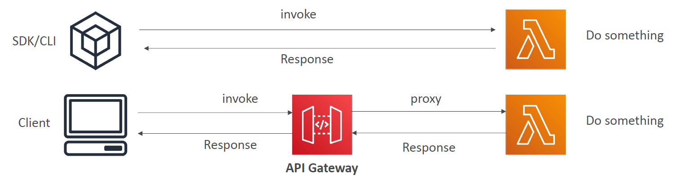
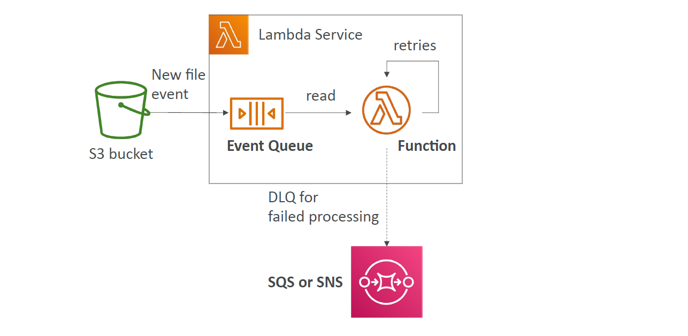
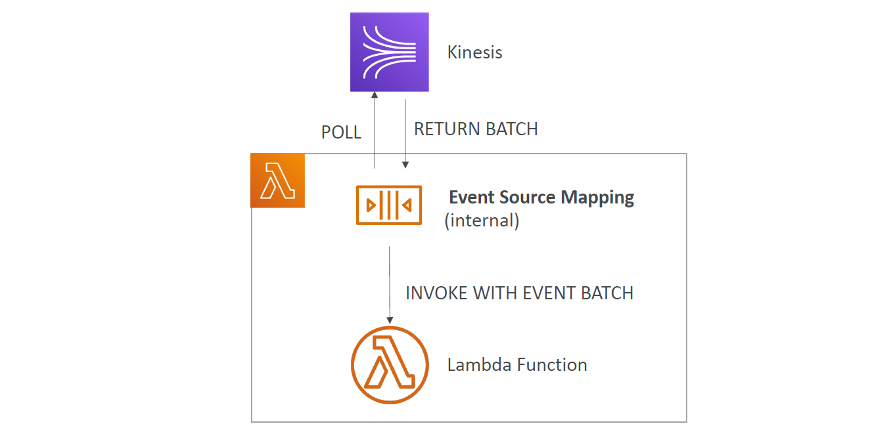

---
tags:
  - aws
  - aws/service
  - aws/domain/compute
  - aws/topic/lambda
aliases:
  - "AWS Lambda Invocation Types The Good The Fast & The Smart"
  - "Lambda Invocation Types"
---

# ⚡ **AWS Lambda Invocation Types – _The Good, The Fast & The Smart!_**

AWS Lambda can be triggered in **three ways**, depending on how the event source interacts with it:

- **1️⃣ Synchronous (Fast & Furious Mode 🚗💨)** → Caller **waits** for a response.
- **2️⃣ Asynchronous (Fire & Forget 🎆)** → Caller **does NOT wait**; AWS queues and retries.
- **3️⃣ Poll-Based (The Watchful Guardian 👀)** → AWS **polls** an event source and invokes Lambda when new events appear.

---

## 🕒 **1. Synchronous Invocation – "Fast & Furious Mode" 🚗💨**

> 👉 **When you need an instant response!**  
> 🔄️ Error handling must happen client side (retries, exponential backoff, etc…)

    

---

💡 **Example Scenario:**

- A user requests **real-time data** from an API, and your backend (Lambda) must **respond immediately**.

🤔 **How It Works:**

1. A service (**API Gateway, Cognito, Load Balancer, CloudFront**) calls your Lambda function.
2. Lambda runs and **returns a response instantly**.
3. The caller **waits until Lambda completes processing**.

🎯 **Use Cases:**

- ✅ REST APIs (**API Gateway → Lambda → DynamoDB**)
- ✅ Chatbots & voice assistants (**Alexa → Lambda**)
- ✅ Real-time data validation (**App → Lambda → RDS**)
- ✅ Authentication & Authorization (**Cognito → Lambda → Custom logic**)
- ✅ Content personalization & security (**CloudFront → Lambda@Edge**)
- ✅ Service-to-service networking (**VPC Lattice → Lambda**)

🛠️ **All AWS Services That Use Synchronous Invocation:**

| **Service**                         | **Description**                                                                   |
| ----------------------------------- | --------------------------------------------------------------------------------- |
| **Amazon API Gateway**              | Triggers Lambda for HTTP/REST API requests.                                       |
| **AWS SDK & CLI**                   | Directly invoke Lambda from applications.                                         |
| **Application Load Balancer (ALB)** | Uses Lambda as a backend for handling HTTP requests.                              |
| **AWS Step Functions**              | Calls Lambda in **synchronous workflows**.                                        |
| **Amazon Lex (Chatbots)**           | Uses Lambda for natural language processing.                                      |
| **Alexa Skills Kit**                | Calls Lambda for voice assistant interactions.                                    |
| **Amazon Cognito** 🛡️               | Uses Lambda for authentication and authorization triggers.                        |
| **Amazon CloudFront** 🌍            | Uses **Lambda@Edge** to process HTTP requests at edge locations.                  |
| **AWS VPC Lattice** 🔗              | Uses Lambda as a backend target for handling service-to-service network requests. |

---

## 🔄 **2. Asynchronous Invocation – "Fire & Forget" 🎆**

> 👉 **The events are placed in an Event Queue** => _When you don’t need an immediate response!_
>
> 🔄️ Lambda attempts to retry on errors:
>
> - 3 tries total
> - 1 minute wait after 1st , then 2 minutes wait
> - You can configure the wait time to your liking

---

    

---

    

---

💡 **Example Scenario:**

- A user uploads a file to **Amazon S3**, and you need Lambda to **process it later in the background**.

🤔 **How It Works:**

1. The event source (**S3, SNS, EventBridge**) triggers Lambda.
2. AWS **queues the event** and **returns instantly** to the caller.
3. Lambda **processes the event asynchronously** (retries on failure).

🎯 **Use Cases:**

- ✅ Image & video processing (**S3 → Lambda → Resized images**)
- ✅ Sending notifications (**SNS → Lambda → Email via SES**)
- ✅ Logging & monitoring (**CloudWatch → Lambda → Log processing**)

🛠️ **All AWS Services That Use Asynchronous Invocation:**

| **Service**                                  | **Description**                                                     |
| -------------------------------------------- | ------------------------------------------------------------------- |
| **Amazon S3**                                | Triggers Lambda on object uploads, deletions, or modifications.     |
| **Amazon SNS (Simple Notification Service)** | Publishes messages to Lambda asynchronously.                        |
| **Amazon EventBridge (CloudWatch Events)**   | Invokes Lambda on scheduled or event-based triggers.                |
| **Amazon SES (Simple Email Service)**        | Calls Lambda for email receiving rules.                             |
| **AWS CodeCommit**                           | Triggers Lambda on repository events (pushes, merges).              |
| **AWS Config**                               | Calls Lambda when there are configuration changes in AWS resources. |
| **AWS CloudFormation**                       | Uses Lambda-backed custom resources for automation.                 |

⚠️ **Retries & Dead Letter Queues (DLQ):**

- If Lambda **fails**, AWS **automatically retries twice** before sending the event to a **DLQ (SQS or SNS)** for debugging.

---

## 👀 **3. Event Source Mapping (Poll-Based Invocation) – "The Watchful Guardian"**

> 👉 **When AWS keeps watching for new data & triggers Lambda automatically!**

---

    

---

💡 **Example Scenario:**

- You have an **SQS queue** that stores incoming customer orders. Lambda **polls** the queue, picks up new orders, and processes them **automatically**.

**🤔 How It Works:**

> Poll-based invocation in AWS Lambda means **AWS itself handles polling** for event sources like **SQS**, **Kinesis**, and **DynamoDB Streams**. Instead of you setting a fixed interval, Lambda dynamically adjusts how often it polls based on load.

- **1️⃣** **Lambda continuously polls** the event source (**SQS, Kinesis, DynamoDB Streams**).
- **2️⃣** **If new events exist**, Lambda retrieves them **in batches**.
- **3️⃣** **Lambda invokes your function** to process the batch.
- **4️⃣** If there's **high traffic**, AWS **polls more frequently** and scales Lambda **automatically**.
- **5️⃣** If no data is present, Lambda **polls less often to save costs**.

🎯 **Use Cases:**

- ✔️ Processing event queues (**SQS → Lambda → Order fulfillment**)
- ✔️ Real-time analytics (**Kinesis → Lambda → Data transformation**)
- ✔️ Database change tracking (**DynamoDB Streams → Lambda → Audit logs**)

⏳ **Polling Interval – "AWS Handles It Automatically"**

- There is **no fixed interval like "every 10 seconds"**.
- AWS dynamically adjusts polling **based on event volume**.
- When there are **more records/messages**, AWS **polls more frequently**.
- When there’s **less activity**, AWS **polls less often** to save resources.

📦 **Batch Processing – "More Efficient, Less Cost"**

- AWS Lambda **groups multiple records/messages** into **batches** before invoking the function.
- This reduces invocation overhead and **optimizes cost & performance**.
- **Batch size depends on the event source:**
  - **SQS**: Up to **10,000 messages** per batch.
  - **Kinesis/DynamoDB Streams**: Up to **10,000 records** or **6 MB of data** per batch.

⚡ **Parallel Processing – "Lambda Scales for You"**

- **Multiple Lambda instances** can process events **in parallel**.
- For **SQS**, each batch is processed by a **separate Lambda instance**.
- For **Kinesis/DynamoDB**, parallelism is **controlled by shards**.
- If more events arrive, AWS **automatically scales Lambda to keep up**.

🤔 **How Lambda Polls Each Event Source**

| **Service**             | **How Polling Works**                                                         |
| ----------------------- | ----------------------------------------------------------------------------- |
| **📨 Amazon SQS**       | Lambda polls the queue continuously and retrieves messages **in batches**.    |
| **📊 Amazon Kinesis**   | Lambda polls **each shard** for new data and processes it.                    |
| **🛢️ DynamoDB Streams** | Lambda polls **the stream** for database changes (inserts, updates, deletes). |

🛠️ **All AWS Services That Use Poll-Based Invocation:**

| **Service**                                  | **Description**                                                |
| -------------------------------------------- | -------------------------------------------------------------- |
| **Amazon SQS (Simple Queue Service)**        | Lambda automatically polls and processes messages in a queue.  |
| **Amazon Kinesis**                           | Lambda processes real-time streaming data in shards.           |
| **Amazon DynamoDB Streams**                  | Lambda reacts to database changes (inserts, updates, deletes). |
| **Amazon MSK (Managed Streaming for Kafka)** | Lambda polls Kafka topics for new messages.                    |
| **Amazon MQ (ActiveMQ & RabbitMQ)**          | Lambda listens to message brokers and processes messages.      |

⚠️ **Concurrency Management:**

- AWS **automatically scales** Lambda if there’s a high event rate.
- You can control batch sizes and retry logic with **event source mappings**.

---

## 🎯 **Final Summary – Which Invocation Type Should You Use?**

| **Invocation Type** | **Response Needed?** | **Best Use Cases**                                                             | **Example AWS Services**                                       |
| ------------------- | -------------------- | ------------------------------------------------------------------------------ | -------------------------------------------------------------- |
| 🕒 Synchronous      | ✅ Yes               | APIs, Chatbots, Real-time Queries, Authentication, Edge Processing, Networking | API Gateway, ALB, Alexa, Lex, Cognito, CloudFront, VPC Lattice |
| 🔄 Asynchronous     | ❌ No                | Background Jobs, Notifications, File Processing                                | S3, SNS, EventBridge, CodeCommit, SES, Config                  |
| 👀 Poll-Based       | 📊 Depends           | Streaming Data, Queues, Change Tracking                                        | SQS, Kinesis, DynamoDB Streams, MSK, MQ                        |

---

**Final Thoughts – Choose Wisely!**

💡 **Quick Rules of Thumb:**

- **Need an instant response?** → **Use Synchronous Invocation**.
- **Processing jobs in the background?** → **Use Asynchronous Invocation**.
- **Handling event streams or message queues?** → **Use Poll-Based Invocation**.
---

## Related Notes
- [[aws-services/5.compute/4.1.lambda/|Index]] - folder map
- [[aws-services/5.compute/4.1.lambda/12.lambda-pricing|AWS Lambda Pricing]] - previous lesson
- [[aws-services/5.compute/4.1.lambda/2.2.lambda-triggers-and-distinations|AWS Lambda Triggers vs. Destinations]] - next lesson
- [[aws-services/5.compute/4.1.lambda/2.3.event-source-mapping|AWS Lambda Event Source Mapping SQS Kinesis DynamoDB]] - mentions Event Source Mapping
-[[1.1.cfn|AWS CloudFormation]]] - mentions AWS CloudFormation
- [[aws-services/8.database/dynamodb/ddb-in-depth/11.1.ddb-streams|DynamoDB Streams CDC in Real-Time]] - mentions DynamoDB Streams
- [[aws-daily/aws-architectures/4.1.streaming-data|Streaming Data The Power of Real-Time Data Processing]] - mentions Streaming Data
- [[aws-services/7.application-integration/step-functions/1.step-functions|AWS Step Functions Orchestrate Your Serverless Workflows with Ease]] - mentions Step Functions
- [[aws-services/3.network/4.api-gateway/x.api-gateway|Amazon API Gateway Streamlining API Management]] - mentions API Gateway
- [[aws-services/3.network/4.api-gateway/1.1.api-gateway|AWS API Gateway The Front Door for Your APIs]] - mentions API Gateway
- [[aws-services/1.management-governance/4.3.config/1.aws-config|AWS Config Track Audit and Enforce Your AWS Resource Compliance]] - mentions AWS Config
- [[aws-services/8.database/dynamodb/ddb-in-depth/1.1.ddb|Deep Dive into AWS DynamoDB]] - mentions DynamoDB

---
