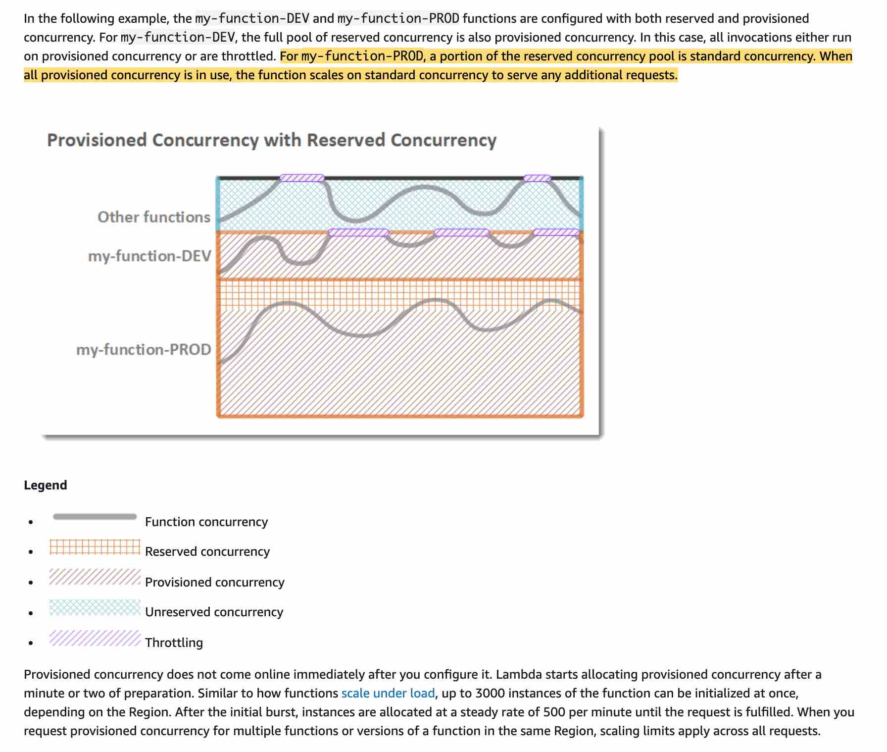
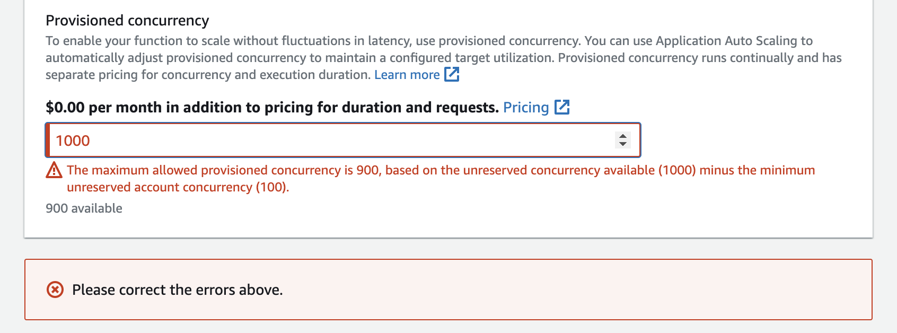

---
tags:
  - aws
  - aws/service
  - aws/domain/compute
  - aws/topic/lambda
aliases:
  - "AWS Lambda Provisioned Concurrency Say Goodbye to Cold Starts"
  - "Lambda Provisioned Concurrency"
---

# 🚀 **AWS Lambda Provisioned Concurrency – Say Goodbye to Cold Starts!**

Provisioned Concurrency is a **game-changer** for AWS Lambda, ensuring **low-latency responses** by keeping function instances **always warm**. If your application demands **instant execution** with **zero cold start delays**, this feature is for you!

---

## ❄️ **Why Do Cold Starts Happen in Lambda?**

By default, AWS Lambda follows an **on-demand execution model**, meaning:

- ✔️ A **new container (execution environment)** is created when a request arrives.
- ✔️ If the function hasn’t been used recently, **AWS shuts down the container** to save resources.
- ✔️ When a new request arrives after inactivity, Lambda **must create a new container**, leading to a **cold start delay**.
- ✔️ Cold starts **can take a few hundred milliseconds to several seconds**, impacting performance.

💡 **Solution?** **Provisioned Concurrency!**

---

## ⚡ **What is Provisioned Concurrency?**

- ✔️ Keeps a **fixed number of Lambda containers** **always running**, even if there's **zero traffic**.
- ✔️ **Completely eliminates cold starts**, ensuring **instant responses** for every request.
- ✔️ AWS **automatically routes incoming requests** to the pre-warmed instances.
- ✔️ If demand exceeds provisioned capacity, AWS **scales using on-demand instances**.

---

## 🔄 **How Provisioned Concurrency Works**

- 1️⃣ **You configure the number of "always warm" instances** (e.g., 10).
- 2️⃣ AWS **keeps these instances active** **at all times**, even if unused.
- 3️⃣ **New requests** are instantly routed to warm instances (✔️ No cold starts!).
- 4️⃣ If traffic **exceeds the provisioned instances**, AWS **scales up dynamically** using on-demand containers.
- 5️⃣ You **pay for the provisioned instances**, even when they are idle.

💡 **Think of it like reserving 10 virtual machines in advance instead of waiting for AWS to spin them up dynamically!**

---

<div style="text-align: center;">
  
</div>

---

## 🛠️ **Enable Provisioned Concurrency (Console)**

1. Go to **Lambda Console**
2. Open your function → **Versions & Aliases**
3. Publish a new version
4. Create an alias (e.g., `prod`)
5. Click **Concurrency** → Enable **Provisioned concurrency**
6. Enter value (e.g., 10) and **Save**

---

<div style="text-align: center;">
    
</div>

---

## ✅ **Real-World Example: Setup Provisioned Concurrency**

Let’s assume you have a Lambda function called `OrderProcessorFunction` with an alias called `live`.

### 🔧 **Step-by-Step Setup via AWS CLI**

1. **Publish a new version of the function:**

   ```bash
   aws lambda publish-version --function-name OrderProcessorFunction
   ```

2. **Create or update alias to point to the version:**

   ```bash
   aws lambda update-alias \
     --function-name OrderProcessorFunction \
     --name live \
     --function-version <version-number>
   ```

3. **Set provisioned concurrency on that alias:**

   ```bash
   aws lambda put-provisioned-concurrency-config \
     --function-name OrderProcessorFunction \
     --qualifier live \
     --provisioned-concurrent-executions 10
   ```

🧠 You must use a **version or alias**, not `$LATEST`.

---

## 📈 **Autoscaling Provisioned Concurrency**

Provisioned Concurrency can be **auto-scaled** based on schedule or metrics using **Application Auto Scaling**.

### 🔄 Option 1: **Scheduled Scaling (e.g., 9 AM - 5 PM)**

```bash
aws application-autoscaling register-scalable-target \
  --service-namespace lambda \
  --resource-id function:OrderProcessorFunction:live \
  --scalable-dimension lambda:function:ProvisionedConcurrency \
  --min-capacity 5 \
  --max-capacity 20
```

Then create a scheduled action:

```bash
aws application-autoscaling put-scheduled-action \
  --service-namespace lambda \
  --scheduled-action-name scaleUpMorning \
  --resource-id function:OrderProcessorFunction:live \
  --scalable-dimension lambda:function:ProvisionedConcurrency \
  --schedule "cron(0 9 * * ? *)" \
  --scalable-target-action MinCapacity=10,MaxCapacity=20
```

> 🕘 You can set another action for scale-down at night.

---

### 📊 Option 2: **Autoscale Based on Load (Metric-Driven)**

Configure CloudWatch alarm to track `ProvisionedConcurrencyUtilization` and trigger scaling policies via:

- CloudWatch Alarm
- Application Auto Scaling Target Tracking

> 🧠 Example: If utilization consistently > 70%, scale from 10 → 20

---

## 🎯 **Best Use Cases for Provisioned Concurrency**

- ✔️ **REST APIs & GraphQL APIs** – Ensure ultra-fast responses for API Gateway calls.
- ✔️ **Chatbots & Voice Assistants** – Reduce lag in Alexa, Google Assistant, and chatbot interactions.
- ✔️ **Financial & E-Commerce Transactions** – Handle payments, fraud detection, and checkout flows smoothly.
- ✔️ **Gaming Applications** – Instant matchmaking, leaderboards, and in-game purchases.
- ✔️ **Streaming & Media Processing** – Low-latency encoding, video processing, and analytics.

🚫 **When NOT to Use It?**

- If occasional **cold starts don’t impact** your application.
- If your traffic **is unpredictable** and you don’t want to **pay for unused instances**.

---

## 📊 **Provisioned Concurrency vs. On-Demand Concurrency**

| Feature              | **On-Demand (Default)**                  | **Provisioned Concurrency**                                  |
| -------------------- | ---------------------------------------- | ------------------------------------------------------------ |
| **Cold Start Delay** | ✔️ Possible                              | ❌ Eliminated                                                |
| **Performance**      | ✔️ May vary based on cold starts         | ✔️ Always consistent                                         |
| **Scaling**          | ✔️ Auto-scales but may cause cold starts | ✔️ Auto-scales within provisioned limit, then uses on-demand |
| **Cost**             | ✔️ Pay per invocation                    | ❌ Pay for provisioned instances, even if idle               |

---

## 💰 **Provisioned Concurrency Pricing**

- ✔️ You **pay for provisioned instances**, **whether they process requests or not**.
- ✔️ **More expensive than on-demand**, but **ensures low latency**.
- ✔️ **Cost optimization tip:** Use **Auto Scaling (Scheduled Provisioning)** to **enable it only during peak hours**.

💡 **Example Cost Scenario:**

- If you set **Provisioned Concurrency = 10**, AWS keeps **10 instances running 24/7**, even if only 2 are needed.
- **You still pay for all 10 instances**, so careful planning is required.

---

## 🍽️ **Analogy: "The Always-Ready Chefs 🍔👨‍🍳"**

Imagine two restaurants:

🥶 **Without Provisioned Concurrency (On-Demand Mode)**

- The kitchen **starts cooking from scratch** when a customer orders.
- **Takes time** (cold start issue), but you **only pay when food is served**.

🔥 **With Provisioned Concurrency**

- The kitchen **keeps 10 meals pre-cooked** at all times.
- Orders are **served instantly** (no waiting), but the restaurant **pays for unused meals**.

💡 **Provisioned Concurrency is like hiring chefs to keep meals ready, so customers (requests) never have to wait!**

---

## 🚀 **Final Takeaways**

- ✔️ **Eliminates cold starts**, ensuring **instant execution**.
- ✔️ **Keeps a fixed number of Lambda instances running** at all times.
- ✔️ **Best for APIs, chatbots, e-commerce, financial services, and gaming apps**.
- ✔️ **Can be expensive**, but **scheduled provisioning helps reduce costs**.
- ✔️ **AWS scales beyond provisioned limits dynamically**, so you get the best of both worlds.
---

## Related Notes
- [[aws-services/5.compute/4.1.lambda/|Index]] - folder map
- [[aws-services/5.compute/4.1.lambda/6.2.lambda-concurrent-execution|AWS Lambda Concurrent Execution Deep Dive]] - previous lesson
- [[aws-services/5.compute/4.1.lambda/6.4.lambda-recursion-detection|AWS Lambda Recursion Detection Stopping Infinite Loops]] - next lesson
- [[aws-daily/aws-waf/5.1.cost-optimization|Cost Optimization]] - mentions Cost Optimization
- [[aws-services/1.management-governance/3.1.cloud-watch/4.cw-alarm|Amazon CloudWatch Alarms Smart Monitoring & Automated Reactions]] - mentions CloudWatch Alarm
- [[aws-services/3.network/4.api-gateway/x.api-gateway|Amazon API Gateway Streamlining API Management]] - mentions API Gateway
- [[aws-services/3.network/4.api-gateway/1.1.api-gateway|AWS API Gateway The Front Door for Your APIs]] - mentions API Gateway
- [[aws-services/10.developer/1.1.aws-cli/aws-cli|AWS Cli]] - mentions AWS Cli
- [[aws-services/12.machine-learning/3.4.alexa/alexa|Amazon Alexa Your Intelligent Voice Assistant]] - mentions Alexa

---
