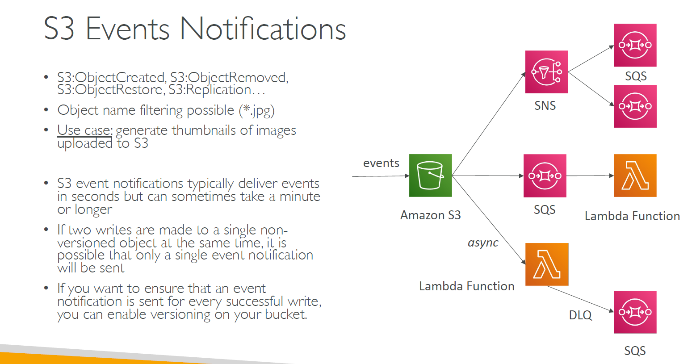

---
tags:
  - aws
  - aws/service
  - aws/domain/compute
  - aws/topic/lambda
aliases:
  - "AWS Lambda with Amazon S3"
  - "Lambda With S3"
---

# 🪣 AWS Lambda with Amazon S3

    

---

## Related Notes
- [[aws-services/5.compute/4.1.lambda/|Index]] - folder map
- [[aws-services/5.compute/4.1.lambda/8.3.function-url|3. Enable Function URL Expose Your Lambda via HTTPS]] - previous lesson
- [[aws-services/5.compute/4.1.lambda/9.2.lambda-with-event-bridge|AWS Lambda with Amazon EventBridge]] - next lesson

---
