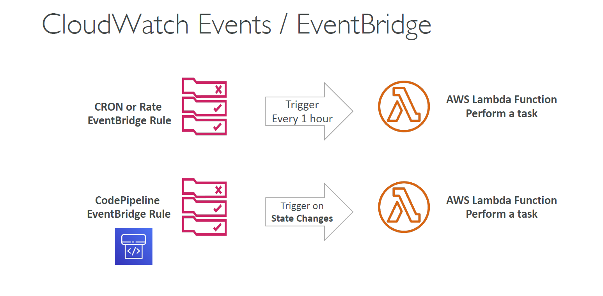

---
tags:
  - aws
  - aws/service
  - aws/domain/compute
  - aws/topic/lambda
aliases:
  - "AWS Lambda with Amazon EventBridge"
  - "Lambda With Event Bridge"
---

# ⏰ AWS Lambda with Amazon EventBridge

    

---

## Related Notes
- [[aws-services/5.compute/4.1.lambda/|Index]] - folder map
- [[aws-services/5.compute/4.1.lambda/9.1.lambda-with-s3|AWS Lambda with Amazon S3]] - previous lesson
- [[aws-services/5.compute/4.1.lambda/9.3.lambda-with-alb|AWS Lambda + ALB Integration]] - next lesson

---
