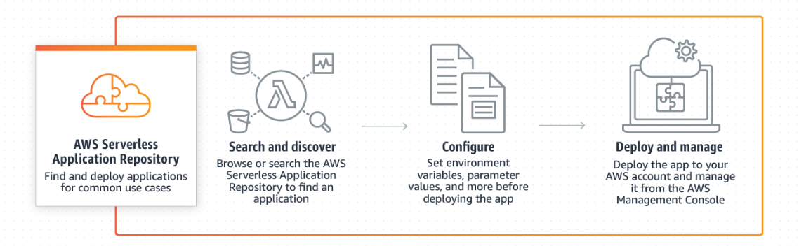

---
tags:
  - aws
  - aws/service
  - aws/domain/compute
  - aws/topic/serverless-application-repository
aliases:
  - "AWS Serverless Application Repository Share and Deploy Serverless Applications Effortlessly"
  - "Serverless Application Repository"
---

# 🏪 **AWS Serverless Application Repository: Share and Deploy Serverless Applications Effortlessly**

The **AWS Serverless Application Repository** is a managed service that hosts serverless applications built using the AWS Serverless Application Model (SAM). It enables developers and organizations to share, discover, and deploy serverless applications quickly and securely.

---

    

---

    

---

## 🔍 **What is AWS Serverless Application Repository?**

The **AWS Serverless Application Repository** is a centralized repository where developers can publish and share serverless applications. It simplifies the process of deploying serverless applications by providing pre-built solutions that can be easily integrated into your projects.

### 📌 **Key Features:**

- **Hosted Repository:** Stores serverless applications built with AWS SAM.
- **Public and Private Sharing:** Share applications publicly or restrict access within your organization or specific teams.
- **Easy Deployment:** Deploy applications directly from the repository using the AWS Management Console, SDKs, or SAM CLI.
- **Search and Browse:** Find applications by publisher, name, or event source.

---

## 🔗 **Sharing Serverless Applications**

### 1. **Public Sharing**

- **Accessibility:** Available to all AWS customers.
- **Use Case:** Share solutions with the broader community to foster collaboration and innovation.

### 2. **Private Sharing**

- **Accessibility:** Restricted to specific organizations or teams.
- **Use Case:** Share internal applications securely within your company without exposing them publicly.

---

## 🔍 **Discovering and Deploying Applications**

### 📚 **Search and Browse:**

- **Filters:** Search by publisher, application name, or event source.
- **Categories:** Browse applications based on functionality or industry use cases.

### 🛠️ **Deployment Methods:**

- **AWS Management Console:** Deploy applications with a few clicks.
- **AWS SDKs:** Integrate deployment into your development workflows programmatically.
- **SAM CLI:** Use the Serverless Application Model CLI for command-line deployments.

---

## 📝 **Publishing Serverless Applications**

To publish a serverless application in the repository, follow these steps:

### 1. **Prepare Your Application:**

- **Code:** Develop your serverless application using AWS Lambda, API Gateway, and other AWS services.
- **SAM Template:** Create a simple manifest file (SAM template) that defines your application's resources and configurations.

### 2. **Publish via Preferred Method:**

- **AWS Console:** Use the web interface to upload your application code and SAM template.
- **AWS SDKs:** Automate the publishing process through software development kits.
- **SAM CLI:** Utilize command-line tools to package and publish your application.

### 📌 **Requirements:**

- **Code Sharing:** Provide the complete source code of your serverless application.
- **SAM Template:** Include a SAM template that outlines the application's infrastructure and deployment parameters.

---

## 🌟 **Benefits**

- **Simplified Sharing:** Easily share your serverless solutions with others without extensive setup.
- **Accelerated Deployment:** Quickly integrate pre-built applications into your projects, reducing development time.
- **Enhanced Collaboration:** Foster a community-driven ecosystem by contributing and utilizing shared serverless applications.
- **Secure Access:** Control who can access and deploy your applications through public and private sharing options.

---

## 🎯 **Use Cases**

- **Rapid Prototyping:** Deploy existing serverless applications to quickly build and test new ideas.
- **Standardizing Solutions:** Share common serverless patterns and solutions across teams to maintain consistency.
- **Extending Functionality:** Integrate third-party serverless applications to enhance your existing infrastructure.
- **Educational Purposes:** Learn from and experiment with sample serverless applications provided by the community.

---

## 🏁 **Conclusion**

The **AWS Serverless Application Repository** is an invaluable resource for developers and organizations looking to leverage serverless architecture efficiently. By enabling easy sharing, discovery, and deployment of serverless applications, it accelerates development cycles, promotes collaboration, and ensures secure access to robust serverless solutions. Whether you're seeking to deploy a ready-made application or share your own, the repository streamlines the entire process, empowering you to build scalable and efficient serverless applications with ease.
---

## Related Notes
- [[aws-services/3.network/4.api-gateway/x.api-gateway|Amazon API Gateway Streamlining API Management]] - mentions API Gateway
- [[aws-services/3.network/4.api-gateway/1.1.api-gateway|AWS API Gateway The Front Door for Your APIs]] - mentions API Gateway
- [[aws-daily/aws-architectures/3.1.serverless|Server-Based Architectures vs. Serverless Computing]] - mentions Serverless
-[[1.serverless|The Ultimate Guide to Serverless Computing & Tools]]] - mentions Serverless
-[[2.1.aws-sam|AWS SAM Serverless Application Model]]] - mentions AWS Sam

---
