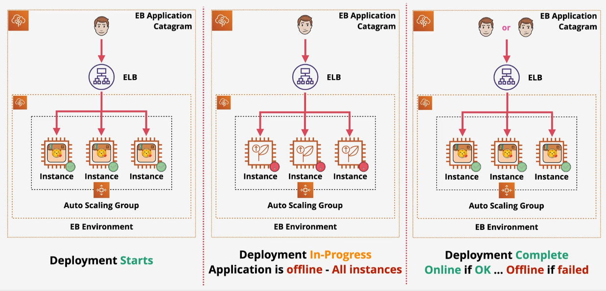
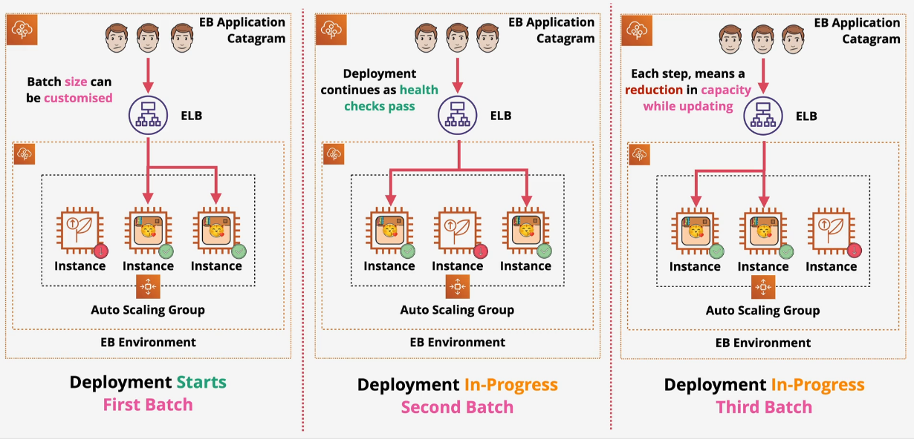
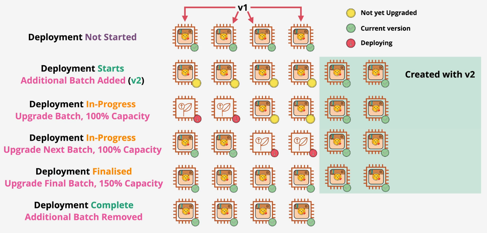
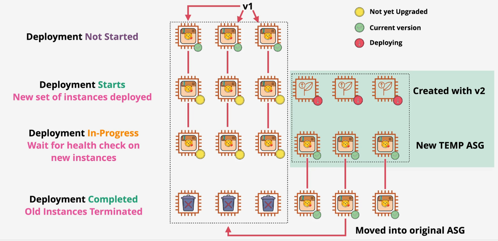
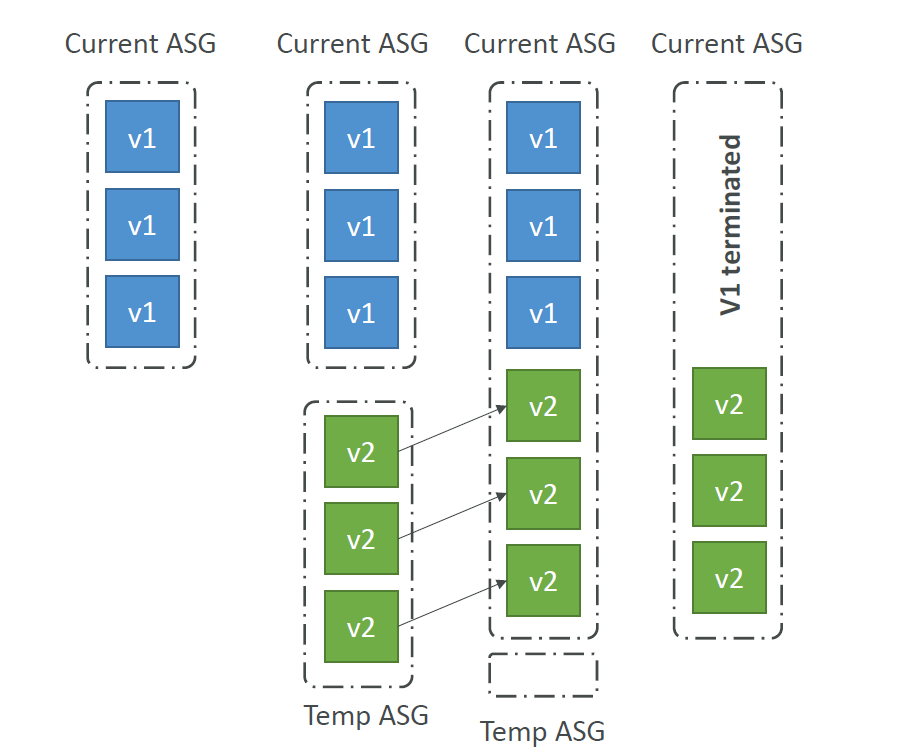
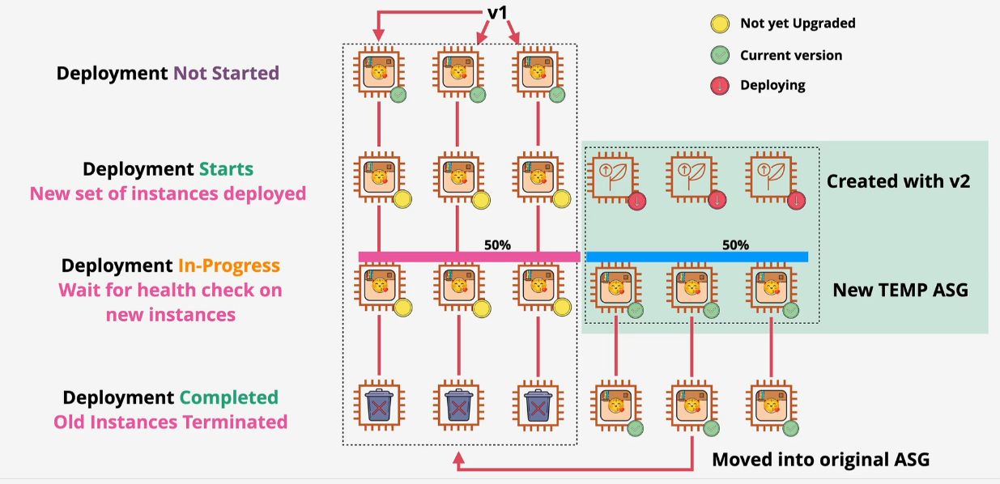
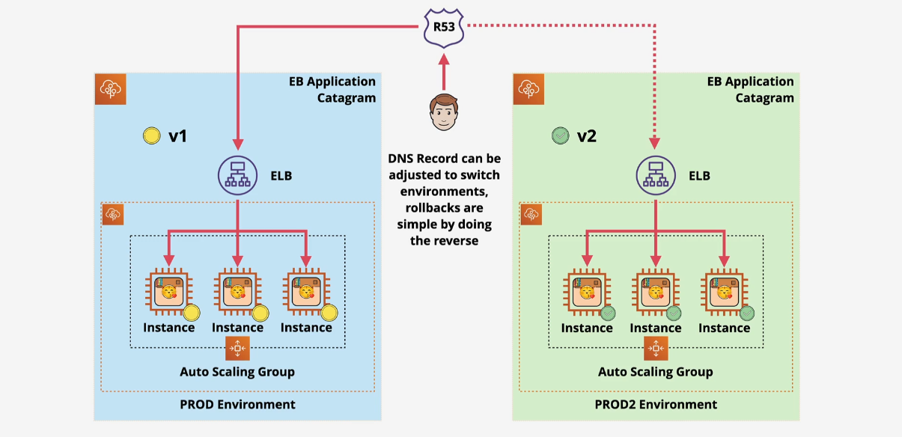

---
tags:
  - aws
  - aws/service
  - aws/domain/compute
  - aws/topic/elastic-beanstalk
aliases:
  - "Deployment Policies in EB"
  - "Elb App Deployment Stratigies"
---

# 🚀 Deployment Policies in EB

Elastic Beanstalk gives you **five strategies** to deploy new versions of your app:

- 1️⃣ All At Once
- 2️⃣ Rolling
- 3️⃣ Rolling with Additional Batch
- 4️⃣ Immutable
- 5️⃣ Traffic Split
- 6️⃣ Blue/Green

---

## 1️⃣ All At Once

Deploys to **all instances simultaneously**.

🟡 **Risk**: Downtime if anything fails  
✅ **Fastest** deployment

---

## 2️⃣ Rolling

Deploys in **batches**, replacing some instances at a time.

✅ **Reduces downtime**  
🟡 Still may reduce capacity

    

---

## 3️⃣ Rolling with Additional Batch

Same as above, but **adds extra instances** during deployment.

✅ Keeps full capacity  
🟥 Uses **more resources** temporarily

    

---

## 4️⃣ Immutable

Creates **new instances with the new version**, swaps them in.

✅ Safer than rolling  
✅ No downtime  
🟥 Slower & more costly

    
    

---

## 5️⃣ Traffic Splitting

Split traffic between **new and old versions** for **canary testing**.

✅ Controlled testing  
✅ Safe rollback  
🟥 Complex monitoring setup needed

    

---

## 🔵 **Blue/Green Deployments in EB**

✅ Zero-downtime updates  
✅ Rollback = instant  
🟥 Double infra = double cost (temporarily)

    

📌 **Steps:**

1. Create a copy (green) of your existing EB environment (blue)
2. Deploy new version to green
3. Swap CNAME when ready
4. Roll back by swapping again if needed

---
---

## Related Notes
- [[aws-services/5.compute/6.1.elastic-beanstalk/|Index]] - folder map
- [[aws-services/5.compute/6.1.elastic-beanstalk/1.eb|AWS Elastic Beanstalk Complete Guide for Developers]] - previous lesson
- [[aws-services/5.compute/6.1.elastic-beanstalk/2.2.elb-rds-deployment-options|Elastic Beanstalk + RDS All Deployment Options Explained]] - next lesson

---
