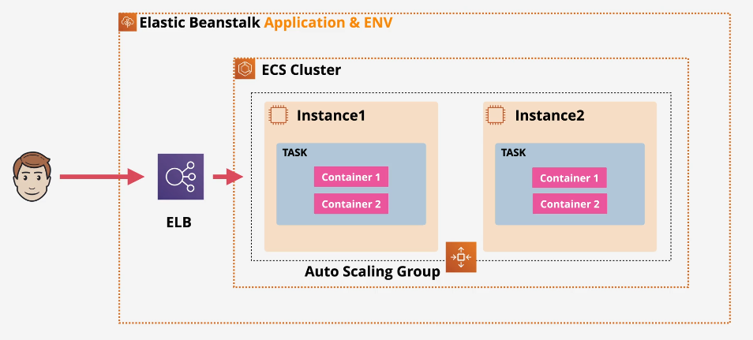

---
tags:
  - aws
  - aws/service
  - aws/domain/compute
  - aws/topic/elastic-beanstalk
aliases:
  - "Running Docker Apps in Elastic Beanstalk"
  - "Elb With Containers"
---

# 🐳 **Running Docker Apps in Elastic Beanstalk**

> Elastic Beanstalk supports **Docker out-of-the-box**, in two major ways:

- **Single-Container Mode** (EC2 + Docker)
- **Multi-Container Mode** (ECS + EC2)

---

<div align="center">
    
</div>

---

## 🧱 1. **Single-Container Mode (EC2 + Docker)**

Elastic Beanstalk launches EC2 instances with Docker and runs a **single container per instance**.

You can use:

| File                    | Description                     |
| ----------------------- | ------------------------------- |
| `Dockerfile`            | Standard Dockerfile             |
| `Dockerrun.aws.json` v1 | Defines image + port + volumes  |
| `docker-compose.yml`    | Optional for multi-stage builds |

📍 All config files go in the **root of your zip bundle**.

---

## 🧱 2. **Multi-Container Mode (ECS + EC2)**

Elastic Beanstalk creates:

- **ECS Cluster**
- EC2 Instances in cluster
- ELB (Load Balancer) in front

You must provide:

```json
// Dockerrun.aws.json (Version 2)
{
  "AWSEBDockerrunVersion": 2,
  "containerDefinitions": [
    {
      "name": "app",
      "image": "nginx",
      "memory": 128,
      "essential": true,
      "portMappings": [
        {
          "containerPort": 80
        }
      ]
    }
  ]
}
```

✅ Use this for **more complex architectures**  
🧠 Works well when moving toward ECS + EKS in future
---

## Related Notes
- [[aws-services/5.compute/6.1.elastic-beanstalk/|Index]] - folder map
- [[aws-services/5.compute/6.1.elastic-beanstalk/4.elb-cloning-environment|Cloning Elastic Beanstalk Environments]] - previous lesson
- [[aws-services/5.compute/6.1.elastic-beanstalk/6.eb-extra|Advanced AWS Elastic Beanstalk EB Internals & Architecture]] - next lesson
- [[aws-services/1.management-governance/4.3.config/x.config|AWS Config Track Manage and Secure Your AWS Resources]] - mentions Config
- [[aws-services/6.containers/3.eks/1.1.eks|Amazon EKS Simplifying Kubernetes on AWS]] - mentions EKS
- [[aws-services/6.containers/2.ecs/1.1.ecs|Amazon ECS Elastic Container Service]] - mentions ECS

---
