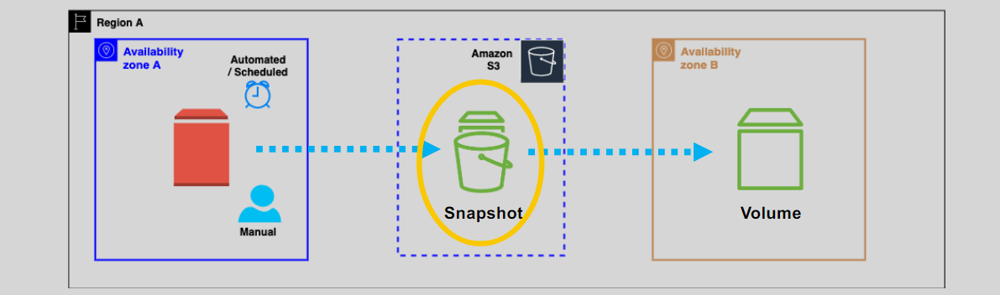
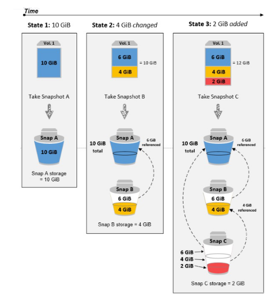

# 📸 Amazon EBS Snapshots – _Efficient, Scalable Backup for Your Volumes_

Amazon **EBS Snapshots** provide point-in-time backups of your EBS volumes, stored securely in Amazon S3. They are **incremental** by design—only storing changes since the last snapshot—making them highly efficient for **backup**, **disaster recovery**, **volume replication**, and **cross-AZ or cross-region cloning**.

## 🔑 Key Features

- ✅ **Stored in Amazon S3** – Snapshots are backed by durable S3 storage (not directly accessible to you).
- 🌍 **Region-Scoped** – Snapshots are tied to the region of the source volume.
- 🔁 **Incremental** – After the first full snapshot, only changes are saved in future snapshots.
- 🧪 **Crash-Consistent** – You can create snapshots without stopping the volume. They capture the current state.
- 🚀 **Create Volumes Anywhere** – Use snapshots to create new volumes in different **Availability Zones** or even across **regions**.

---

    

---

    

---

## 🌐 Cross-Region Snapshot Copy

> Want to use a snapshot in another region? You must **copy** it first:

---

    

---

📤 Copy snapshots manually or automate it via **AWS Backup** or **Lambda**.  
📦 Once copied, you can **launch volumes or AMIs** from the new region.

---

## 🛒 Features

### 🗃️ 1.EBS Snapshot Archive Tier

For long-term retention at low cost:

- 📦 Move snapshots to **EBS Snapshot Archive Tier** to save **up to 75%**.
- 🛑 Archived snapshots are stored as **full copies**, not incremental.
- 🔄 To use them again, **restore to standard tier** (can take hours).

---

### 🗑️ 2.Recycle Bin for Snapshots and AMIs

Accidentally deleted a snapshot or AMI? Use **Recycle Bin**:

- ♻️ Recover deleted snapshots within a **retention window** you define.
- ⏳ Resources are retained for days/weeks (you choose).
- 💵 Storage still incurs regular snapshot charges during retention.

---

### ⚡ 3.Fast Snapshot Restore (FSR)

Normally, volumes created from snapshots are **lazy-loaded**—data is pulled from S3 when accessed, leading to initial latency. **FSR** solves that:

- ⚡ Pre-warms the volume so full performance is available instantly.
- 🔧 Must be **explicitly enabled** for each snapshot.
- 💵 **Pricing**: ~\$0.75 per snapshot per AZ per hour
  - Example: 1 snapshot in `us-east-1a` for 30 days = ~\$540

---

## 🔁 **Automation Tools – Snapshot Like a Pro**

Managing EBS snapshots manually? Ain’t nobody got time for that.
Let AWS do the heavy lifting for you — **safely**, **consistently**, and **on schedule**.

---

### 📆 **1. Amazon Data Lifecycle Manager (DLM)** – _Policy-Driven Snapshot Automation_

Define smart **lifecycle policies** to:

| Task                   | How DLM Helps                            |
| ---------------------- | ---------------------------------------- |
| 🗓️ Schedule Snapshots  | Hourly, daily, weekly… totally up to you |
| ♻️ Retention Rules     | Keep only the last N snapshots           |
| 🏷️ Tag-Based Targeting | Automate snapshots using EC2/EBS tags    |
| 🧼 Auto-Cleanup        | Expire old backups automatically         |

> ✅ **Recommended for most use cases** — scalable, low-code, and integrated with EC2 tags.

💡 **Use Case**:
Want daily backups of all volumes tagged with `Backup=Daily` and retain only the last 7? DLM can do that in seconds.

---

### 📡 **2. CloudWatch Events + Lambda** – _Custom Snapshot Workflows_

Set up **event-driven snapshots** triggered by EC2 or system events.

#### 🛠️ How It Works

- CloudWatch detects an **event** (e.g., instance starts, stops, or fails a status check).
- It triggers an **AWS Lambda function**.
- The Lambda script calls `create-snapshot` via the EC2 API.

> ⚠️ **Not ideal for multiple volumes** — works best for single-volume automation unless extended manually.

💡 **Use Case**:
You want to take a snapshot **only when an EC2 instance is stopped** or **fails a health check**? CloudWatch Events + Lambda is your go-to.

---

## ‼️ **Notes**

📌 Snapshot are **Regional** scoped (Not tied to AZ).  
📌 Snapshot are **not encrypted by default**.  
📌 **Snapshots only apply to EBS volumes**. You **cannot snapshot instance store** volumes. Instead:

- Copy data to **EBS volumes** and snapshot that.
- Or backup files directly to **Amazon S3**.

## 🏁 Conclusion

Amazon EBS Snapshots provide a powerful, cost-efficient way to back up your data, migrate workloads across AZs or regions, and protect against disasters. With features like **incremental backups**, **Fast Snapshot Restore**, **automated policies**, and **archiving**, snapshots are a core component of any reliable cloud storage strategy. Plan your lifecycle policies and leverage the right snapshot tier to get the best mix of performance, recoverability, and cost savings.
