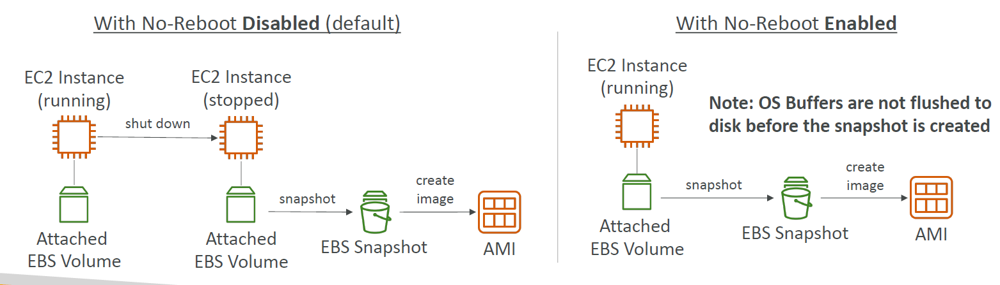

# 📦 **Amazon Machine Image (AMI) – Simplified & Powerful**

## 🧱 **What is an AMI?**

An **Amazon Machine Image (AMI)** is a **blueprint of an EC2 instance**. It includes:

- 🖥️ Operating System (e.g., Amazon Linux, Ubuntu, Windows)
- ⚙️ Custom software and packages
- 🧰 Configuration (e.g., agents, dependencies, firewalls)
- 🛠️ Application code or monitoring tools

---

### ⁉️ Why Use AMIs?

| Feature               | Benefit                                                    |
| --------------------- | ---------------------------------------------------------- |
| 🧠 Pre-packaged state | Faster boot time and reduced setup steps                   |
| 🌀 Customizable       | Add anything: apps, services, scripts                      |
| 🌍 Region-specific    | AMIs are built per-region _(can be copied across regions)_ |
| 🔄 Reusable           | Launch any number of EC2 instances from it                 |

---

## 🧰 **AMI Creation – Step-by-Step Process**

1️⃣ **Launch** a base EC2 instance.  
2️⃣ **Customize** it with required apps, agents, or configs.  
3️⃣ **Stop** the instance for a clean and safe capture.  
4️⃣ **Create AMI** → AWS takes an **EBS snapshot**.  
5️⃣ **Use AMI** to launch new identical instances anytime.

---

## 📚 **AMI Types**

| Type                     | Source                   | Description                             |
| ------------------------ | ------------------------ | --------------------------------------- |
| 🔓 Public AMI            | AWS-provided             | Prebuilt OS images (e.g., Amazon Linux) |
| 🧑‍💻 Private (Your Own) | Created by you           | Fully customized for internal use       |
| 🏬 Marketplace AMI       | 3rd-party (paid or free) | Built by vendors (e.g., Bitnami, Cisco) |

---

## 🔄 **No-Reboot Option for AMI Creation**

> Enables you to create an AMI without shutting down your instance.

| Mode                                | Description                                                                      |
| ----------------------------------- | -------------------------------------------------------------------------------- |
| ❌ **No-Reboot Disabled** (Default) | Instance is **shut down** first for snapshot consistency (OS buffers flushed)    |
| ✅ **No-Reboot Enabled**            | Create AMI **without stopping** the instance → ⚠️ filesystem may be inconsistent |

> 📌 By default, it’s not selected _(AWS will shut down the instance before creating an AMI to maintain the file system integrity)._

---

    

**🟠 Left:** Instance is stopped → snapshot → AMI (safe).  
**🟢 Right:** Instance keeps running → snapshot may miss in-memory data.

---

> 📌 **Best Practices:**
>
> - 🧠 Use **default (shutdown)** for production.
> - 👉🏻 Use **no-reboot** for quick testing or non-critical environments.

---

## 🧪 **Best Practices for AMIs**

- Always **tag your AMIs** (e.g., version, service name)
- Store them in **S3-backed EBS snapshots** for cost efficiency
- Use **automation** (e.g., EC2 Image Builder or Packer) for frequent builds
- **Copy AMIs across regions** if needed for global deployment

---

## 📌 Summary

| 🔍 Topic         | ✅ Key Details                                   |
| ---------------- | ------------------------------------------------ |
| What is an AMI?  | Prebuilt EC2 image with OS, config, and software |
| Types of AMIs    | Public, Private (Custom), Marketplace            |
| How to create it | Customize EC2 → Stop → Create Image → Launch     |
| No-Reboot Option | Avoids shutdown, but risks data inconsistency    |
| Region behavior  | AMIs are region-specific (but copyable)          |
