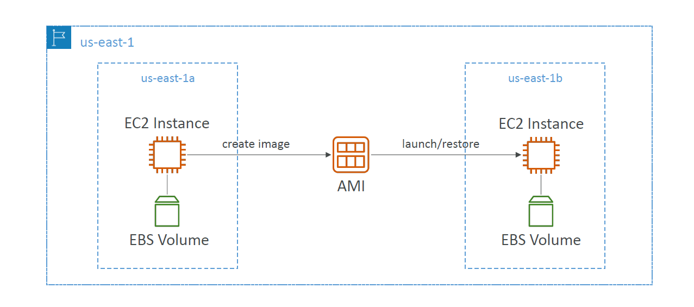
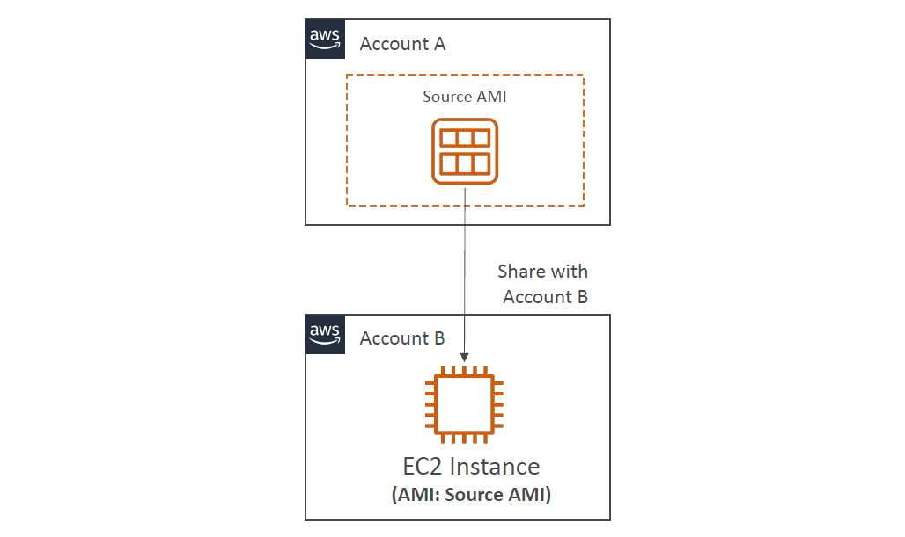
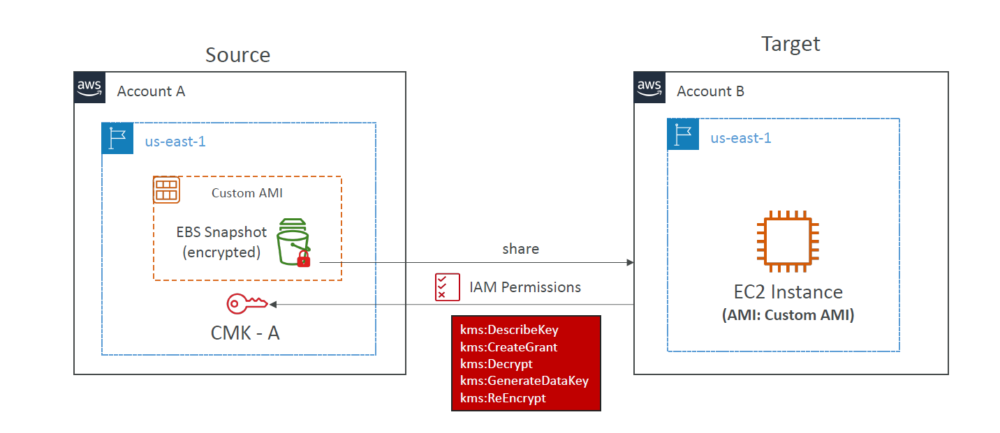
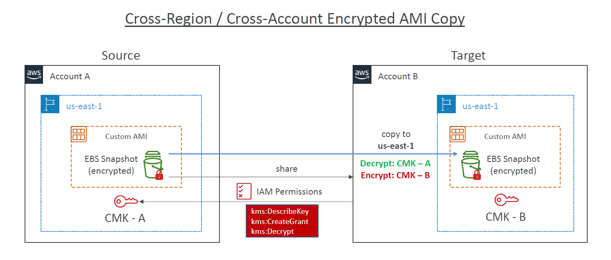

# 🔄 **AMI Sharing & Copying – Across AZ, Accounts & Regions**

> _Launch identical EC2 instances in different zones, accounts, or regions using Amazon Machine Images (AMIs) with or without encryption._

---

## 🌐 **1. EC2 Instance Migration Between Availability Zones (AZ)**

> An **EC2 instance is AZ-bound** — you can’t move it directly.  
> ✅ Solution: **Create an AMI**, then **launch it in another AZ**.

---

<div style="text-align: center;">
    
</div>

---

### 🛠️ **Process:**

1. EC2 in `us-east-1a`
2. 📸 Create AMI
3. 🚀 Launch EC2 from AMI in `us-east-1b`

---

> 🧠 **Note**: The EBS volume will also be recreated in the target AZ.

---

## 👥 **2. Cross-Account AMI Sharing (Unencrypted or CMK-Encrypted)**

<div style="text-align: center;">
    
</div>

---

### ✅ **Basic Flow (Unencrypted or CMK):**

- AMI is created in **Account A**
- Account A **shares it with Account B**
- Account B can launch EC2 using the shared AMI

### 📌 **Key Points:**

- Shared AMI **does not transfer ownership**
- You can **only share**:

  - 🔓 Unencrypted AMIs
  - 🔐 AMIs encrypted with **Customer Managed Keys (CMKs)**

- ❌ Cannot share AMIs encrypted with AWS-managed default keys

---

## 🔐 **3. Sharing AMI with KMS-Encrypted Snapshots**

<div style="text-align: center;">
    
</div>

---

When sharing an encrypted AMI:

- You **must share** the associated **KMS key (CMK)** with the target account
- You **must also allow** access to the **EBS snapshot**

### ✅ **Required KMS Permissions:**

```yaml
kms:DescribeKey
kms:CreateGrant
kms:Decrypt
kms:GenerateDataKey
kms:ReEncrypt
```

---

## 📤 **4. Cross-Account AMI Copy**

<div style="text-align: center;">
    
</div>

---

When **Account B copies** the shared AMI:

- The **AMI becomes owned by Account B**
- Account A must grant **read permissions** on the EBS snapshot
- 🔐 Optionally, Account B can re-encrypt the AMI using its own KMS key

🧠 Ideal when:

- You want **ownership transfer**
- You want to **re-encrypt** with your own CMK
- You want to **launch in another region**

---

## 🌍 **5. Cross-Region / Cross-Account Encrypted AMI Copy**

<div style="text-align: center;">
    
</div>

---

This approach allows you to:

- Copy a **CMK-encrypted AMI** across **regions** and **accounts**
- Decrypt with **CMK-A** (source)
- Re-encrypt with **CMK-B** (target)

### 🧩 **Required Setup:**

| Task                  | Details                                         |
| --------------------- | ----------------------------------------------- |
| 🔓 Decrypt with CMK-A | Source account must **share CMK-A** permissions |
| 🔐 Encrypt with CMK-B | Target account uses its own KMS key             |
| ✅ IAM + KMS          | Grant access to both **snapshot** and **key**   |

---

## 📌 Summary Table

| Action                    | Description                            | Notes                                      |
| ------------------------- | -------------------------------------- | ------------------------------------------ |
| Migrate across AZs        | Create AMI → Launch in different AZ    | Preserves app state but not instance ID/IP |
| Share AMI across accounts | Use unencrypted or CMK-encrypted AMI   | Source retains ownership                   |
| Copy AMI across accounts  | Target gets ownership via AMI copy     | Source must allow snapshot read            |
| Share encrypted AMIs      | Must share snapshot + CMK              | KMS policy + permissions needed            |
| Cross-region + encrypted  | Decrypt with CMK-A, encrypt with CMK-B | Enables multi-region AMI portability       |

---

## 💡 Best Practices

- ✅ **Use CMKs** for better control and sharing
- 📋 **Tag AMIs** by owner, region, app, version
- 🔐 **Audit KMS & IAM permissions** before sharing
- 🔄 Use **EC2 Image Builder** to automate multi-region AMI creation
- 🧪 Test launch after sharing or copying — especially with encryption!
