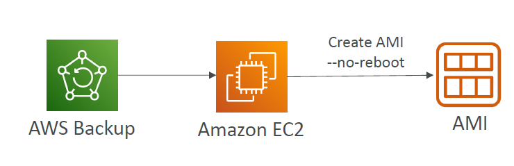
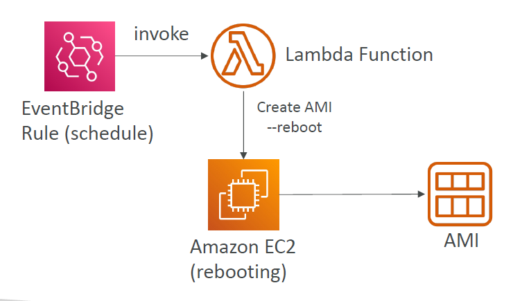
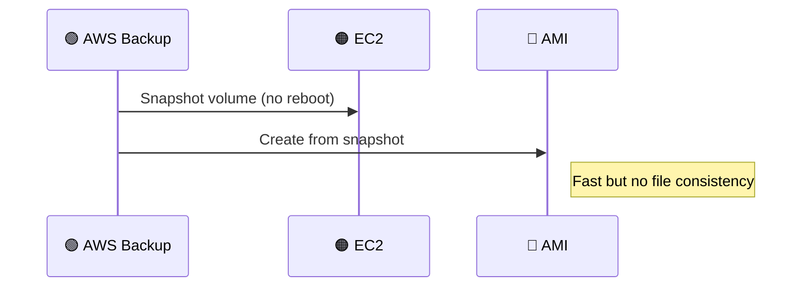
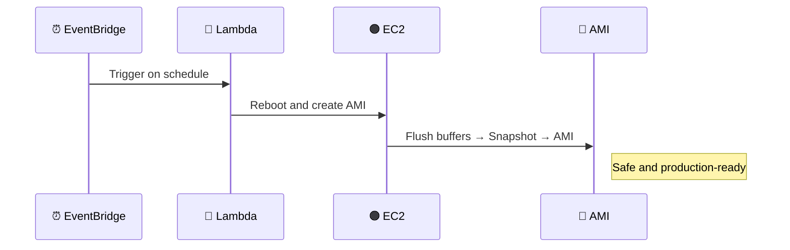

# 🧠 **Creating EC2 AMIs: AWS Backup vs. EventBridge + Lambda**

> _Not all backups are equal — especially when it comes to ensuring file system integrity._
> Let’s explore how **AWS Backup** and **EventBridge-triggered Lambda** differ when used for **automated AMI creation**.

---

## 📦 **Option 1: AMI Creation via AWS Backup – No Reboot**

### 🔹 Flow

<div style="text-align: center;">
  
</div>

### ✅ What Happens

- AWS Backup creates an **EBS snapshot** of the root volume
- This snapshot is used to generate an **AMI**
- **The EC2 instance remains running** (no interruption)

### ⚠️ Key Caveat

- ⚠️ **No reboot** → **OS buffers may not be flushed to disk**
- ❗ Result: AMI may not **fully reflect a consistent state**

> Use this only for **non-critical systems** or **quick testing environments**.

---

## ⏰ **Option 2: EventBridge + Lambda – With Reboot**

### 🔹 Flow

<div style="text-align: center;">
  
</div>

### 🔁 Process

1. **EventBridge Rule** triggers Lambda on a schedule
2. Lambda calls `create-image` EC2 API with `--reboot`
3. EC2 instance is rebooted to flush memory
4. AMI is created from the clean, consistent snapshot

### ✅ Pros

- Ensures **filesystem integrity** (ideal for prod)
- Automatable via **cron-style EventBridge rule**

### Example CLI

```bash
aws ec2 create-image \
  --instance-id i-1234567890abcdef0 \
  --name "MyApp-AMI-$(date +%Y-%m-%d)" \
  --reboot
```

---

## 🧬 Sequence Diagram Comparison

### 📤 Backup Plan (No Reboot)

<div align="center">



</div>

### ⏰ EventBridge + Lambda (With Reboot)

<div align="center">



</div>

---

## 📌 Summary

| Feature                | AWS Backup (No Reboot)   | EventBridge + Lambda (Reboot)        |
| ---------------------- | ------------------------ | ------------------------------------ |
| 🔁 Instance rebooted   | ❌ No                    | ✅ Yes                               |
| 🧹 File system flushed | ❌ Risk of inconsistency | ✅ Guaranteed integrity              |
| ⚙️ Custom logic        | ❌ No control            | ✅ Full automation via Lambda        |
| 📆 Scheduling          | ✅ Backup plans          | ✅ EventBridge rule                  |
| ✅ Use Case            | Dev/test backups         | Production-safe, clean image backups |

---

## ✅ Best Practices

- For **dev/test instances** → AWS Backup is simple and cost-efficient
- For **production-critical** systems → use **EventBridge + Lambda** with `--reboot`
- Always tag AMIs with `CreatedBy=Automation`, `Source=EC2-ID`, `Safe=True/False`
- Consider using **Amazon Data Lifecycle Manager (DLM)** if you want **native AMI rotation**
