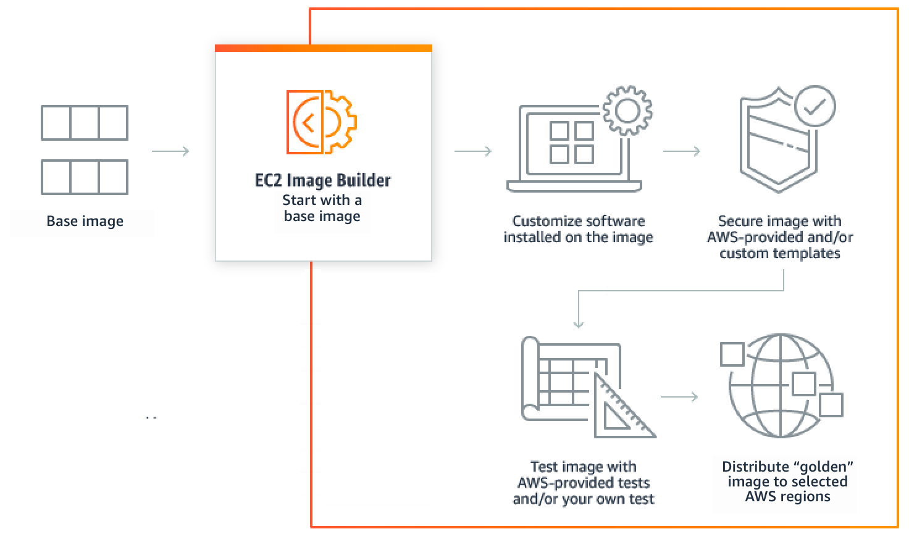
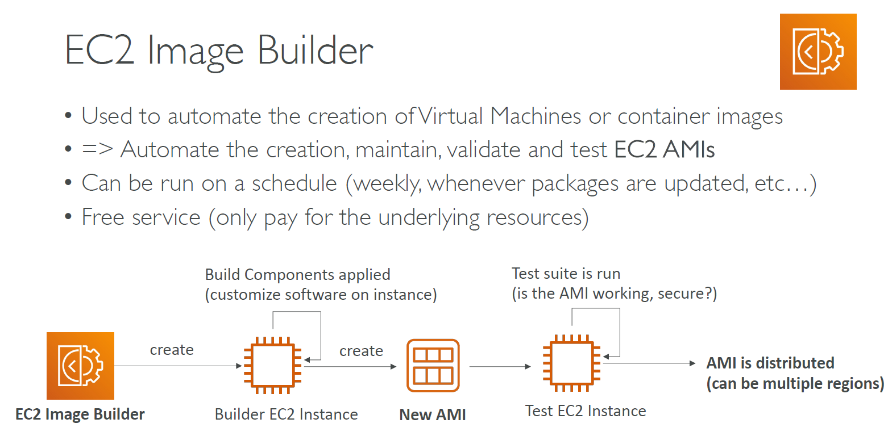
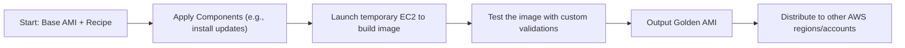

# 🏗️🖼️ **Amazon EC2 Image Builder: Automate Your Golden AMIs**

**Amazon EC2 Image Builder** is a fully managed AWS service that helps you **automate the creation, maintenance, validation, and testing of Amazon Machine Images (AMIs)** — ensuring that your VM images are secure, up to date, and consistent across environments.

---

  

---

## 🎯 **Why Use EC2 Image Builder?**

| ✅ Benefit                       | 📌 Description                                              |
| -------------------------------- | ----------------------------------------------------------- |
| 🔄 **Automates image creation**  | Regularly build and patch AMIs with latest updates          |
| 🔐 **Improves security**         | Automatically include latest OS and app patches             |
| 📦 **Standardizes environments** | Enforce consistent software and configuration across fleets |
| ⚙️ **Integrates easily**         | Works with EC2, Systems Manager, CodePipeline, and more     |

---

## 🧱 **Core Components**

| Component                 | Description                                                  |
| ------------------------- | ------------------------------------------------------------ |
| **Image Recipe**          | Blueprint defining base AMI + software packages              |
| **Component**             | Scripts or commands (e.g., install Apache, run updates)      |
| **Pipeline**              | Defines the full automation flow (build → test → distribute) |
| **Infrastructure Config** | Details like instance type, subnet, IAM role for the build   |
| **Distribution Config**   | Regions and accounts to share the image with                 |

---

## ⚙️ **How It Works (Simplified)**

  

---

---

## 🔄 **Build Triggers**

- 🕓 **Scheduled (e.g., weekly builds)**
- ✏️ **Manual build trigger**
- 🚨 **Change-based (e.g., new patch released)**

---

## 🔐 **Security Features**

- Integration with **AWS KMS** for encryption
- Builds run in **temporary isolated EC2 instances**
- Supports **image signing** to verify AMI authenticity
- Includes **automated testing** stages to validate hardening

---

## 📦 **Typical Use Case Examples**

| Scenario                                       | Image Builder Benefit                   |
| ---------------------------------------------- | --------------------------------------- |
| Create hardened base images monthly            | Schedule patching + validation          |
| Distribute pre-configured AMIs across accounts | Use cross-account sharing               |
| Enforce security tools on all EC2 instances    | Add in antivirus, agents, audit configs |
| Minimize drift from base image                 | Regular refresh ensures consistency     |

---

## 🚀 Getting Started

1. Go to **EC2 → Image Builder** in the AWS Console
2. Create an **Image Recipe** (choose base OS + components)
3. Define **Build Pipeline** (infrastructure, test, distribution)
4. Launch your first build!

---

## 🧠 Summary

| Feature                     | Description                                         |
| --------------------------- | --------------------------------------------------- |
| 🔄 Automated Image Pipeline | Create & update AMIs on schedule                    |
| 🧩 Customizable Components  | Install packages, configure OS, run hardening steps |
| 🧪 Integrated Testing       | Verify the image before using                       |
| 🚀 Easy Distribution        | Share AMIs across regions/accounts                  |
| 🔐 Security-First           | Encrypted, signed, tested AMIs                      |
