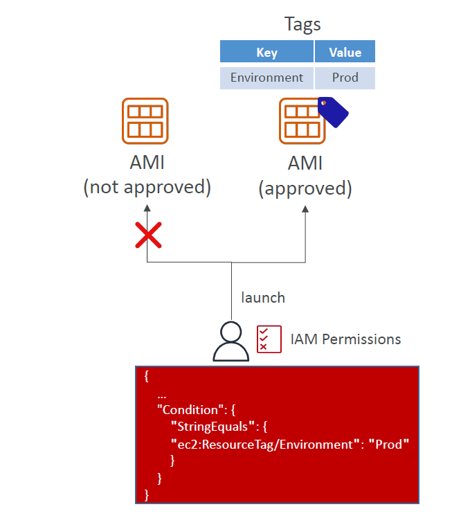
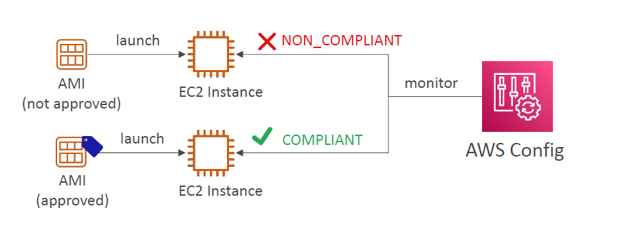

# ✅ **Using Approved AMIs for Production EC2 Instances**

> _Control what images are used in your production environment using tags, IAM policies, and AWS Config compliance checks._

---

## 🧱 **Why Control AMI Usage in Production?**

Using **unapproved AMIs** in production can lead to:

- 🛡️ Security vulnerabilities
- ⚠️ Configuration drift
- ❌ Compliance violations

You should enforce launching EC2s **only** from **approved AMIs**, especially in regulated or mission-critical workloads.

---

## 🏷️ **1. Restriction using AMIs Tags**

### 1️⃣ **Tag AMIs as “Approved”**

- Tag key: `Environment`
- Tag value: `Prod`

#### ✅ Example

| Key         | Value |
| ----------- | ----- |
| Environment | Prod  |

Only AMIs with this tag should be allowed for use in production.

---

### 2️⃣ **IAM Policy to Enforce AMI Tag Restriction**

Use IAM policy conditions to restrict launching EC2s unless the AMI has the correct tag.

#### 🧾 Sample Policy Condition

```json
{
  "Condition": {
    "StringEquals": {
      "ec2:ResourceTag/Environment": "Prod"
    }
  }
}
```

#### 🔐 Result

- ✅ User can launch EC2 from **approved** AMIs
- ❌ Launch from **non-approved** AMIs is blocked

#### 🧭 Diagram

<div style="text-align: center;">
    
</div>

---

## 📋 **2. Restriction using AWS Config**

Use **AWS Config** to continuously monitor whether running EC2 instances were launched from approved AMIs.

### ✅ Behavior

- EC2 with tag-matching AMI → ✅ `COMPLIANT`
- EC2 with unknown/unapproved AMI → ❌ `NON_COMPLIANT`

### 🔍 Example Use Case

- Find all EC2s that were **manually launched** with outdated or unverified AMIs.

### 🔍 Diagram

<div style="text-align: center;">
    
</div>

---

## ✅ Summary Table

| Feature               | Description                              | Tool       |
| --------------------- | ---------------------------------------- | ---------- |
| Tag enforcement       | Only launch EC2s from AMIs tagged `Prod` | IAM Policy |
| Compliance monitoring | Detect unauthorized AMI usage in EC2s    | AWS Config |
| Remediation action    | Manual or automated alert/removal        | Lambda/SNS |

---

## 🛡️ Best Practices

- 🔐 Apply IAM restrictions to **prod-only IAM roles**
- 🧪 Use AWS Config rules like `approved-amis-by-id` or `approved-amis-by-tag`
- 📬 Integrate with **SNS** to alert on non-compliant launches
- 🔁 Periodically audit and **retire unused/unapproved AMIs**
