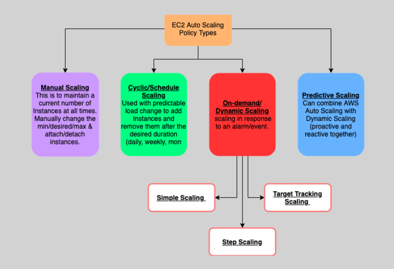
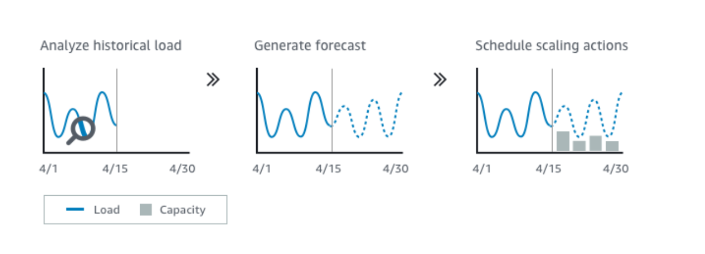
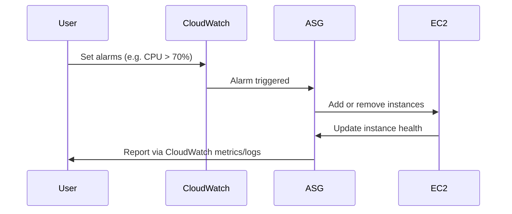
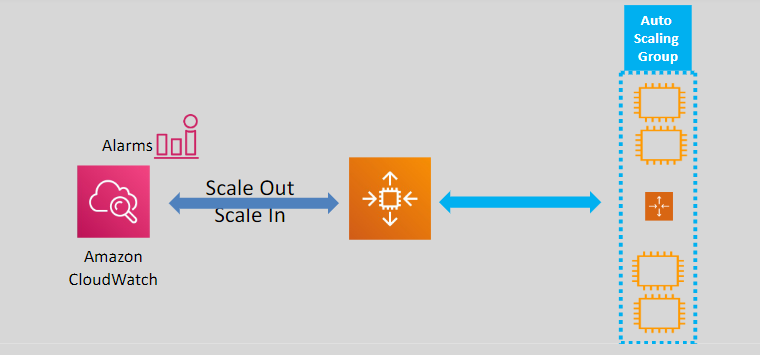
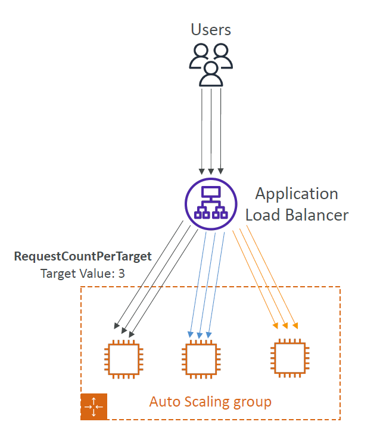

# **🔄 Auto Scaling Policies**

Auto Scaling in AWS ensures that your application has the **right number of EC2 instances** at the right time—automatically adjusting to changing load. Whether you're running a traffic-heavy website, a dynamic backend API, or a batch job processor, **Auto Scaling policies** let you balance **performance**, **cost**, and **resilience** effortlessly.

---

## **🧠 What Are Auto Scaling Policies?**

Auto Scaling policies define **how and when** your **Auto Scaling Groups (ASGs)** should **scale in (remove)** or **scale out (add)** EC2 instances based on various triggers like **metrics**, **schedules**, or even **machine learning predictions**.

    

---

## **🤹 Types of Auto Scaling Policies**

### **🧍 Manual Scaling** (_User-Based_)

- You manually adjust the desired capacity of your Auto Scaling Group.
- Good for one-time scale adjustments (e.g., pre-launch boost).

---

### **📆 Scheduled Scaling** (_Time-Based_)

- Schedule actions at specific times of day or week.
- Great for **predictable workloads**, such as **business hours traffic**.
- 🕘 Example: Scale out to 10 instances at 9 AM; scale in to 2 at 6 PM.

---

### **⚡ Dynamic Scaling** (_Metric-Based_)

Triggered by **CloudWatch alarms**, this automatically adjusts capacity in response to real-time metrics (e.g., CPU usage).

#### **1️⃣ Simple Scaling**

- Executes a single scaling action per alarm.
- 🧪 Example: If CPU > 70%, add 1 instance.

#### **2️⃣ Step Scaling**

- Multiple scaling steps depending on how far a metric deviates from a threshold.
- 📊 Example:
  - CPU > 70% → +1 instance
  - CPU > 80% → +2 instances
  - CPU < 40% → -1 instance

#### **3️⃣ Target Tracking Scaling**

- "Thermostat-style" policy.
- You define a target metric (like 50% CPU), and AWS adjusts the instance count to maintain it.
- 🧠 AWS recommends this as the default dynamic policy for most use cases.

---

### **🔮 Predictive Scaling**

Uses **machine learning** to analyze historic traffic trends and **predict** future demand, scaling **proactively**.

- 🧬 Learns from CloudWatch data (minimum 24 hours of history required)
- 🧑‍💼 Ideal for cyclical patterns like weekday traffic spikes
- ⏱️ Reduces cold starts and latency by **scaling before** the spike hits

---

    

---

## **⚙️ How Dynamic Scaling Works**

---

    

---

## 🎯 **Good metrics to scale on**

- **CPUUtilization**: Average CPU utilization across your instances
- **RequestCountPerTarget**: to make sure the number of requests per EC2 instances is stable
- **Average Network In / Out** (if you’re application is network bound)
- **Any custom metric** (that you push using CloudWatch)

---

    

---

## **✍️ Example Use Case – Web App with Predictable Spikes**

🕹️ Scenario: You run a web app that gets high traffic during business hours (9 AM–6 PM) and low traffic overnight.

### **Step-by-step Setup:**

1. **Initial Setup (Manual)**

   - ASG min: 2, max: 10, desired: 2

2. **Enable Target Tracking**

   - Metric: Average CPU
   - Target: 50%
   - Result: Instances scale up/down based on CPU load

3. **Enable Predictive Scaling**

   - Learns that CPU spikes at 9 AM every weekday
   - Scales out **before** the spike

4. **CloudWatch Monitoring**
   - Alarms set for CPU, network, or custom app metrics
   - Instance **warm-up period**: 5 minutes to avoid premature scale-in

---

## **🌟 Best Practices**

- 🔁 Use **Target Tracking** for most applications—simple and effective
- 🧠 Use **Predictive Scaling** for workloads with regular, cyclical patterns
- 🏷️ Tag instances for lifecycle monitoring and cost tracking
- 🔒 Use IAM roles to restrict scaling policies to authorized users
- 📊 Monitor everything with **CloudWatch Dashboards** and **AWS Budgets**

---

## **🎯 Conclusion**

AWS Auto Scaling policies give you powerful levers to **automate**, **optimize**, and **protect** your application’s compute environment. Whether you're reacting to spikes with **dynamic scaling**, planning for them with **scheduled scaling**, or predicting them with **machine learning**, Auto Scaling policies ensure your app remains resilient, performant, and cost-effective.

> Remember: Scale smart, not just fast. 😉
