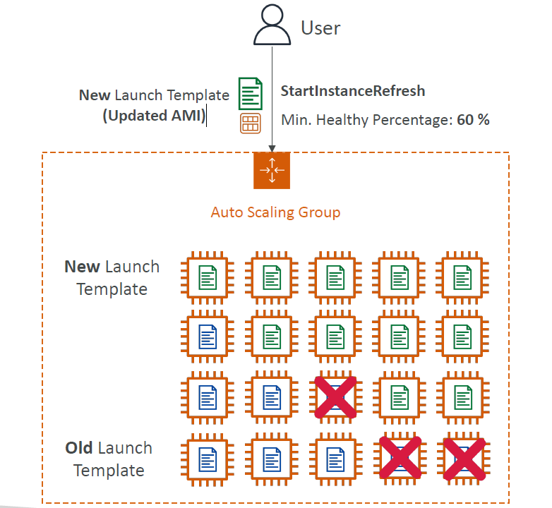

# 🔄 **EC2 Auto Scaling – Instance Refresh**

The **Instance Refresh** feature in **Amazon EC2 Auto Scaling** allows you to **automatically replace existing instances** in an Auto Scaling Group (ASG) when you **update the launch template** (e.g., with a new AMI or configuration).

---

    

---

## 🎯 **Why Use Instance Refresh?**

> Instead of manually terminating and replacing instances, Instance Refresh lets you perform **automated rolling updates** to apply new changes — **safely and with zero downtime**.

---

## ⚙️ **How It Works**

1. ✅ **You update the launch template or launch configuration** (e.g., new AMI).
2. ✅ **You trigger Instance Refresh** via the console, CLI, or API.
3. 🔁 Auto Scaling **gradually replaces instances** using the new configuration.

---

## 🧩 **Key Configuration Parameters**

| Setting                       | Description                                                                                |
| ----------------------------- | ------------------------------------------------------------------------------------------ |
| 🔧 **Min Healthy Percentage** | The percentage of instances that must remain healthy during the refresh. E.g., 60%         |
| 🕒 **Instance Warm-Up Time**  | The time Auto Scaling waits for a new instance to become healthy before moving to the next |
| 🚫 **Cancellation Support**   | You can cancel a refresh at any time                                                       |
| 🔍 **Monitoring**             | Integrated with **CloudWatch** and **AWS Health** for progress tracking                    |

---

## 🛠️ **Use Case Example**

> 🧪 You update your **AMI** with a security patch or performance tweak.

Instead of:

- ❌ Manually terminating instances
- ❌ Waiting for ASG to launch new ones

You:

- ✅ Update the launch template
- ✅ Trigger **Instance Refresh**
- ✅ Let Auto Scaling handle the rollout with **zero downtime**

---

## ✅ **Benefits**

- 🚀 **Automated rollout** of new configurations
- 🔄 **Safe replacement** of instances with health checks
- 🧘 **No service interruption** (respects your availability settings)
- 🧠 **Fully managed and monitored** via AWS Console or CLI

---

## 🧠 **Final Thought**

**Instance Refresh** simplifies how you roll out updates to EC2 Auto Scaling Groups — giving you control over **availability**, **consistency**, and **deployment safety**. It's ideal for keeping your fleets **up-to-date**, **secure**, and **high-performing**.

> Ready to modernize your instance updates? Just update the launch template and trigger the refresh!
