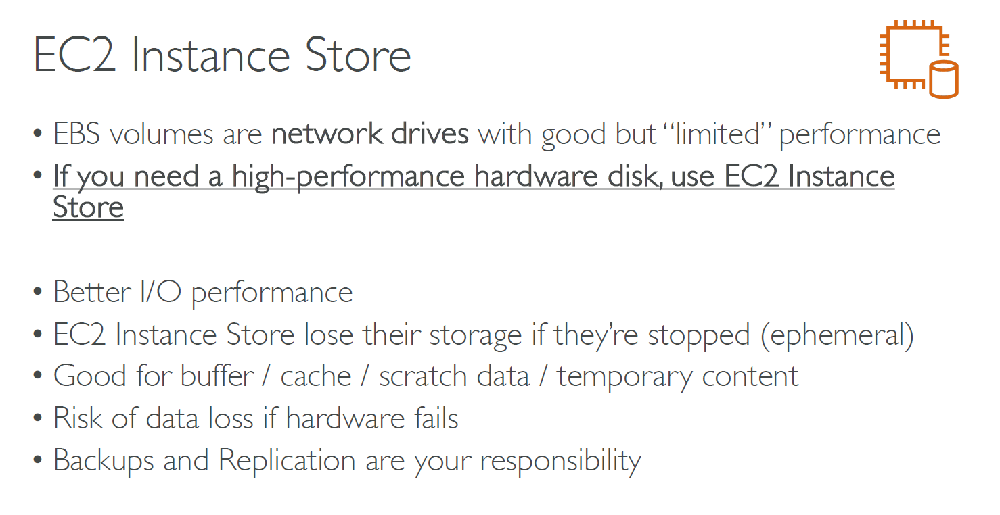
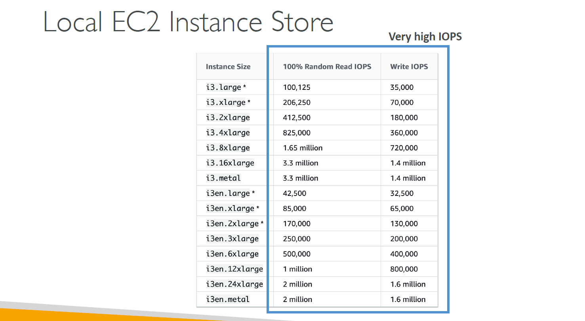

# 💽 **Amazon EC2 Instance Store (Ephemeral Storage)**

**EC2 Instance Store** provides **temporary block-level storage** for Amazon EC2 instances. It is physically attached to the host machine and offers **high IOPS**, but the data **does not persist** when:

- The instance is **stopped or terminated**
- The **underlying hardware fails**

---

  

---

  

---

## 📦 Key Characteristics

| Feature              | Description                                                   |
| -------------------- | ------------------------------------------------------------- |
| ⏱️ **Ephemeral**     | Data is lost when the instance stops or terminates            |
| ⚡ **Fast I/O**      | High-performance for temporary data like cache, buffers       |
| 🛠️ **Included**      | Comes at **no additional cost** with supported instance types |
| 📌 **Not backed up** | Cannot be used with EBS snapshots or lifecycle rules          |

---

## ✅ Use Cases

- Temporary storage (e.g., **buffers, caches, scratch space**)
- **Data processing** where the output is stored elsewhere (e.g., S3)
- High-speed storage for workloads that don't require durability

---

## ⚠️ Limitations

- ❌ No data persistence
- ❌ Not all instance types support it (e.g., newer instance families often use only EBS)
- ❌ Can't be detached or moved between instances

---

## 🔍 Example Instance Types with Instance Store

- `c5d`, `i3`, `m5d`, `r5d` → the “**d**” suffix indicates instance store support

---

## 🧠 Summary

| 🔹 Feature        | 💡 Value |
| ----------------- | -------- |
| Temporary Storage | Yes      |
| Data Persistence  | No       |
| High Performance  | Yes      |
| Backup Support    | No       |

> 🛑 Always use **Amazon S3 or EBS** for critical or persistent data.
