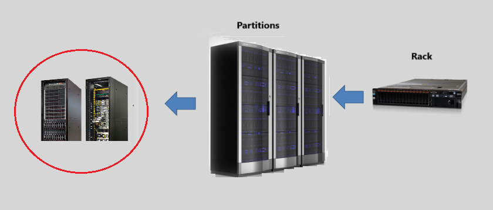
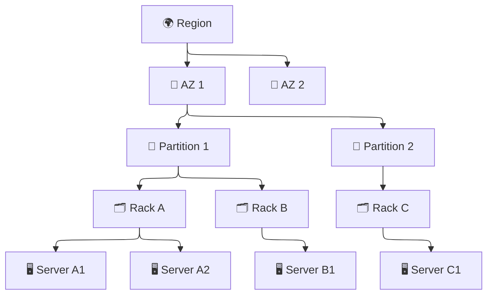

# 🏗️ **Inside AWS Availability Zones (AZ): The Physical Components Explained**

Ever wondered what's **physically inside an AZ**? What does AWS mean by “rack,” “partition,” or “hardware isolation”? Let’s open the black box and reveal what’s inside.

---

    

---

## 🧠 TL;DR Summary

| 🧱 Layer                   | 📌 Description                                                       |
| -------------------------- | -------------------------------------------------------------------- |
| **Region**                 | A geographical area (like `us-east-1`)                               |
| **AZ (Availability Zone)** | An **isolated data center** (or cluster of data centers) in a Region |
| **Partition**              | A **group of racks** designed for **hardware-level isolation**       |
| **Rack**                   | A **shelf-like cabinet** that stores many physical servers           |
| **Host (Physical Server)** | A physical machine that runs one or more EC2 instances               |

---

## 🌍 **Region vs. Availability Zone**

1. **Region** = A **geographic location** (e.g., `us-west-2`, `eu-central-1`)
2. **AZ** = An **isolated data center** or **cluster of data centers** within a Region

> - ✅ Each AZ has **independent power, networking, and cooling**
> - ✅ AZs are **physically separated**, often many kilometers apart
> - 🔁 Regions contain **2–6+ AZs** to ensure **high availability**

---

## 🧱 **What’s Inside an Availability Zone?**

Inside an AZ, AWS infrastructure is organized into **racks, servers (hosts), and partitions**.

### 📦 The Physical Layers

---

### 🧩 **1.Partition**

> A **partition** is a **hardware-isolated group of racks** within an AZ.

- ✔ Used by **Partition Placement Groups** to ensure that if one partition fails, others stay safe
- ✔ Each partition has **isolated power/networking** from others
- ✔ Up to **7 partitions per AZ**

---

### 🧱 **2.Rack**

> A **rack** is a **metal cabinet** that holds **multiple physical servers** (called **hosts**).  
> Each rack typically contains **20–40+ servers**.

💡 Think of it like a bookshelf — each shelf is a physical server.

---

### 🖥️ **3.Physical Host (Server)**

> A **host** is a **real machine** with CPU, RAM, storage, and network.  
> It runs one or more **EC2 instances** via a **hypervisor**.

🔐 AWS does not allow direct access to the physical host (except via **Dedicated Hosts**).

---

> 🔞 For Simplicity => Think The Rack == 1 physical Server (to understand how pg works in aws)

---

## 🧠 Use Case Mapping

| AWS Concept                 | Maps To…                                           |
| --------------------------- | -------------------------------------------------- |
| **EC2 Instance**            | A **virtual machine** on a server                  |
| **Dedicated Host**          | A **specific physical server** just for you        |
| **Spread Placement Group**  | EC2 instances placed on **different racks**        |
| **Cluster Placement Group** | EC2 instances on the **same rack** for low latency |
| **Partition PG**            | EC2s spread across **isolated partitions**         |

---

## 🔍 Key Facts About AZ Components

| Component     | Purpose                                      | Used In                        |
| ------------- | -------------------------------------------- | ------------------------------ |
| **Rack**      | Organizes servers physically                 | Spread PG                      |
| **Host**      | Runs your EC2 instances                      | All EC2 types                  |
| **Partition** | Fault domain to isolate failure risks        | Partition Placement Group      |
| **AZ**        | Guarantees redundancy and isolation at scale | All high-availability services |

---

## 💡 Real-World Analogy

| AWS Concept   | Real-World Equivalent               |
| ------------- | ----------------------------------- |
| AZ            | A data center building              |
| Partition     | A separate floor with its own power |
| Rack          | A server shelf inside a room        |
| Physical Host | A computer on that shelf            |
| EC2 Instance  | A guest OS running on that computer |

---

## 🔐 Bonus: Why You Should Care

Understanding the AZ internals helps with:

| ✅ Use Case                      | 🧠 Benefit                                  |
| -------------------------------- | ------------------------------------------- |
| Designing **HA architectures**   | Helps avoid single points of failure        |
| Setting up **Placement Groups**  | You’ll know when to use Spread vs Partition |
| Using **Dedicated Hosts**        | You understand what “host” means            |
| Planning for **fault tolerance** | Map app tiers across partitions/AZs         |

---

## 🏁 Conclusion

An **Availability Zone** is more than just a name — it's a **carefully structured physical environment** composed of racks, hosts, and partitions.

- ✅ **Racks** = Cabinets full of servers
- ✅ **Hosts** = Real machines that run your EC2s
- ✅ **Partitions** = Fault-isolated zones to reduce blast radius
- ✅ **AZs** = High-availability data centers in a Region
