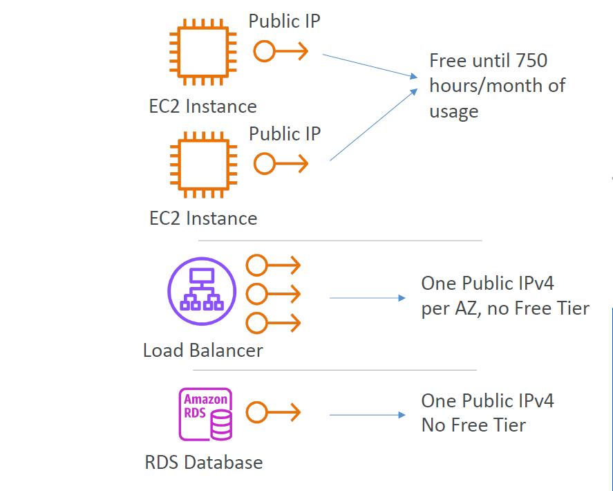

# 🧠 **Elastic Network Interfaces (ENI) & Public IP Management in AWS**

> _Master networking identity, availability strategies, and billing optimization with ENIs and Elastic IPs._

---

## 🔌 **What is an Elastic Network Interface (ENI)?**

An **ENI** is your EC2's **virtual network adapter**, containing:

- 🧾 Private and Public IP addresses
- 🔐 Security groups
- 🔀 MAC address
- 🧭 Subnet and AZ binding

ENIs allow **flexible attachment/detachment** to EC2s in the **same Availability Zone**, making them powerful for high-availability, failover, and advanced networking.

---

## 📦 **ENI Attributes Explained**

| Attribute             | Description                                                 |
| --------------------- | ----------------------------------------------------------- |
| 🆔 Primary Private IP | Mandatory IP in your subnet                                 |
| ➕ Secondary IPs      | Optional, great for hosting multiple services or containers |
| 🌐 Public IPv4        | Dynamic — changes when you stop/start the instance          |
| 📍 Elastic IP (EIP)   | Static public IP — your fixed public address                |
| 🔐 Security Groups    | Firewall rules attached to ENI                              |
| 🧲 MAC Address        | Unique to the ENI                                           |
| 🔁 Attachment         | Reusable and movable across EC2s in same AZ                 |

---

## 🔁 **ENI Lifecycle: Resilience & Flexibility**

ENIs are useful for:

- 🔄 **Failover:** Move an ENI (and IP) to another EC2 during crash
- 🧱 **Custom setups:** Frontend/backend separation via multiple ENIs
- 🛡️ **Security appliances:** Mirror traffic or apply different SGs per ENI

### ✅ Real Example

```ini
EC2-A (web server) crashes

🟢 ENI with static IP (EIP) is detached
🟢 Same ENI is attached to EC2-B
✅ Clients continue accessing your app — no DNS update needed
```

---

## 🌍 **Elastic IPs (EIPs)**

> _Elastic IPs give you a **persistent public IPv4** address in AWS._

### 📌 Key Facts

- 🔄 EC2 **Public IP changes** on stop/start
- 📍 **Elastic IP (EIP)** is **static** — stays the same until you release it
- 🔗 Can be **remapped** to another instance in the same region
- 🧠 **1 EIP = 1 instance** at a time

### 💰 EIP Billing

| 💡 Condition                   | 💸 Billed?                   |
| ------------------------------ | ---------------------------- |
| Attached to a running instance | ✅ Free                      |
| Unattached (idle Elastic IP)   | ❌ **Charged** (\~\$3.60/mo) |

### ⚠️ EIP Quotas

- 🔢 Max 5 EIPs per region (can request a quota increase)

---

## 🚀 **High Availability with Elastic IPs**

With an EIP, you can:

- ✅ Mask instance failures: Re-map EIP to another EC2 on failure
- 🔄 Do failovers manually or with automation (e.g., scripts or Lambda)
- 📌 Maintain consistent public access without DNS propagation delays

---

## 🧠 **Should You Avoid Elastic IPs?**

Sometimes, yes.

### 💡 Better Alternatives

| Option                          | Use Case                                                     |
| ------------------------------- | ------------------------------------------------------------ |
| 🌐 Dynamic Public IP + Route 53 | Attach a DNS name to the random public IP                    |
| 🧭 Elastic Load Balancer (ELB)  | Frontend traffic handler with **fixed hostname** (not an IP) |
| 🕵️ Use NAT Gateway              | Allow private EC2s to reach the internet without public IPs  |

---

## 🧪 **Quick Hands-On: Static IP via ENI**

```bash
# Step 1: Create an ENI in your subnet
aws ec2 create-network-interface \
  --subnet-id subnet-abc123 \
  --groups sg-xyz123

# Step 2: Attach it to an EC2 instance
aws ec2 attach-network-interface \
  --network-interface-id eni-abc123 \
  --instance-id i-0123456789abcdef0 \
  --device-index 1
```

---

## 🧭 **IPv6 – What’s the Deal?**

- 🌍 IPv6 is free — **no charge** for public IPv6 addresses
- 🚫 Not all ISPs support it — test yours at:
  👉 [https://test-ipv6.com/](https://test-ipv6.com/)
- 🧠 **No NAT** in IPv6 — instances have **global routable IPs**
- 🎛️ More configuration needed (SGs, custom routing, etc.)

---

## 📊 **AWS IPv4 Billing Summary (Post-Feb 2024)**

<div style="text-align: center;">
    
</div>

---

| Component       | Public IPv4 Included?               | Free Tier?                |
| --------------- | ----------------------------------- | ------------------------- |
| EC2             | ✅ 750 hours/month (12 months only) | ✅ Yes (for new accounts) |
| Load Balancer   | ❌ 1 IPv4 per AZ – always billed    | ❌ No                     |
| RDS             | ❌ 1 IPv4 per DB – always billed    | ❌ No                     |
| Idle Elastic IP | ❌ Charged per hour                 | ❌ No                     |

---

> 📎 Starting **Feb 1st, 2024**, AWS bills **\$0.005/hour** (\~\$3.60/month) per public IPv4 (including EIPs) — except during free tier.

---

## 📜 **How to Track IPv4 Charges**

1. Go to **Billing Dashboard** → “Bills”
2. Look under “Elastic IPs” and “Public IPv4”
3. Use **AWS Public IP Insights** to analyze usage
   👉 [Public IP Insights](https://docs.aws.amazon.com/vpc/latest/ipam/public-ip-insights.html)

---

## ✅ **ENI + EIP Use Case Cheat Sheet**

| 💼 Scenario                      | 🧠 Recommended Setup                               |
| -------------------------------- | -------------------------------------------------- |
| Highly Available Web Server      | ENI + EIP → attach/detach on failure               |
| Short-lived app with stable DNS  | Use Route 53 + Dynamic IP (no need for EIP)        |
| Multi-service EC2 (VPN, Proxy)   | Attach multiple ENIs (separate IPs & SGs)          |
| Cost-sensitive test/dev instance | Use Dynamic IP → avoid EIP charges when not needed |
| Backend EC2, no public access    | Skip EIP/public IP → use NAT or Bastion Host       |

---

## 🧠 Summary Tips

- 🧲 ENIs give you **modular control** over EC2 networking
- 📍 Use **Elastic IPs** only when fixed IPs are truly needed
- 🧼 Clean up **idle EIPs** to avoid hidden billing surprises
- 🧠 Think **DNS first** — not every public IP needs to be fixed
