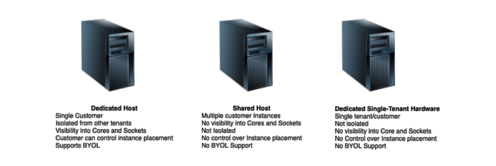

# 🫙 **Dedicated Hosts 🆚 Dedicated Instances 🆚 Shared Hosts**

> _Which EC2 deployment model fits your needs? Let’s break it down the AWS way._ 😎

---

    

---

## 🏗️ **Dedicated Hosts** – _Full Hardware Ownership_

A **Dedicated Host** gives you an **entire physical server**—yours and yours alone.

### ✅ Key Benefits

- **Full Hardware Control**: You control instance placement on the host.
- **Visibility**: Know exactly what’s running where.
- **BYOL Support**: Bring Your Own Licenses (Windows Server, SQL Server).
- **Great for Compliance**: Meets strict auditing & regulatory standards.

### 🧠 Use When

- You need **software license compliance** (e.g. Microsoft licensing).
- You must meet **strict physical isolation** or **regulatory requirements**.
- You want **control over host-level configurations**.

---

## 🏠 **Dedicated Instances** – _Isolated but Abstracted_

**Dedicated Instances** are EC2 instances that run on **hardware dedicated to your account**, but **you don't control the host**.

### ✅ Key Benefits

- **Hardware Isolation**: You don’t share with other AWS accounts.
- **Simpler than Hosts**: AWS places instances automatically.
- **Pay-as-you-go**: No need to manage physical host allocation.

### ❗ Limitations

- **No BYOL** support.
- **No host-level control** (you don’t pick what runs where).

### 🧠 Use When

- You want **hardware isolation** but don’t need visibility or control.
- You have **compliance needs** but not strict licensing constraints.

---

## 🖥️ **Shared Hosts (Default EC2)** – _Cost-Effective & Scalable_

The default EC2 deployment model—**multi-tenant physical servers**.

### ✅ Key Benefits

- **Cheapest option** 💰.
- **Fully managed by AWS**.
- **Perfect for scale-out workloads** (web servers, dev/test, batch jobs).

### ❗ Limitations

- **No isolation** from other AWS customers.
- Not suitable for strict **compliance or licensing** needs.

### 🧠 Use When

- You need **scale and savings**.
- You don’t care about who else is on the hardware.

---

## 🧾 **🆚 Quick Comparison Table**

| Feature                 | 🏗️ **Dedicated Host**          | 🏠 **Dedicated Instance**       | 🖥️ **Shared Host (Default)**      |
| ----------------------- | ------------------------------ | ------------------------------- | --------------------------------- |
| Tenant Type             | Single-tenant                  | Single-tenant                   | Multi-tenant                      |
| Hardware Control        | ✅ Yes (host-level)            | ❌ No                           | ❌ No                             |
| BYOL Support            | ✅ Yes                         | ❌ No                           | ❌ No                             |
| License Optimization    | ✅ Yes                         | ❌ No                           | ❌ No                             |
| Cost                    | 💸 Highest                     | 💵 Medium                       | 💰 Lowest                         |
| Compliance & Regulation | ✅ Best for high-compliance    | ☑️ Good for moderate compliance | ❌ Not suitable                   |
| Use Case                | Legacy apps, audits, licensing | Isolation without complexity    | Web apps, batch jobs, general use |
| Placement Control       | ✅ Full control                | ❌ Managed by AWS               | ❌ Managed by AWS                 |

---

## 💡 **Summary Cheat Sheet**

| Scenario                                  | Use This              |
| ----------------------------------------- | --------------------- |
| I need full control + BYOL                | ✅ Dedicated Host     |
| I want isolated hardware, no BYOL         | ✅ Dedicated Instance |
| I need fast, cheap, and general workloads | ✅ Shared Host        |

---

## 🏁 **Final Thoughts**

Choosing between **Dedicated Hosts**, **Dedicated Instances**, and **Shared Hosts** depends on:

- 🔐 **Security & Compliance** needs
- 🧾 **Licensing** requirements (e.g., Microsoft)
- 💰 **Cost tolerance**
- 🤖 **Workload type** (regulated vs. general-purpose)

Use **Dedicated Hosts** when precision matters, **Dedicated Instances** when isolation suffices, and **Shared Hosts** when budget wins.
