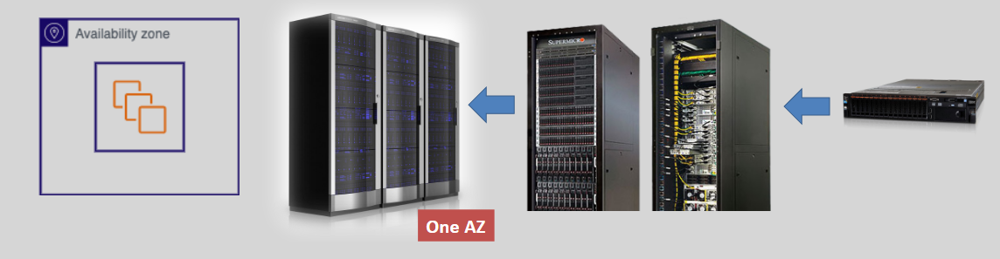
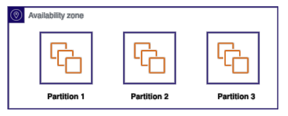
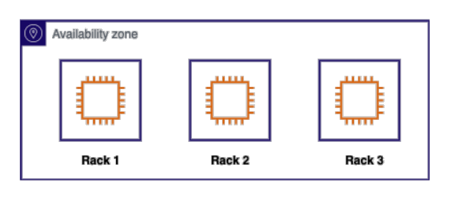

# 🧩 **EC2 Placement Groups**

_Take control of how your instances are physically placed inside AWS infrastructure._

---

## 🤔 **What Are EC2 Placement Groups?**

By default, AWS spreads your EC2 instances across racks and hardware to prevent failure of one component from impacting many instances. But **when your app needs**:

- **⚡ Super-low latency**
- **🧱 Fault isolation**
- **🔒 Full blast-radius protection**

You’ll need to choose from **three placement strategies**.

---

### 🔍 Key Concept

> “Placement Groups define how close (or far apart) EC2 instances are deployed — to optimize **performance**, **fault tolerance**, or **redundancy**.”

---

## 🧭 **Placement Group Types at a Glance**

| Purpose                      | Use This Group |
| ---------------------------- | -------------- |
| ⚡ Low-latency communication | **Cluster**    |
| 🧱 Fault-isolated zones      | **Partition**  |
| 🔒 Max blast-radius control  | **Spread**     |

---

## 1️⃣ **Cluster Placement Group** – _Performance First_ ⚡

    

---

### 🧠 What It Does

- Launches all instances **in the same Availability Zone and rack**
- Delivers **very low latency** and **high network throughput**
- Ideal when instances must **talk frequently and fast**

### 🛠️ Use Cases

- High Performance Computing (HPC)
- Real-time data analysis (e.g., video encoding, analytics engines)
- GPU-heavy ML workloads
- Rendering farms

### 📌 Quick Facts

| Key Factor       | Value                           |
| ---------------- | ------------------------------- |
| 🏗️ AZ Constraint | All in **same AZ**              |
| 🔗 Proximity     | **Same rack**                   |
| ⚠️ Failure Blast | High – rack failure affects all |

### ⚠️ **What Happens If...**

- 🔌 **The rack fails?** → All instances go down at once
- 🧩 **You launch 50 instances?** → AWS might **fail to place all** unless enough capacity is available in the same rack (fallback = error)

---

## 2️⃣ **Partition Placement Group** – _Hardware Fault Isolation_ 🧱

    

---

### 🧠 What It Does

- Splits instances into **isolated partitions** — each on its **own rack + hardware**
- Ensures failure in one partition **doesn’t affect others**
- Supports up to **7 partitions per AZ**

### 🛠️ Use Cases

- HDFS / Hadoop / Cassandra / HBase
- Kafka clusters
- Fault-tolerant distributed databases

### 📌 Quick Facts

| Key Factor         | Value                       |
| ------------------ | --------------------------- |
| 🧩 Partition Logic | Up to 7 partitions per AZ   |
| 🧱 Isolation Level | Strong (no shared hardware) |
| 🔀 Multi-AZ        | ✅ Yes (1 group per AZ)     |

### ⚠️ **What Happens If...**

- 🧮 **You launch 6 instances in a 3-partition group?**
  → They’ll be evenly distributed: 2 per partition

- 💥 **One rack fails?**
  → Only the 2 instances in that partition are affected — **others stay up!**

- 🧍 **You want full isolation?**
  → Launch 1 instance **per partition** for **maximum blast-radius reduction**

---

## 3️⃣ **Spread Placement Group** – _Maximum Resilience_ 🌐

    

---

### 🧠 What It Does

- Places each instance on a **separate rack**, each with **its own power and networking**
- Designed to **minimize failure impact** — full rack-level isolation
- Supports up to **7 instances per AZ per group**

### 🛠️ Use Cases

- Small but critical services (e.g., database quorum nodes)
- App components that **must not share hardware**
- HA setups for **core voting nodes or primary replicas**

### 📌 Quick Facts

| Key Factor        | Value                           |
| ----------------- | ------------------------------- |
| 📦 Isolation Type | **Rack-level** (max separation) |
| 🔁 Multi-AZ       | ✅ Yes                          |
| ⚠️ Limitations    | Max **7 instances per AZ**      |

### ⚠️ **What Happens If...**

- ❌ **You launch an 8th instance in the same AZ?**
  → It will **fail** – 7 per AZ is the hard limit

- 💥 **One rack fails?**
  → Only **1 instance goes down** — all others are safe

- 🧠 **You need 21 isolated instances?**
  → Spread across **3 AZs**, with 7 per AZ

---

## 📊 **Side-by-Side Comparison**

| Feature               | ⚡ Cluster             | 🧱 Partition              | 🌐 Spread                     |
| --------------------- | ---------------------- | ------------------------- | ----------------------------- |
| 🚀 AZ Scope           | Single AZ              | Multi-AZ (1 group per AZ) | Multi-AZ (1 group per AZ)     |
| 🔗 Rack Placement     | Same rack              | Separated by partition    | Separate racks (per instance) |
| 🧱 Hardware Isolation | ❌ No                  | ✅ Yes (per partition)    | ✅ Max (per instance)         |
| 🧠 Fault Tolerance    | ❌ Low                 | ✅ High                   | ✅✅ Very High                |
| 📈 Instance Limits    | Limited by AZ capacity | Up to 7 partitions per AZ | 7 instances per AZ            |
| 🧠 Ideal Use Case     | HPC, low latency apps  | Distributed fault zones   | Critical services, HA setups  |

---

## 🔄 **Can I Move Instances Between Placement Groups?**

Yes — but you must:

1. **Stop the instance**
2. Modify the **placement group attribute**
3. **Start it again**

⚠️ **Limitations**:

- Not supported by **all instance types**
- **Running instances cannot be moved**
- Spread group rules are **strictly enforced** (max 7 per AZ)

---

## 🧠 **Real-World Analogy**

| Placement Group | Think of it like...                             |
| --------------- | ----------------------------------------------- |
| Cluster         | 🚅 All your teammates in one **high-speed lab** |
| Partition       | 🧱 Each team in **a separate secure building**  |
| Spread          | 🌍 Each person in **a different city**          |

---

## 🏁 **Final Thoughts: Which Should You Use?**

| Need...                                        | Use...        |
| ---------------------------------------------- | ------------- |
| ⚡ Fast networking between instances           | **Cluster**   |
| 🧱 Failure tolerance with moderate scale       | **Partition** |
| 🌐 Max fault tolerance with small instance set | **Spread**    |

> Placement Groups = **infrastructure-level performance tuning & resilience control**.
> Pick based on what matters most: **speed**, **safety**, or **separation**.
