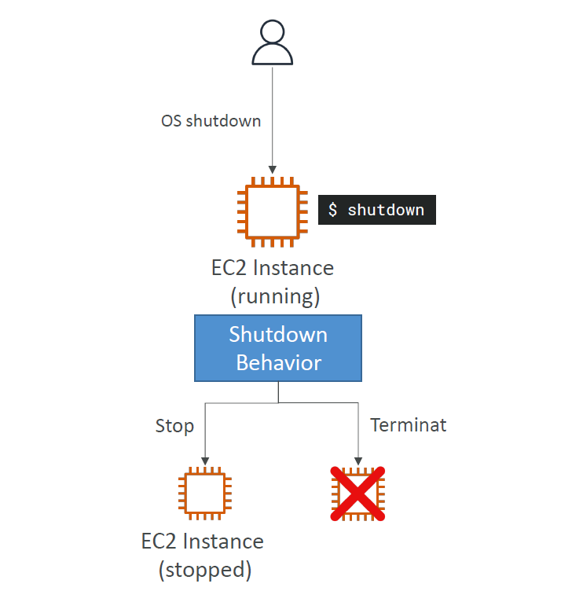

# 🔌 **EC2 Shutdown Behavior & Termination Protection**

> _Understand what happens when you shut down an EC2 instance — and how to prevent accidental terminations._

---

## 🧯 **What Is EC2 Shutdown Behavior?**

When you **shut down** an EC2 instance from **inside the operating system** (e.g., using `shutdown` or `poweroff`), AWS checks the **shutdown behavior** setting to decide what happens next.

### 📊 **Shutdown Options:**

| Behavior      | Result                                 |
| ------------- | -------------------------------------- |
| **Stop**      | ❄️ The instance is stopped (default)   |
| **Terminate** | ❌ The instance is permanently deleted |

---

### 🖼️ Visual Reference

<div style="text-align: center;">
    
</div>

---

## 🧪 **When Does This Apply?**

✅ Applies when you:

- Run `shutdown`, `init 0`, or `poweroff` **inside the instance**

🚫 Does **not** apply when:

- You stop/terminate the instance from **AWS Console** or **CLI**

---

## ⚙️ **How to Set Shutdown Behavior**

### 🟩 **Using AWS CLI:**

```bash
aws ec2 modify-instance-attribute \
  --instance-id i-0123456789abcdef0 \
  --instance-initiated-shutdown-behavior terminate
```

### 🔍 **To View Current Behavior:**

```bash
aws ec2 describe-instance-attribute \
  --instance-id i-0123456789abcdef0 \
  --attribute instanceInitiatedShutdownBehavior
```

---

## 🛡️ **Termination Protection**

You can enable **termination protection** to prevent accidental terminations from the AWS Console or CLI.

### ✅ **To Enable:**

```bash
aws ec2 modify-instance-attribute \
  --instance-id i-0123456789abcdef0 \
  --disable-api-termination
```

### 🔍 **Check Status:**

```bash
aws ec2 describe-instance-attribute \
  --instance-id i-0123456789abcdef0 \
  --attribute disableApiTermination
```

---

## ⚠️ **Important Exam Tip**

> 💡 **If the instance's shutdown behavior is set to `terminate`, and termination protection is enabled…**

### ❓What happens if you shut down from the OS?

- ✅ **Answer:** **The instance will still be terminated.**
- 🧠 Why? Because **termination protection only applies to API calls** — not to shutdowns from within the OS.

---

## 🔁 **Real-World Example**

Imagine a developer logs into an EC2 instance and runs:

```bash
sudo shutdown now
```

- If `shutdownBehavior = stop` → instance stops (safe)
- If `shutdownBehavior = terminate` → instance **will be deleted** 💥 even if there is **termination protection** enabled

---

## 🧠 Best Practices

- 🔒 Always **keep shutdown behavior as `stop`** unless you're 100% sure
- 🧪 Test termination protection on non-prod instances
- 🛑 Use `disable-api-termination` on critical systems
- 📌 Tag and label production instances for visibility and alerts
