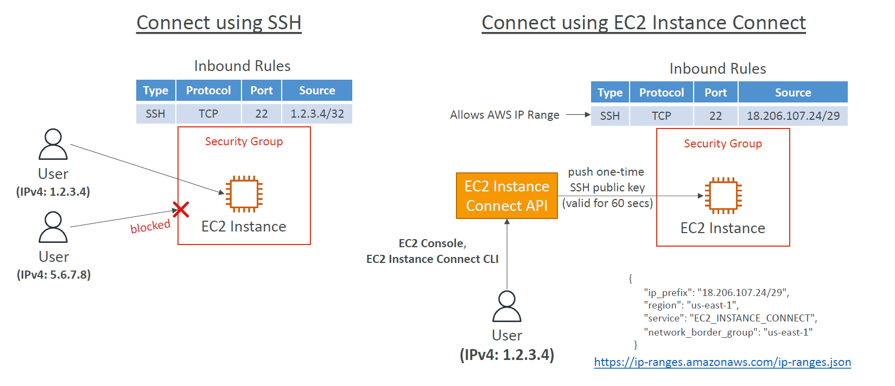

# 🛠️ **Amazon EC2 Launch & Connection Troubleshooting Guide**

> _Fix common launch errors, capacity issues, and SSH access problems with EC2._

---

## 🚨 **1. InstanceLimitExceeded**

**🔍 Error:**

```ini
InstanceLimitExceeded: You have reached your vCPU limit in this region.
```

**💡 Reason:**
You're hitting the **vCPU quota** limit for On-Demand or Spot instances in a specific region.

**✅ Resolution:**

- 📍 Launch in a **different region**
- 📤 **Request a limit increase** via AWS Service Quotas
- 🔢 View your current limits:
  Console → EC2 → **Limits** → Filter by "vCPU"

> ℹ️ **vCPU-based quotas** only apply to **running** On-Demand and Spot instances — not Stopped or Reserved ones.

---

## ⚠️ **2. InsufficientInstanceCapacity**

**🔍 Error:**

```ini
InsufficientInstanceCapacity: AWS does not have sufficient capacity to fulfill the request in this AZ.
```

**💡 Reason:**
The selected AZ doesn't currently have capacity for that instance type.

**✅ Resolution:**

- 🔁 Retry after a few minutes
- 📦 Request fewer instances at a time (e.g., 5 → 1+1+1...)
- 🔁 Try a **different AZ** within the same region
- 🔀 Use a **different instance type** and resize later

---

## ❌ **3. Instance Terminates Immediately**

**🔍 Symptom:**
EC2 instance goes from **Pending → Terminated** in seconds

**🔍 Root Causes:**

- ⚠️ EBS volume quota exceeded
- 🧊 EBS snapshot is **corrupted**
- 🔐 Root volume is **encrypted**, and you lack KMS access
- 📦 **Instance store-backed AMI** is missing part files (e.g., `image.part.xx`)

**✅ Resolution:**

- Open **EC2 Console → Instances → Description tab**
- Check **“State transition reason”** for the cause
- Validate IAM access to KMS, or verify snapshot/AMI status

---

## 🔒 **4. SSH Connection Troubleshooting**

### ✅ **Checklist:**

| ❓ **Issue**                 | 🔍 **Cause**                                                  |
| ---------------------------- | ------------------------------------------------------------- |
| 🔐 “Unprotected private key” | `.pem` file not `chmod 400`                                   |
| ⛔ “Permission denied”       | Wrong **username** (e.g., `ec2-user`, `ubuntu`, `admin`)      |
| 🔇 “Connection timed out”    | - Incorrect SG or NACL <br> - No public IP <br> - Bad routing |
| ⚠️ No traffic out of subnet  | Missing route to **Internet Gateway** (IGW)                   |
| 🧠 SSH freeze                | Instance CPU is under **stress** or pegged to 100%            |

```bash
chmod 400 my-key.pem
ssh -i my-key.pem ec2-user@<public-ip>
```

---

## 🌐 **5. EC2 Instance Connect (vs. SSH)**

<div style="text-align: center;">
    
</div>

---

| Feature                    | SSH              | EC2 Instance Connect              |
| -------------------------- | ---------------- | --------------------------------- |
| Uses `.pem` file           | ✅ Yes           | ❌ No need                        |
| Needs port 22 open to user | ✅ Yes (your IP) | ❌ No (just allow AWS IP range)   |
| Web console access         | ❌ No            | ✅ Yes                            |
| Good for temporary access  | ❌ Not ideal     | ✅ Auto-expiring public key (60s) |

**EC2 Connect Requirements:**

- Security Group must allow:

  ```ini
  Source: 18.206.107.24/29
  Port: TCP 22
  ```

- Uses the EC2 Connect API to **push a temporary public key**

  > 📘 Full list of IP ranges:
  > [https://ip-ranges.amazonaws.com/ip-ranges.json](https://ip-ranges.amazonaws.com/ip-ranges.json)

---

## 🧠 **Pro Tips**

- 🧪 **Test connectivity** with `telnet <public-ip> 22` or `nc -vz`
- 🛡️ **Restrict SSH** access using `/32` CIDR for trusted IPs only
- 💬 Use **EC2 Session Manager** if no SSH or public IP is allowed
- 🧭 Place new EC2s in **public subnets** if you expect external SSH
