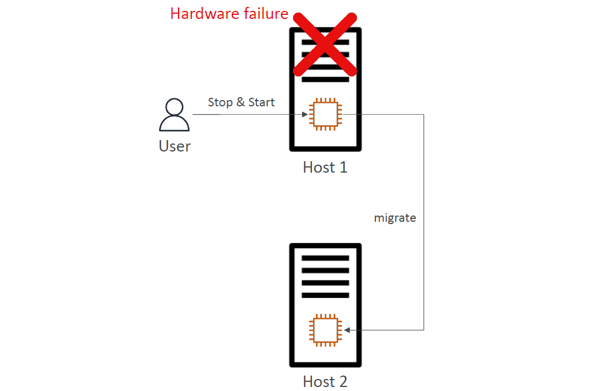
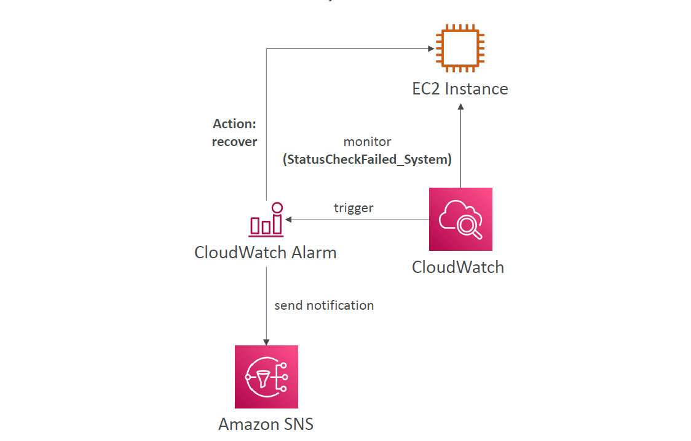

# 🧠 **EC2 Status Checks – Automated Monitoring for Hardware & Software Issues**

> _EC2 status checks help you automatically identify issues with both the underlying hardware and the instance configuration, ensuring reliability and recovery without manual intervention._

---

## ✅ **What Are Status Checks in EC2?**

**EC2 Status Checks** are automated diagnostic tools that continuously monitor the health of your instances. AWS performs these checks to help identify:

1. **Hardware failures** (e.g., host issues)
2. **Software issues** (e.g., misconfigurations or memory exhaustion)
3. **Attached EBS volume health** (e.g., connectivity issues)

### **Types of EC2 Status Checks**

1. **System Status Check**
2. **Instance Status Check**
3. **Attached EBS Status Check**

---

## 🛠️ **1. System Status Check**

- **Purpose:** Monitors AWS's **infrastructure-level health** (hardware, power, hypervisor, etc.).
- **What It Detects:**

  - Hardware failures (e.g., power loss, physical server failure)
  - Hypervisor issues (software problems with the underlying AWS systems)

- **Resolution:**

  - **Stop and Start** the instance to migrate it to a **new host**.
  - Check the **Personal Health Dashboard** for AWS-provided maintenance or system failures.

**Example Behavior:**
If a hardware failure is detected in the physical host where your EC2 instance is running, AWS migrates the instance to a new host automatically after a **stop and start**.

  

---

## 🧑‍💻 **2. Instance Status Check**

- **Purpose:** Monitors the **software** and **network configuration** of your EC2 instance.
- **What It Detects:**

  - **Network configuration issues** (e.g., misconfigured VPC, subnets, security groups)
  - **Exhausted memory** or other OS-level problems

- **Resolution:**

  - **Reboot** the instance to resolve software crashes or network issues.
  - If needed, **change instance configuration** (e.g., adjust memory, resize instance).

**Example Behavior:**
If your EC2 instance fails due to an exhausted memory condition, a reboot can resolve the issue by restarting the instance and clearing memory.

---

## 💾 **3. Attached EBS Status Check**

- **Purpose:** Monitors the health of the **attached EBS volumes**.

- **What It Detects:**

  - **Reachability issues** (e.g., volume is not reachable, I/O operations failure)
  - **Corrupt or failed volumes**

- **Resolution:**

  - **Reboot** the EC2 instance to re-establish the connection to EBS volumes.
  - **Replace** or detach the problematic EBS volume.

---

## 📊 **CloudWatch Metrics for Status Checks**

To monitor EC2 instance health, AWS provides **CloudWatch metrics** that track the status of EC2 instances and attached resources.

### 🧠 Key CloudWatch Metrics

- `StatusCheckFailed_System`: AWS system-level failure (hypervisor or hardware failure)
- `StatusCheckFailed_Instance`: EC2 software or configuration failure
- `StatusCheckFailed_AttachedEBS`: Failure in the attached EBS volumes
- `StatusCheckFailed`: General status check failure (combines all three)

> CloudWatch metrics are collected at a **1-minute interval** for accurate and timely detection.

---

## 🚨 **Recovering from Status Check Failures**

### 🔧 **Option 1: CloudWatch Alarm for Recovery**

**Action:**

- **Trigger an EC2 instance recovery action** (auto-recovery) when a **System Status Check** fails.
- **Recover** the instance while maintaining the same private/public IP, **Elastic IP** (EIP), and metadata.

**CloudWatch Alarm Workflow:**

1. Monitor `StatusCheckFailed_System` using a CloudWatch alarm.
2. Trigger recovery action if the alarm is triggered.
3. **Send notifications** via Amazon SNS to alert administrators.

**Diagram:**

    

---

### 🔧 **Option 2: Auto Scaling Group for Recovery**

**Action:**

- If the EC2 instance fails (e.g., `StatusCheckFailed_Instance`), you can configure an **Auto Scaling Group** to:

  - **Launch a new instance** to replace the unhealthy one.
  - **Keep the same number of instances** based on the desired capacity.

**Key Points:**

- **Auto Scaling** can automatically replace unhealthy instances.
- **Instance IPs (Private/EIP)** will not be preserved, but the instance will be replaced to meet the required capacity.

**Important:**
Use Auto Scaling when you want to **replace** failed instances but **don’t need to preserve IP addresses**.

---

## 📈 **CloudWatch Alarm and SNS Notification Example**

1. **Create a CloudWatch Alarm** for `StatusCheckFailed_System` or `StatusCheckFailed_Instance`.
2. Set the alarm to trigger an **auto-recovery** or **notify** via SNS.
3. **SNS** sends a notification to admins, which can be directed to systems like:

   - Email 📧
   - SMS 📱
   - Slack 🧑‍💻
   - Other integrations

---

## 💡 **Best Practices for EC2 Health Management**

- **Regularly check** the **Personal Health Dashboard** for upcoming AWS system maintenance that might affect your EC2 instance.
- **Use CloudWatch Alarms** to **automatically recover** instances or **notify** admins when hardware or software failures occur.
- **Test your recovery** actions regularly to ensure they’re functioning as expected in case of real failures.
- **Consider Auto Scaling Groups** for high-availability architectures where automatic replacement of instances is required.

---

## 🎓 **Why Is This Important for the AWS SOA-C03 Exam?**

**Status Checks** will likely appear in questions regarding:

- How to **recover from hardware/software failures** using AWS services.
- How to **set up automated responses** to system failures (using **CloudWatch Alarms** and **SNS**).
- Understanding the **types of failures** and how to resolve them (using **Auto Scaling** or manual recovery actions).

Expect questions like:

> **Question**: You have an EC2 instance in a production environment that experienced a **hardware failure**. What action should you take to ensure minimal downtime and preserve the instance’s private/public IP?

**✅ Answer:**

- **Action:** Stop and start the instance to migrate to another host. Optionally, set up **CloudWatch Alarms** for auto-recovery.
