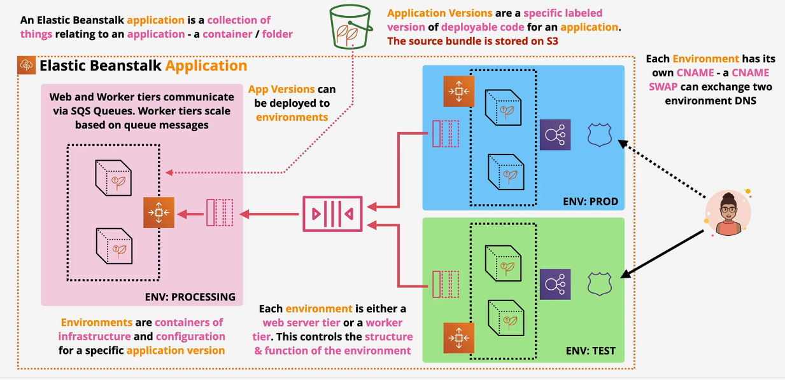
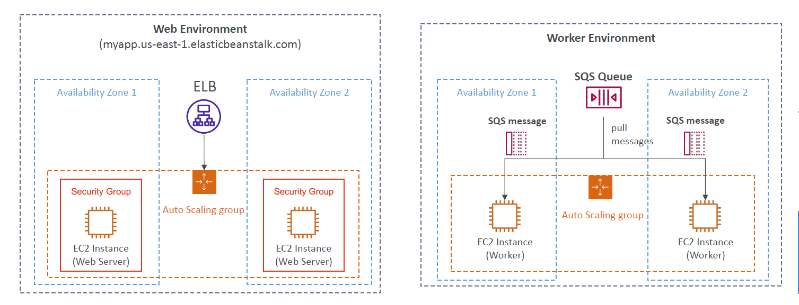
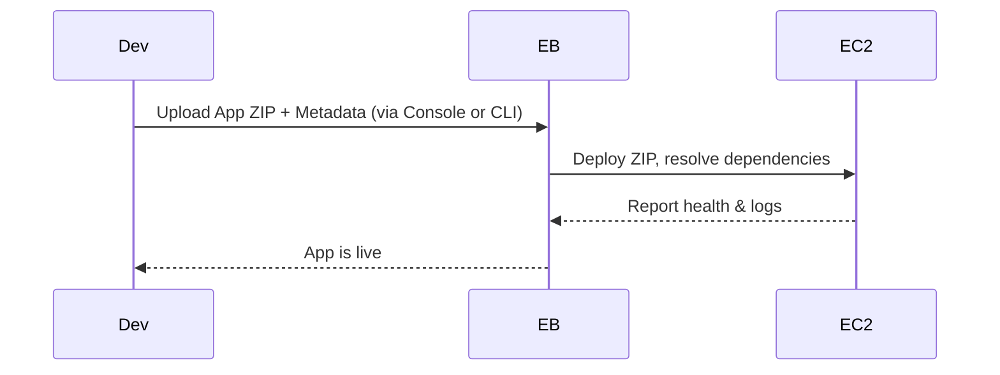

# 🌱 **AWS Elastic Beanstalk – Complete Guide for Developers**

> A developer-friendly **Platform-as-a-Service (PaaS)** on AWS that deploys and runs your web apps or background workers — **no infrastructure knowledge needed**.

  

---

## 🌍 **What Is Elastic Beanstalk?**

Elastic Beanstalk (**EB**) helps you:

- Deploy web apps or worker jobs in minutes
- Avoid writing IaC to spin up EC2, ALB, ASG, RDS, etc.
- Focus on your **code**, not your **infrastructure**

It provisions and manages:

- ✅ EC2 instances
- ✅ Load Balancers
- ✅ Auto Scaling Groups
- ✅ IAM roles, CloudWatch, and Logs

> 🧠 You just **zip and deploy your app**, and EB handles the rest.

---

## 📚 **Core Concepts in EB**

| Concept                 | Explanation                                              |
| ----------------------- | -------------------------------------------------------- |
| **Application**         | A container for app versions and environments            |
| **Application Version** | A snapshot of your deployable app code (ZIP/Docker)      |
| **Environment**         | A collection of AWS resources running a specific version |
| **Platform**            | OS + language runtime (Node.js, .NET, Java, etc.)        |
| **Environment Tier**    | Defines the type of app workload (Web or Worker)         |

---

## 🧠 **Environment Tiers**

  

---

| Tier Type      | Purpose                                     | Example Use Case          |
| -------------- | ------------------------------------------- | ------------------------- |
| 🌐 Web Tier    | Handles HTTP(S) requests with Load Balancer | Deploy a frontend or API  |
| ⚙️ Worker Tier | Polls an SQS queue and runs jobs            | Background task processor |

---

> 🧠 **Web Tier** environments expose a URL and sit behind a Load Balancer.
>
> 🧠 **Worker Tier** environments pull messages from an SQS queue and run tasks (no public endpoint).
>
> - Scale based on the number of SQS messages
> - Can push messages to SQS queue from another Web Server Tier

---

### 🎯 Common Use Case Combo

- Deploy a **frontend app** with a **Web Tier**
- Deploy a **background processor** with a **Worker Tier**
- Connect both through **SQS + IAM roles**

---

## 🏗️ **Environment Types**

| Type                               | Best For                   |
| ---------------------------------- | -------------------------- |
| 💻 **Single Instance**             | Dev/testing (low cost)     |
| 🧩 **Load-Balanced & Auto-Scaled** | Production-ready workloads |
| ⚙️ **Worker Auto-Scaled**          | Background processing apps |

---

## 📦 **Elastic Beanstalk Deployment Process**

> 🛠️ You package your code → upload a ZIP → EB deploys it to EC2 and starts your app

### 👣 Deployment Workflow

### 🔧 Language-Specific Files

| Language | Dependency File    |
| -------- | ------------------ |
| Python   | `requirements.txt` |
| Node.js  | `package.json`     |

### 🧰 Methods

| Method  | How It Works                           |
| ------- | -------------------------------------- |
| Console | Upload `.zip` manually                 |
| EB CLI  | Run `eb deploy` – uploads & deploys    |
| CI/CD   | Automate ZIP upload + `eb deploy` call |

---

## 🧑‍💻 **Elastic Beanstalk CLI (EB CLI)**

> A powerful tool to **create, manage, and monitor** your EB apps from the terminal

### ✅ Common Commands

| Command        | Purpose                         |
| -------------- | ------------------------------- |
| `eb init`      | Configure app and platform      |
| `eb create`    | Create new environment          |
| `eb deploy`    | Deploy app version              |
| `eb status`    | Show environment status         |
| `eb health`    | Display instance health summary |
| `eb events`    | Show recent EB events           |
| `eb logs`      | Fetch application logs          |
| `eb open`      | Open app URL in browser         |
| `eb config`    | View/edit environment config    |
| `eb terminate` | Delete environment              |

> 🧠 Helpful for **manual deployments** or as part of **automated scripts** in your pipeline

---

## 🔁 **Application Version Lifecycle Policy**

> 📦 EB stores every ZIP file you deploy as an **Application Version** (max 1000)

### 🔄 Why It Matters

- Exceeding the limit = **deployment failures**
- Old versions pile up in **S3 & EB console**

### 🧹 Policy Options

| Policy Type     | Description                                 |
| --------------- | ------------------------------------------- |
| 🕒 Time-based   | Delete versions older than X days           |
| 📦 Count-based  | Keep only the latest N versions             |
| 🔐 Safe Mode    | **Active versions never deleted**           |
| ☁️ S3 Retention | Choose whether to delete ZIP from S3 or not |

---

## 🔧 Platform Support Highlights

| Language / Runtime     | Notes                          |
| ---------------------- | ------------------------------ |
| Node.js, Python, Ruby  | Prebuilt platforms             |
| Java, .NET (Linux/Win) | JVM or .NET Core/.NET 6+       |
| Docker (Single/Multi)  | Bring your own container logic |
| Go                     | Native support                 |
| Custom Platform        | Built with **Packer**          |

---

## ⚙️ Key Features Developers Love

| Feature                   | Why It Matters                              |
| ------------------------- | ------------------------------------------- |
| 🚀 One-click Deploy       | Use CLI, Console, or GitHub Actions         |
| 🔁 Blue/Green Deployments | Swap CNAMEs between staging and prod safely |
| ⚙️ Managed Infra          | Load Balancers, EC2, ASG — auto-managed     |
| 📊 Monitoring & Logs      | Built-in health checks & CloudWatch streams |
| 🧩 `.ebextensions`        | Fine-grained config customization           |
| 📂 Multiple Environments  | Easily create dev / staging / prod          |

---

## ✅ **When to Use Elastic Beanstalk**

| Ideal For                           | Not Ideal For                               |
| ----------------------------------- | ------------------------------------------- |
| 🚀 Startups and solo developers     | 🏢 Large teams needing fine-grained control |
| 🧠 Quick PaaS deployments on AWS    | 🔍 Advanced ECS/Fargate tuning needed       |
| ⚙️ Legacy monoliths moving to cloud | ☁️ Complex microservices architecture       |
| 🧪 MVPs, internal tools, hackathons | 🎯 Multi-cloud portability required         |

> 🛑 **Warning**: If you use RDS _inside_ your EB environment, it will be **deleted** with the environment!

---

## 📊 Pros vs Cons

| ✅ Pros                              | ❌ Cons                                 |
| ------------------------------------ | --------------------------------------- |
| Easy deploy → scale → manage         | Less control than ECS/EKS               |
| Blue/Green, rollback, multi-env      | Not suitable for microservices mesh     |
| Supports many platforms (and Docker) | App-specific infra — less flexible      |
| Great for full-stack bootstraps      | RDS tied to env can be risky if deleted |

---

## 📌 Exam Tips & Real-World Takeaways

| Concept           | Remember                                |
| ----------------- | --------------------------------------- |
| Environment Tier  | Web = HTTP, Worker = SQS                |
| Deployment Format | ZIP file with `requirements.txt` etc    |
| Lifecycle Policy  | Set it to avoid version bloat           |
| EB CLI            | Great for teams & CI/CD pipelines       |
| Platform Support  | Use Docker or custom platform if needed |
