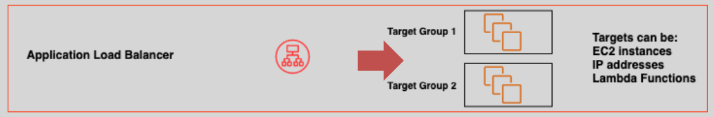
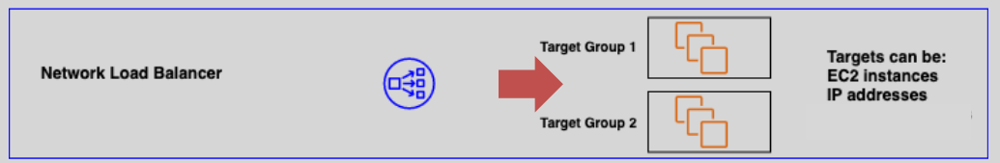

# 🔄 ELB Types and Their Key Differences

Elastic Load Balancing (ELB) supports multiple types of load balancers, each optimized for specific use cases, protocols, and workloads. Below, we explore the **four types of ELBs**—CLB, ALB, NLB, and GWLB—by diving into how each works, their architectures, supported protocols, and use cases.

---

## **🌐 1. Classic Load Balancer (CLB)**

  

---

### 💡 Key

- **Layers**: Layer 4 (TCP) & Layer 7 (HTTP/HTTPS)
- **Target Type**: EC2 instances **only**
- **Legacy**: It’s AWS’s original load balancer, now largely superseded by ALB and NLB
- **Health Checks**: Basic TCP or HTTP checks

### ✨ Features

- Basic load balancing capabilities.
- Limited routing features compared to newer ELB types.
- No support for container-based workloads.
- No native integration with AWS Auto Scaling or EC2 Container Service (ECS).

### ⚙️ Internals

- Directs traffic to registered EC2 instances.
- No support for containers, microservices, or path-based routing.
- Each listener can only route to a **single backend pool**.

### ✅ Use Cases

- Legacy applications
- Monolithic apps not requiring advanced routing features

---

## **🔥 2. Application Load Balancer (ALB)**

  

---

### 💡 Key

- **Layers**: **Layer 7**(Application – HTTP/HTTPS)
- **Target Type**: Target Groups (**EC2**, **ECS tasks**, **Lambda**, **IPs**)
- **Routing Features**: **Host-based**, **path-based**, **query-string-based**
- **Health Checks**: Configurable **per target group**

### ✨ Features

- Provides **content-based routing**, meaning you can route requests based on URL paths or host names.
- Supports WebSocket and HTTP/2 for improved performance.
- Native support for containerized applications via ECS.
- Enhanced routing capabilities such as path-based routing, host-based routing, and query string-based routing.

### ⚙️ Internals

- Uses listeners and rules to route HTTP requests intelligently.
- Listeners match **host headers**, **paths**, **HTTP methods**, or **query strings**.
- Native support for **WebSocket** and **HTTP/2**.
- Supports **containerized workloads** via ECS with dynamic port mapping.

### ✅ Use Cases

- Microservices
- Containerized applications
- Dynamic web apps needing granular routing logic

---

## **⚡ 3. Network Load Balancer (NLB)**

  

---

### 💡 Keys

- **Layers**: Layer 4 (Transport – TCP/UDP/TLS)
- **Target Type**: Target Groups (EC2, IPs, Lambda)
- **Routing Mechanism**: Flow Hash (source/destination IP:Port)
- **Latency**: Microsecond-level

### ✨ Features

- Extremely **low latency** and **high throughput**.
- **Static IP support**, making it ideal for applications that require a fixed IP address.
- Supports **TLS termination**, allowing for secure communication between clients and your application.
- Ideal for applications that require high availability and need to handle volatile traffic patterns.

### ⚙️ Internals

- Allocates **Elastic IPs (EIPs)** for each AZ.
- TLS termination and **pass-through mode** supported.
- Directly preserves the client source IP (ideal for security and analytics).

### ✅ Use Cases

- Real-time gaming
- Financial trading platforms
- IoT and high-performance APIs

---

## **🔐 4. Gateway Load Balancer (GWLB)**

  

---

### 💡 Keys

- **Layers**: Layer 3/4 (Generic IP forwarding)
- **Target Type**: Security appliances (e.g., firewalls, IDS/IPS)
- **Key Protocol**: GENEVE encapsulation (port 6081)

### ✨ Features

- Allows seamless integration of third-party security appliances for network traffic inspection.
- Supports **automatic scaling** based on traffic requirements.
- Commonly used to support **hybrid cloud architectures** and **secure network traffic**.

### ⚙️ Internals

- Acts as a transparent middlebox for inline inspection of network traffic.
- Integrates with **third-party appliances** and allows autoscaling and high availability.
- Used alongside **Gateway Load Balancer Endpoints (GWLBe)** for VPC service chaining.

### ✅ Use Cases

- Centralized traffic inspection
- Inline threat detection
- Compliance and security monitoring

---

## **📊 ELB Comparison Table**

| Feature / ELB Type     | CLB               | ALB                                  | NLB                                | GWLB                                |
| ---------------------- | ----------------- | ------------------------------------ | ---------------------------------- | ----------------------------------- |
| **Layer**              | L4/L7             | L7                                   | L4                                 | L3/L4                               |
| **Protocol Support**   | HTTP, HTTPS, TCP  | HTTP, HTTPS                          | TCP, UDP, TLS                      | Any (GENEVE for traffic forwarding) |
| **Routing Logic**      | Basic Round Robin | Path-based, Host-based, Header rules | Flow Hash                          | Transparent network forwarding      |
| **Target Types**       | EC2 only          | EC2, IP, Lambda, Containers          | EC2, IP, Lambda                    | Security appliances                 |
| **Use Case**           | Legacy apps       | Web apps, APIs, microservices        | High-performance, low-latency apps | Inline security appliances          |
| **Preserve Source IP** | ❌                | ❌                                   | ✅                                 | ✅                                  |
| **WebSocket Support**  | ❌                | ✅                                   | ❌                                 | ❌                                  |
| **TLS Termination**    | ✅ (limited)      | ✅                                   | ✅                                 | ❌                                  |

### ‼️ Notes

#### 🔍 1. **Preserve Source IP**

- ✅ **Means:** The **real IP address of the client** is passed to the target (like your EC2).
- ❌ **If not preserved:** The client’s IP appears as the load balancer’s IP — not useful for logging, geolocation, or firewall rules.

  > ✅ **NLB & GWLB preserve it**, while **ALB & CLB do not** (unless you extract it via headers like `X-Forwarded-For`).

#### 🔐 2. **TLS Termination**

- ✅ **Means:** The **load balancer decrypts HTTPS traffic** (TLS/SSL) before sending it to the backend.
- ❌ **If not terminated:** The traffic remains encrypted all the way to the backend, which must decrypt it.

  > ✅ This **reduces CPU load** on backend instances and allows the LB to inspect or route based on decrypted data (like host/path).

---

## **💰 Pricing Overview**

### ✅ Free Tier

- **ALB**: 750 hours/month + 15 LCUs

### 🧾 General Charges

- **ALB**:

  - Charged by **running hours** and **LCUs** (Load Balancer Capacity Units)
  - LCU metrics include new connections, active connections, bandwidth, and rule evaluations

- **NLB**:

  - Charged by hours and **NLCUs** (Network LCUs)
  - Measured by connection count and bandwidth

- **GWLB**:
  - Charged by running hours and **GWLCUs** (Gateway Load Balancer Capacity Units)
  - Ideal for steady traffic inspection use cases

---

## **🏁 Conclusion**

Each ELB type offers specific capabilities designed for modern, legacy, high-performance, or security-driven applications. Choosing the right one depends on your:

- **Protocol needs (L7 vs L4 vs L3)**
- **Target type (EC2, IPs, Lambda, containers)**
- **Performance and availability requirements**
