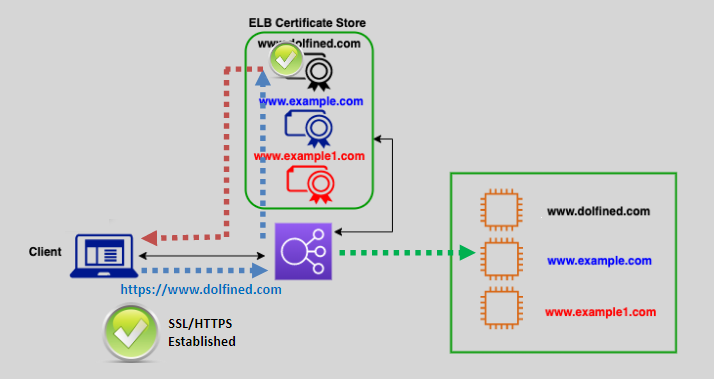
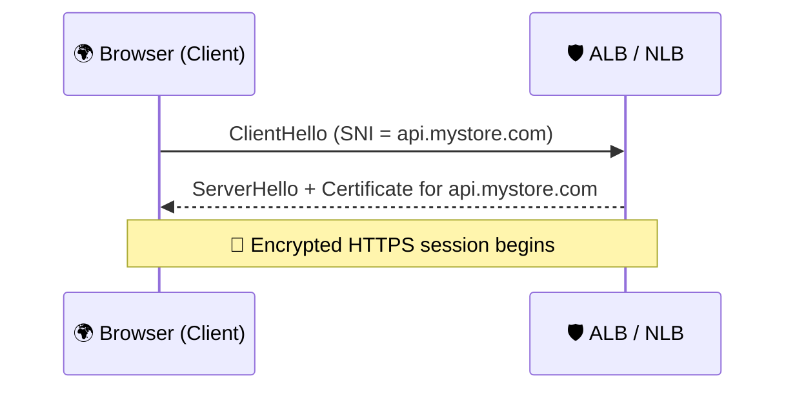

# 🌐🔐 **Server Name Indication (SNI): One IP, Many Secure Hosts**

> _How can a single IP serve **multiple HTTPS domains** with the right certificate for each?_
> Answer: **SNI** — a simple trick that modern browsers and AWS load balancers use every day.

---

    

---

## 🤔 **What Is SNI? (Simplified)**

**SNI (Server Name Indication)** is a feature of the **TLS (HTTPS)** protocol.
It lets the **client (like your browser)** tell the **server (like an ALB/NLB)** **which domain it’s trying to reach — before** encryption starts.

### 🧠 Why?

Because the server needs to **pick the correct SSL/TLS certificate**.
With SNI, it can do that **on the fly**, even when **many domains share the same IP address**.

---

## 📦 **Real-World Example**

You have **1 ALB** with IP `13.1.2.3`, and it handles:

- `www.mystore.com`
- `admin.mystore.com`
- `api.mystore.com`

All 3 domains are **served on the same port (443)** with **different certificates**.

### 🔄 What happens when a user visits `https://admin.mystore.com`?

1. The browser says “Hi! I’m trying to reach `admin.mystore.com`” inside the TLS handshake (`ClientHello`).
2. The ALB reads this and picks the **matching certificate** for `admin.mystore.com`.
3. The secure connection continues — encrypted and correct ✅

> 📌 So yes, SNI allows **multiple domains** (hosts) on **one IP** using **the correct cert per request**.

---

## 🛠️ **How SNI Works (Quick Visual)**

---

## ⚙️ **How It Works in AWS**

### ✅ **Application Load Balancer (ALB)**

- Attach **multiple certificates** to the same ALB listener (HTTPS 443).
- AWS uses the **SNI hostname** to choose the right cert per request.

### ✅ **Network Load Balancer (NLB)** (TLS listeners)

- Supports SNI too!
- You can attach **multiple certificates**, and AWS matches them using the **hostname from the client**.

> 🎯 No custom code is needed — **AWS handles SNI automatically** for HTTPS/TLS listeners.

---

## 🧪 **Is SNI Always Sent? (Yes, if modern)**

SNI is **automatically included** in most HTTPS tools:

| Tool / Client         | Sends SNI? | Example                           |
| --------------------- | ---------- | --------------------------------- |
| Chrome, Firefox, Edge | ✅ Yes     | Visiting `https://yourdomain.com` |
| curl                  | ✅ Yes     | `curl https://yourdomain.com`     |
| Python requests       | ✅ Yes     | `requests.get('https://...')`     |
| Java HTTP clients     | ✅ Yes     | Unless using outdated JVMs        |

---

## 🧠 **Common Questions**

### ❓ Can SNI handle more than one domain per IP?

**Yes**! That’s the whole point.
Use **1 IP** (e.g., 1 ALB) to serve **many HTTPS domains** with their **own certs**.

---

### ❓ What if the client doesn’t support SNI?

AWS allows you to configure a **default certificate** that is always returned if no SNI is provided (very rare with modern clients).

---

### ❓ How many certificates can I attach to an ALB?

Up to **25 certificates per HTTPS listener** (can be raised via support request).

---

## 🎯 **Summary**

| Feature                | SNI Benefit                       |
| ---------------------- | --------------------------------- |
| 🧠 Purpose             | Serve multiple domains on one IP  |
| 🔐 Selects Certificate | Based on client’s hostname        |
| 🌍 Works For           | Browsers, SDKs, AWS ALB/NLB       |
| ☁️ In AWS              | ALB & NLB handle it automatically |
| 💡 Result              | Correct certificate, secure HTTPS |

---

## 🏁 Final Thought

SNI is the **reason HTTPS at scale works**.
Thanks to it, you don’t need a separate IP for every domain.

> _“One IP to rule them all. One handshake to serve them.”_ 😉
