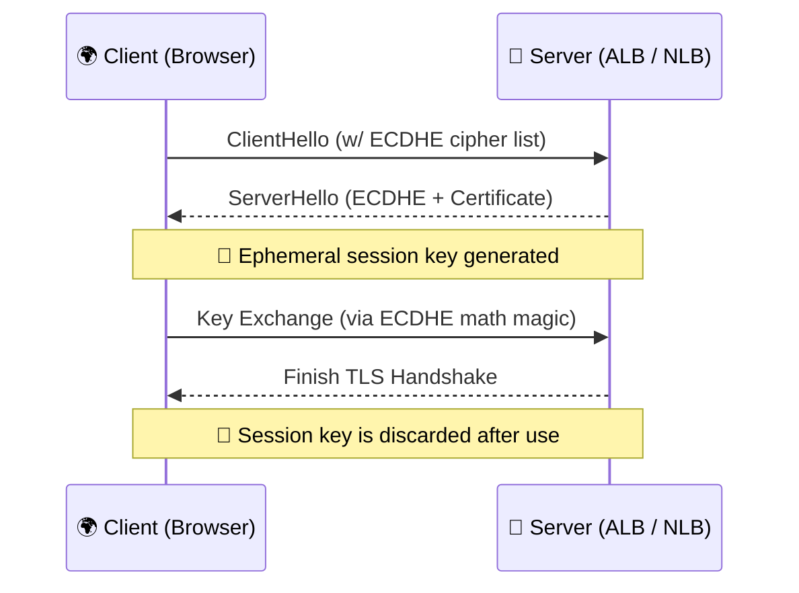

# 🔐 **Perfect Forward Secrecy (PFS)**

> PFS = Even if your server is hacked tomorrow, **your past encrypted traffic stays safe**.
> It’s like burning the key after every conversation. 🔥

---

## 🤔 **What Is Perfect Forward Secrecy?**

**Perfect Forward Secrecy (PFS)** makes sure that each HTTPS session gets its own **temporary, random encryption key** — and that key is **destroyed after the session ends**.

### 🧠 Why it matters

- Even if someone steals your private key later...
- ...they **still can’t decrypt your past traffic**.
- That’s because **session keys were unique and never stored**.

---

## 🔁 **How PFS Actually Works (Step by Step)**

Imagine you open a secure chat room. Every time someone joins:

1. A **new, secret room key** is created for just that chat session.
2. 🔑 That key is **never written down**.
3. After the session ends, the key is **destroyed**.

### 💡 In tech terms

- The browser and server use **ECDHE** (a secure key agreement protocol).
- ECDHE stands for **Elliptic Curve Diffie-Hellman Ephemeral**.
- “Ephemeral” = short-lived keys that **exist for one session only**.

---

## 📈 **What a PFS-Enabled TLS Handshake Looks Like**

### ✅ Key takeaway

Every HTTPS connection has its own **temporary key** that is **never reused**, **never stored**, and **can't be recovered later**.

---

## ☁️ **How PFS Works in AWS**

### Supported By

- ✅ **Application Load Balancer (ALB)**
- ✅ **Network Load Balancer (NLB)** (when using TLS termination)

### 🔧 How to Enable

1. Choose a **TLS security policy** with `ECDHE` in the cipher name.

   - Example: `ELBSecurityPolicy-TLS13-1-2-2021-06`

2. Attach your **TLS certificate** (from AWS ACM or manually).
3. AWS Load Balancer handles the **ephemeral key exchange automatically**.

> 🔍 You don’t need to code this logic — AWS takes care of the math behind ECDHE.

---

## 🎁 **Why You Should Use PFS**

| ✅ Benefit               | 📘 Description                                                     |
| ------------------------ | ------------------------------------------------------------------ |
| 🔐 Protects old traffic  | Even if your cert is stolen, **past sessions stay encrypted**      |
| 🧠 Reduces risk          | No long-term secrets = less for hackers to steal                   |
| 📋 Helps with compliance | Required by standards like **PCI-DSS**, **HIPAA**, etc.            |
| 🧘 Peace of mind         | If attackers record traffic today, they **can’t decrypt it later** |

---

## 🧰 **Best Practices for Enabling PFS**

- ✅ Use modern TLS policies (e.g. `TLS-1-2-2021` or TLS 1.3)
- 🔁 Review your cipher suite list regularly
- 🧪 Test your domain at [ssllabs.com/ssltest](https://www.ssllabs.com/ssltest)
- ❌ Avoid old protocols (SSL, TLS 1.0/1.1) that don’t support PFS

---

## 📌 TL;DR

- **Perfect Forward Secrecy** = 🔐 New session key every time
- It uses **ECDHE**, built into modern TLS
- Even if your cert is stolen, your **past traffic stays private**
- AWS Load Balancers support PFS automatically — just choose the right TLS policy

> _“If you care about your users’ privacy, PFS is a no-brainer.”_
