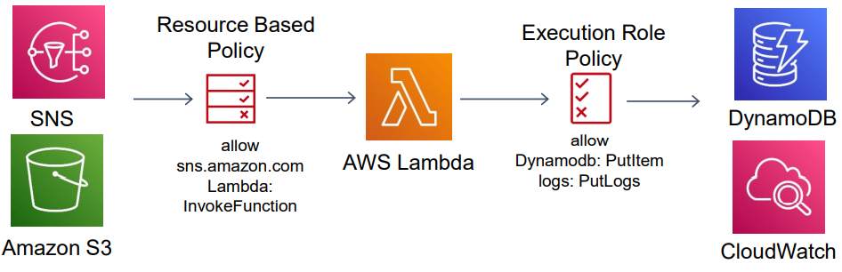
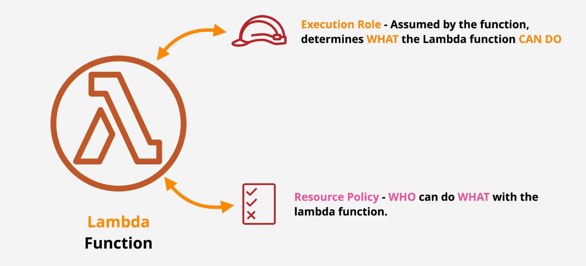
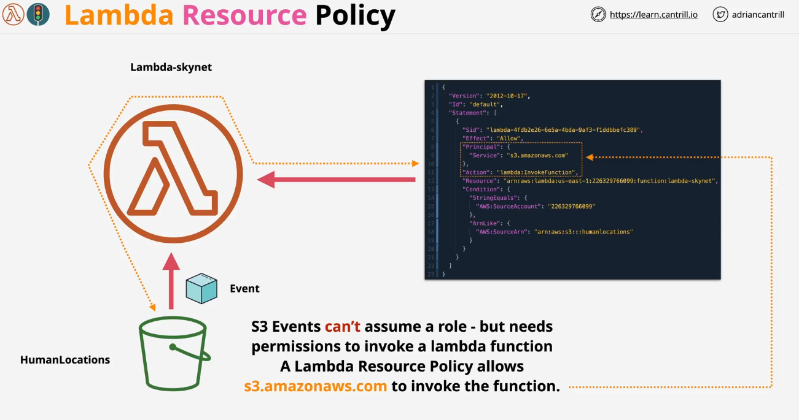
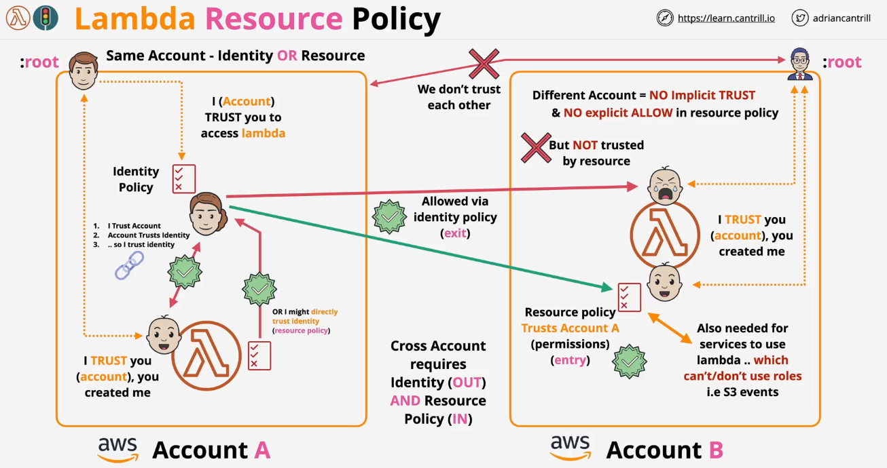

# 🔐 **AWS Lambda Permissions**

> AWS Lambda permissions are crucial for defining **what your function can access** and **who can invoke it**.  
> Managing permissions correctly ensures security and efficiency in serverless applications.

---

<div style="text-align: center;">
    
</div>

---

<div style="text-align: center;">
    
</div>

## ⛑️ **Lambda Execution Roles** _(what your function can access)_

Every AWS Lambda function requires an **IAM execution role** that defines what AWS services the function can interact with. Without the right permissions, your Lambda function **cannot access** resources like S3, DynamoDB, or CloudWatch.

### 🔑 **What is an Execution Role?**

- An **IAM role** assigned to the Lambda function at creation.
- It contains **policies** that allow access to specific AWS services.
- Without the correct role, Lambda **cannot function properly**.

---

### 🎯 **Example: Basic Lambda Execution Role**

By default, AWS Lambda needs permission to write logs to **Amazon CloudWatch** for monitoring. Here’s an **IAM role policy** that allows Lambda to write logs:

```json
{
  "Version": "2012-10-17",
  "Statement": [
    {
      "Effect": "Allow",
      "Action": ["logs:CreateLogGroup", "logs:CreateLogStream", "logs:PutLogEvents"],
      "Resource": "arn:aws:logs:*:*:*"
    }
  ]
}
```

> **This policy allows Lambda to:**
>
> - Create new CloudWatch Log Groups & Streams
> - Write logs for debugging and monitoring

---

### 📦 **Example: Lambda Role for S3 Access**

If your Lambda function needs to read from or write to an **S3 bucket**, you must add **S3 permissions** to the IAM role.

```json
{
  "Version": "2012-10-17",
  "Statement": [
    {
      "Effect": "Allow",
      "Action": ["s3:GetObject", "s3:PutObject"],
      "Resource": "arn:aws:s3:::my-bucket/*"
    }
  ]
}
```

> **This policy allows Lambda to:**
>
> - **Read (`GetObject`) and write (`PutObject`) files** inside `my-bucket`
>
> 💡 **Best Practice:** Always follow **the principle of least privilege**—give Lambda only the permissions it absolutely needs!

---

### 🛠️ **How to Assign an Execution Role to a Lambda Function**

#### **🖱️ Using AWS Console**

- **1️⃣** Go to **AWS Lambda Console**
- **2️⃣** Select your **Lambda function**
- **3️⃣** Navigate to **Configuration** → **Permissions**
- **4️⃣** Click **"Edit" Execution Role**
- **5️⃣** Attach the correct **IAM Role** with necessary policies

---

#### **🧑‍💻 Using AWS CLI**

**1️⃣ Create an IAM Role for Lambda:**

```sh
aws iam create-role --role-name LambdaExecutionRole \
--assume-role-policy-document file://trust-policy.json
```

> This command creates a new IAM role called `LambdaExecutionRole` with the trust policy defined in `trust-policy.json`.

👉 **Example trust policy (`trust-policy.json`):**

```json
{
  "Version": "2012-10-17",
  "Statement": [
    {
      "Effect": "Allow",
      "Principal": {
        "Service": "lambda.amazonaws.com"
      },
      "Action": "sts:AssumeRole"
    }
  ]
}
```

**2️⃣ Attach an IAM Policy (e.g., CloudWatch Logs & S3 Access):**

```sh
aws iam attach-role-policy --role-name LambdaExecutionRole \
--policy-arn arn:aws:iam::aws:policy/service-role/AWSLambdaBasicExecutionRole
```

```sh
aws iam put-role-policy --role-name LambdaExecutionRole \
--policy-name S3AccessPolicy \
--policy-document file://s3-policy.json
```

> The first command attaches basic Lambda logging permissions.
> The second command adds S3 permissions using `s3-policy.json` (defined earlier).

**3️⃣ Assign the Role to a Lambda Function:**

```sh
aws lambda update-function-configuration --function-name myLambdaFunction \
--role arn:aws:iam::123456789012:role/LambdaExecutionRole
```

> Replace `myLambdaFunction` with your actual function name and `123456789012` with your AWS account ID.

---

## 📞 **Lambda Resource Policies** _(who can invoke it)_

> While **execution roles** define what a Lambda function **can access**, **resource-based policies** define **who** or **what** can invoke the Lambda function.

<div style="text-align: center;">
  
</div>

---

📌 **Use Cases:**

- ✅ Allow **S3, API Gateway, or SNS** to invoke your Lambda
- ✅ Enable **cross-account** access to Lambda

---

### 🔥 **Example: Allow S3 to Invoke a Lambda Function**

If an **S3 bucket** needs to **trigger a Lambda function**, you must add an **InvokeFunction permission** to the function’s **resource-based policy**.

```json
{
  "Version": "2012-10-17",
  "Statement": [
    {
      "Effect": "Allow",
      "Principal": {
        "Service": "s3.amazonaws.com"
      },
      "Action": "lambda:InvokeFunction",
      "Resource": "arn:aws:lambda:us-east-1:123456789012:function:myFunction",
      "Condition": {
        "StringEquals": {
          "AWS:SourceAccount": "123456789012"
        },
        "ArnLike": {
          "AWS:SourceArn": "arn:aws:s3:::my-bucket"
        }
      }
    }
  ]
}
```

> 📌 **Breakdown:**
>
> - **Effect:** "Allow" → Grants access
> - **Principal:** "s3.amazonaws.com" → Allows S3 to invoke the function
> - **Action:** "lambda:InvokeFunction" → Allows invocation
> - **Condition:** Ensures only **a specific S3 bucket** can trigger Lambda

---

### 🔗 **Example: Cross-Account Access to Lambda**

> If a Lambda function needs to be invoked from **another AWS account**, you need to add a **cross-account resource-based policy**.

<div style="text-align: center;">
  
</div>

```json
{
  "Version": "2012-10-17",
  "Statement": [
    {
      "Effect": "Allow",
      "Principal": {
        "AWS": "arn:aws:iam::987654321098:root"
      },
      "Action": "lambda:InvokeFunction",
      "Resource": "arn:aws:lambda:us-west-2:123456789012:function:myFunction"
    }
  ]
}
```

> 📌 **Breakdown:**
>
> - Allows **account `987654321098`** to invoke the function
> - Restricts the action to only `lambda:InvokeFunction`
>
> 💡 **Best Practice:**
>
> - Use **specific IAM roles** instead of `root`
> - Restrict access to certain AWS regions or conditions

---

### 🛠️ **How to Add a Resource-Based Policy to Lambda**

#### **🖱️ Using AWS Console**

- **1️⃣** Go to **AWS Lambda Console**
- **2️⃣** Select your **Lambda function**
- **3️⃣** Navigate to **Configuration** → **Permissions**
- **4️⃣** Click **"Add Permissions"** → **Resource-based policy**
- **5️⃣** Add a policy allowing the required AWS service or account

---

#### **🧑‍💻 Using AWS CLI**

**1️⃣ Allow S3 to Invoke Lambda Function:**

```sh
aws lambda add-permission --function-name myFunction \
--statement-id AllowS3Invoke \
--action "lambda:InvokeFunction" \
--principal s3.amazonaws.com \
--source-arn arn:aws:s3:::my-bucket \
--source-account 123456789012
```

> This allows **S3 bucket `my-bucket`** to invoke the Lambda function `myFunction`.

**2️⃣ Allow Another AWS Account to Invoke Lambda:**

```sh
aws lambda add-permission --function-name myFunction \
--statement-id AllowCrossAccountInvoke \
--action "lambda:InvokeFunction" \
--principal arn:aws:iam::987654321098:root
```

> This allows **AWS Account `987654321098`** to invoke `myFunction`.

---

## 🏁 **Conclusion**

- ✅ **Execution Roles** control what AWS resources Lambda can access
- ✅ **Resource Policies** define who or what can invoke your function
- ✅ Always **follow the principle of least privilege** for security
