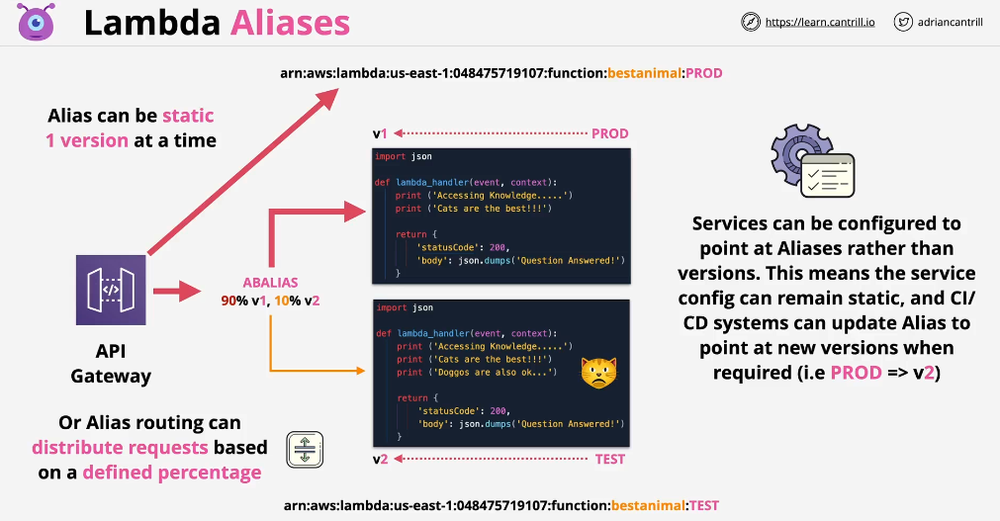
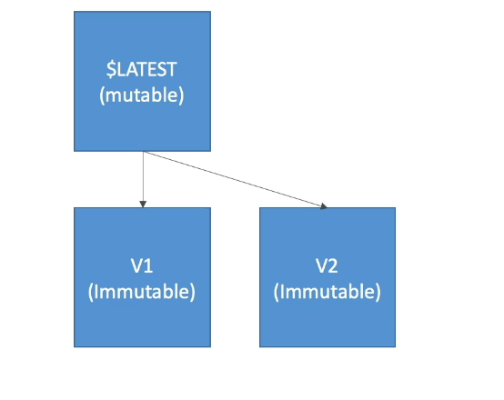
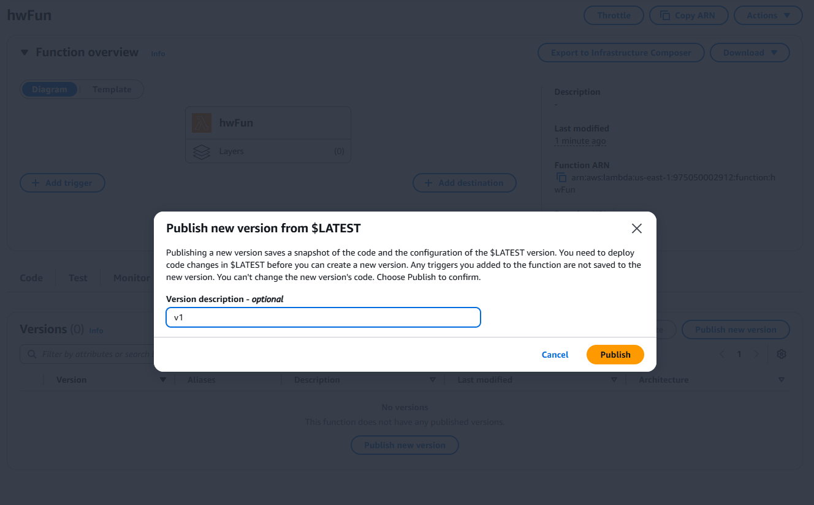
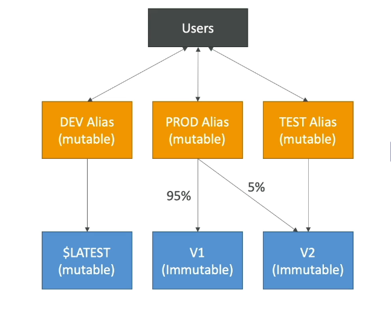
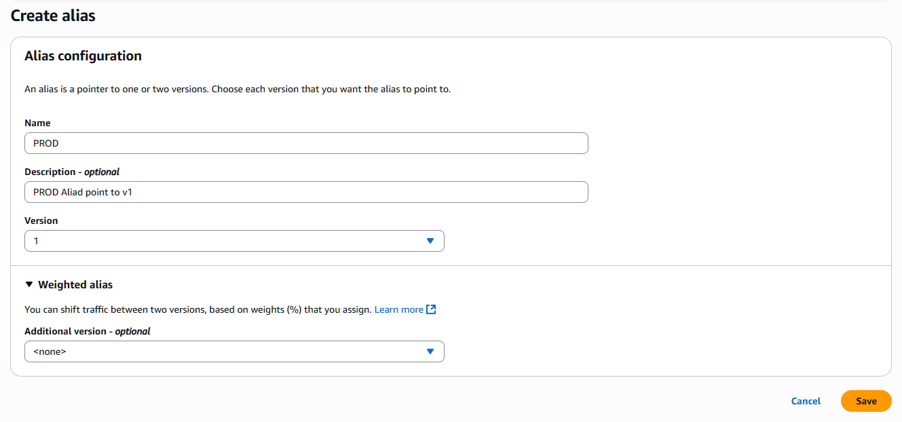

# 🔄 **AWS Lambda Function Versions & Aliases**

> AWS Lambda **versions and aliases** help you **manage, deploy, and route traffic** between different versions of your Lambda function. They allow you to implement **safe updates, rollbacks, and traffic shifting** without modifying the function’s ARN.

---

<div style="text-align: center;">
    
</div>

---

## **📌 What are Lambda Function Versions?**

> Each time you deploy a Lambda function, it is updated as **\$LATEST**, which means it is the most recent version.  
> However, you can **publish specific versions** to create **immutable snapshots** of your function.

---

<div style="text-align: center;">
    
</div>

---

<div style="text-align: center;">
    
</div>

---

### **🔹 Key Features of Versions:**

- **🚫 Immutable** – Once published, code **cannot be changed**.
- **🏷️ Labeled with numbers** (e.g., `Version 1`, `Version 2`, etc.).
- **⚙️ References a specific function code & configuration**.
- **🆕 \$LATEST always points to the most recent, unpublished version.**

📌 **Example:**

```sh
aws lambda publish-version --function-name myFunction
```

> 💡 **Creates a new version (e.g., Version 1).**

---

## **📌 What are Lambda Aliases?**

> A **Lambda alias** is like a **nickname** that points to a specific function version. Instead of updating references to different versions, you can **update the alias to point to a new version**.

---

<div style="text-align: center;">
    
</div>

---

<div style="text-align: center;">
    
</div>

---

### **🔹 Key Features of Aliases:**

- **✍️ Aliases are mutable** – You can update them anytime.
- **🗺️ Each alias maps to a specific Lambda version.**
- **✌️ Can split traffic between two versions with canary deployment (e.g., `90% v1`, `10% v2`).**
- **🧻 Helps in rolling out new features safely**.

📌 **Example:**

```sh
aws lambda create-alias --function-name myFunction \
  --name production --function-version 1
```

> 💡 **Creates an alias called `production` that points to `Version 1`.**

---

> 💡 _Aliases have their own ARNs_
> 💡 _Aliases cannot references other aliases_

---

## **🤔 Why Use Versions & Aliases?**

| **Feature**          | **Versions**                           | **Aliases**                                  |
| -------------------- | -------------------------------------- | -------------------------------------------- |
| **Mutability**       | ❌ Cannot be changed                   | ✅ Can be updated                            |
| **References**       | Refers to a specific code version      | Points to a version, can change              |
| **Traffic Routing**  | No built-in traffic shifting           | ✅ Supports weighted traffic shifting        |
| **Rollback Support** | Requires calling old versions manually | ✅ Update alias to point to previous version |
| **Example Use Case** | Archiving old versions for rollback    | Gradual deployment in production             |

---

## **📌 Example: Deploying Lambda with Versions & Aliases**

### **🔹 Step 1: Deploy a New Function (Latest Version)**

```sh
aws lambda update-function-code --function-name myFunction --zip-file fileb://function.zip
```

> 💡 **Updates the function (`$LATEST` version).**

---

### **🔹 Step 2: Publish a New Version**

```sh
aws lambda publish-version --function-name myFunction
```

> 💡 **Creates an immutable version (e.g., Version 1).**

---

### **🔹 Step 3: Create an Alias for Production**

```sh
aws lambda create-alias --function-name myFunction \
  --name production --function-version 1
```

> 💡 **Alias `production` now points to Version 1.**

---

### **🔹 Step 4: Deploy a New Version & Update Alias**

- **1️⃣ Deploy new function code (`$LATEST` updated).**
- **2️⃣ Publish it as a new version (`Version 2`).**
- **3️⃣ Update alias to point to the new version.**

```sh
aws lambda update-alias --function-name myFunction \
  --name production --function-version 2
```

> 💡 **Now, `production` alias points to Version 2.**
> 💡 **No need to change client references – just update the alias!**

---

## ⚖️ **5️⃣ Traffic Shifting Between Versions**

Aliases allow **gradual deployment** by **splitting traffic** between two versions.

📌 **Example: Route 90% traffic to `Version 1`, 10% to `Version 2`.**

```sh
aws lambda update-alias --function-name myFunction \
  --name production --function-version 1 \
  --routing-config '{"AdditionalVersionWeights": {"2": 0.1}}'
```

> 💡 **Helps test new versions without affecting all users.**

---

## **📌 Summary: AWS Lambda Versions & Aliases**

🔹 **Versions** allow you to create **immutable snapshots** of your function.  
🔹 **Aliases** provide a **stable reference** that can point to different versions.  
🔹 **Traffic shifting** helps in safe deployments and rollback strategies.  
🔹 **Best practice**: Use **aliases (`production`, `staging`, etc.)** instead of pointing to versions directly.
