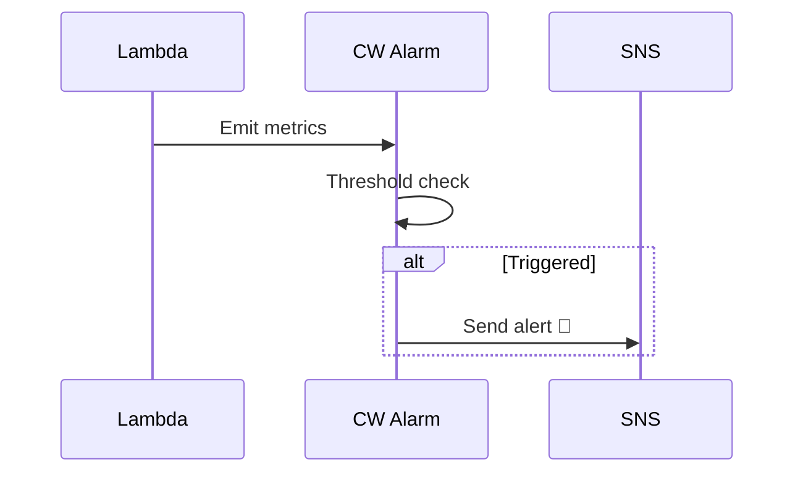
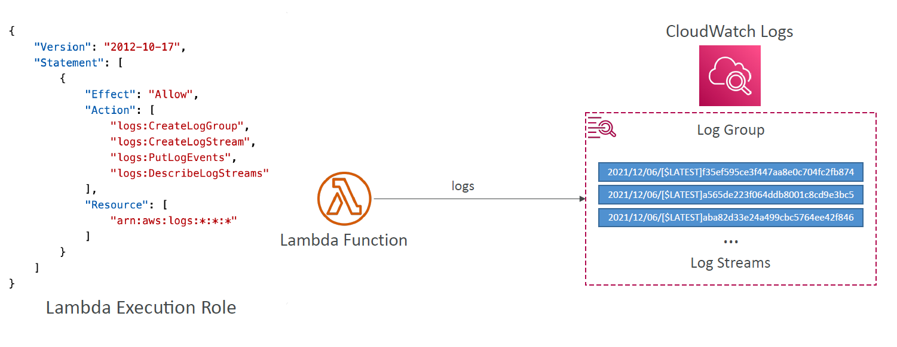
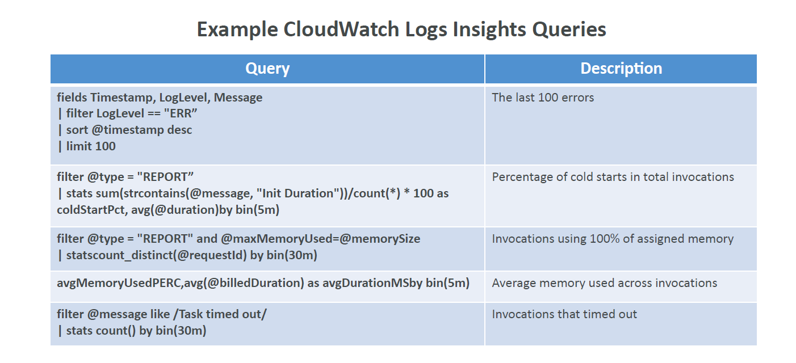

# 📈 **Lambda Monitoring with CloudWatch – From Metrics to Insights**

> _Know exactly what your Lambda is doing, when it breaks, and how to fix it – all through CloudWatch._

---

## 📊 **Lambda CloudWatch Metrics (Automatic)**

These are **pushed by AWS** every time your Lambda runs:

| 📌 Metric                | 📘 Description                                                |
| ------------------------ | ------------------------------------------------------------- |
| **Invocations**          | Number of times the function is called (success or failure)   |
| **Duration**             | Time (ms) your function runs from trigger to finish           |
| **Errors**               | Number of failed invocations (exceptions, timeouts, etc.)     |
| **Throttles**            | Invocations that were blocked due to concurrency limits       |
| **DeadLetterErrors**     | Failed attempts to send an event to DLQ for async invocations |
| **IteratorAge**          | Age of the latest record in stream before Lambda processes it |
| **ConcurrentExecutions** | Number of Lambda workers running simultaneously               |

---

### 🧠 **Example CloudWatch Alarm Use Cases**

| 🔔 Alarm Name        | 📌 Trigger Condition                                  |
| -------------------- | ----------------------------------------------------- |
| `NoInvocations`      | No Lambda calls in last hour (🕐 inactivity alert)    |
| `LambdaErrorsAlarm`  | If `Errors > 0` → notify DevOps                       |
| `HighThrottlesAlarm` | If `Throttles > 0` → increase concurrency or optimize |

---

<div align="center">



</div>

---

## 📄 **Lambda Logs – CloudWatch Logs**

Every Lambda logs to a dedicated **log group**:

```ini
/aws/lambda/your-function-name
```

- Each **log stream** contains one execution’s output
- Requires Lambda role permission:

```json
("logs:CreateLogGroup", "logs:CreateLogStream", "logs:PutLogEvents")
```

📸 Diagram:

<div style="text-align: center;">
    
</div>

---

## 🔍 **CloudWatch Logs Insights – Powerful Log Search**

Use structured queries to:

- Filter 🔎 logs
- Count ❌ errors
- Investigate cold starts 🥶
- Detect timeouts ⏳

📋 Example:

```sql
fields @timestamp, @message
| filter @message like /ERROR/
| sort @timestamp desc
```

🧠 Common Queries:

<div style="text-align: center;">
    
</div>

---

## 📊 **Lambda Insights – Enhanced Monitoring**

> Advanced metrics via **CloudWatch Lambda Extension**.

✅ Lambda Insights provides:

| 📈 Metric Type           | 🔍 Examples                                   |
| ------------------------ | --------------------------------------------- |
| **System Metrics**       | CPU, memory, network, disk                    |
| **Function Diagnostics** | Cold starts, shutdown reason, memory max used |
| **Networking**           | Bytes sent/received                           |

📦 Output appears under `/aws/lambda-insights/...`
Includes structured JSON like:

```json
{
  "function_name": "cpu-intensive",
  "duration": 45191,
  "cold_start": true,
  "timeout": true,
  "shutdown_reason": "Timeout",
  "used_memory_max": 63,
  ...
}
```

## ✅ Summary Cheat Sheet

| Tool                   | Purpose                            | Data You Get                            |
| ---------------------- | ---------------------------------- | --------------------------------------- |
| **CloudWatch Metrics** | Function KPIs (duration, errors)   | Auto-generated for every Lambda         |
| **CloudWatch Alarms**  | Alerting on thresholds             | Triggers based on metrics (SNS/email)   |
| **CloudWatch Logs**    | Logs from `console.log()`          | Stored in log groups/streams            |
| **Logs Insights**      | Query/search logs                  | Find errors, cold starts, memory issues |
| **Lambda Insights**    | Enhanced diagnostics (system view) | CPU, memory, shutdown reason            |
