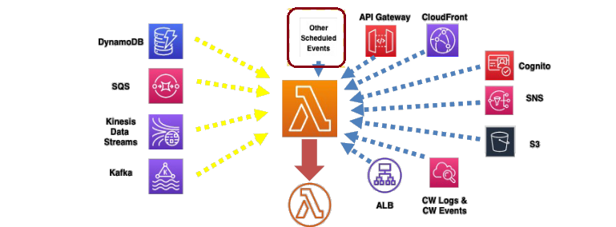
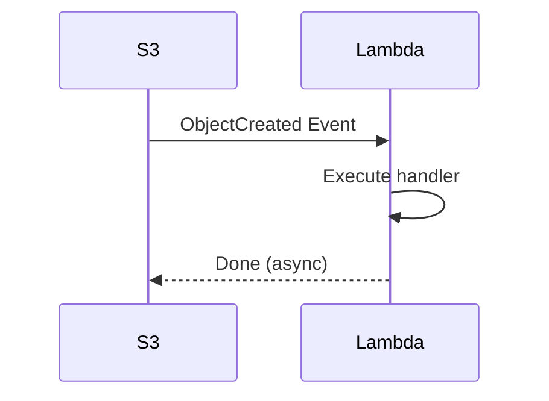

# 🔄 **AWS Lambda Triggers vs. Destinations**

AWS Lambda is fundamentally **event-driven** — it executes **in response to events**, not in isolation. But there’s a crucial distinction between:

- ✅ **Triggers** – Define **when** Lambda runs
- 🔁 **Destinations** – Define **what happens after** Lambda runs (for async)

---

<div style="text-align: center;">
    
</div>

---

## ⚡ **What Are AWS Lambda Triggers?**

A **trigger** tells Lambda:

> “📣 When this event happens — run this function!”

### 📡 Who Can Trigger Lambda?

| 🧩 Source            | 🔍 Example Trigger Scenario                 |
| -------------------- | ------------------------------------------- |
| **S3**               | New file uploaded → image processing Lambda |
| **API Gateway**      | HTTP request → Lambda as backend            |
| **SNS**              | Message publish → trigger processing Lambda |
| **SQS**              | New queue message → async job processing    |
| **EventBridge**      | Scheduled rule or event pattern → Lambda    |
| **Kinesis / Kafka**  | Stream message → real-time analytics        |
| **DynamoDB Streams** | Table item modified → sync secondary table  |
| **Cognito**          | User signup/signin → validation hook        |
| **CloudFront**       | Viewer request → Lambda\@Edge               |
| **Step Functions**   | Lambda used as a task in workflow           |
| **Function URLs**    | Direct HTTP call → invoke Lambda securely   |
| **Others**           | SES, IoT, Lex, Alexa, etc.                  |

---

### 🛠️ **How Do Triggers Work?**

**1️⃣** Event source detects an event  
**2️⃣** Sends data to Lambda  
**3️⃣** Lambda executes with the event as payload

<div align="center">



</div>

---

## 🧪 **Real Example: S3 Trigger + Lambda**

### 🧱 Step 1: S3 Sends Events to Lambda

```bash
aws s3api put-bucket-notification-configuration \
  --bucket my-bucket \
  --notification-configuration '{
    "LambdaFunctionConfigurations": [
      {
        "LambdaFunctionArn": "arn:aws:lambda:us-east-1:123456789012:function:myFunction",
        "Events": ["s3:ObjectCreated:*"]
      }
    ]
  }'
```

### 🔐 Step 2: Allow S3 to Invoke Lambda

```bash
aws lambda add-permission \
  --function-name myFunction \
  --statement-id AllowS3Invoke \
  --action "lambda:InvokeFunction" \
  --principal s3.amazonaws.com \
  --source-arn arn:aws:s3:::my-bucket \
  --source-account 123456789012
```

> ✅ Now Lambda is ready to react to new files in the bucket.

---

## 🛰️ **What Are AWS Lambda Destinations?**

**Destinations** define **where Lambda sends the result of an asynchronous invocation**, based on success or failure.

Think of it like this:

> 🛫 Trigger fires Lambda → Lambda executes → 🛬 Result goes to destination

---

### 🧭 Supported Destinations

| Result            | Possible Destinations                             |
| ----------------- | ------------------------------------------------- |
| **On Success** ✅ | SNS topic, SQS queue, EventBridge, another Lambda |
| **On Failure** ❌ | SNS topic, SQS queue, EventBridge, another Lambda |

---

### 🛠️ **Example: Send Success/Failure to SNS + SQS**

```bash
aws lambda put-function-event-invoke-config \
  --function-name myFunction \
  --destination-config '{
      "OnSuccess": {
          "Destination": "arn:aws:sns:us-east-1:123456789012:SuccessTopic"
      },
      "OnFailure": {
          "Destination": "arn:aws:sqs:us-east-1:123456789012:FailureQueue"
      }
  }'
```

> 🟢 **Success → SNS**  
> 🔴 **Failure → SQS**

Perfect for building post-execution flows like:

- Notifications
- Chaining Lambdas
- Dead-letter handling
- Real-time dashboards

---

## 🎯 **Triggers vs. Destinations: What's the Difference?**

| Feature                    | **Triggers**                      | **Destinations**                                  |
| -------------------------- | --------------------------------- | ------------------------------------------------- |
| **Purpose**                | Start function execution          | Handle the result after function finishes         |
| **Type**                   | Event Source → Lambda             | Lambda → External target (after async execution)  |
| **Works with**             | All Lambda types                  | Only **asynchronous** Lambda invocations          |
| **Common Use Cases**       | S3 → Lambda, API Gateway → Lambda | Lambda → SQS/SNS/EventBridge (on success/failure) |
| **Configuration Location** | Event source or Lambda console    | Lambda function’s **invoke config**               |

---

## 🔐 **Resource-Based Policies: The Missing Piece**

Even if you configure a **trigger**, the source **must be allowed** to invoke the Lambda. That’s where **resource-based policies** come in.

### 🧠 **Think of it like this:**

> 🔔 Trigger = “You’re allowed to call Lambda”  
> 💂 Policy = “You’re authorized to call Lambda”

---

### 🛠 Example: Allow Another AWS Account or Service

```bash
aws lambda add-permission \
  --function-name myFunction \
  --statement-id AllowExternal \
  --action "lambda:InvokeFunction" \
  --principal sns.amazonaws.com \
  --source-arn arn:aws:sns:us-east-1:123456789012:MySNSTopic
```

> ✅ SNS now has permission to trigger Lambda.

---

## 🧪 **When Do You Only Need a Resource-Based Policy?**

You **don’t need a trigger** if you are:

- Allowing **manual invocation** from another AWS account
- Letting **Step Functions**, **CLI**, or **SDK** call your function directly
- Securing **Lambda Function URLs** (HTTP endpoints)

---

## 🧩 Final Recap – Know When to Use What

| 🧠 Scenario                                 | Trigger Needed | Destination Needed | Resource Policy Needed |
| ------------------------------------------- | -------------- | ------------------ | ---------------------- |
| S3 triggers Lambda                          | ✅             | ❌                 | ✅                     |
| Lambda sends result to SQS on failure       | ❌             | ✅                 | ✅                     |
| API Gateway invokes Lambda on HTTP request  | ✅             | ❌                 | ✅                     |
| Step Function invokes Lambda task           | ❌             | ❌                 | ✅                     |
| Manually invoke Lambda from another account | ❌             | ❌                 | ✅                     |

---

## 🚀 **Pro Tip: Build Event-Driven Workflows**

You can combine:

- **Trigger → Lambda → Destination → Queue → Next Lambda**
- **Trigger → Lambda → DLQ → Analysis**

💡 This enables **chaining**, **error handling**, and **buffering**, all without servers.
