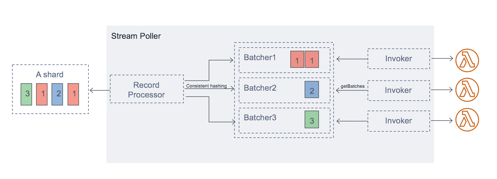

# 🔁 **AWS Lambda – Event Source Mapping (SQS, Kinesis, DynamoDB)**

> **Event Source Mapping** (ESM) is the powerful engine that connects AWS Lambda to streaming or queuing services like **SQS**, **SQS FIFO**, **Kinesis**, and **DynamoDB Streams**.
>
> It acts as an **internal poller** that reads events from the source and invokes your function **synchronously with event batches**, all without you managing polling logic.

---

## 🎯 **What is Event Source Mapping (ESM)?**

> Event Source Mapping is a Lambda component that **polls** an event source (queue or stream), **buffers messages**, and **triggers Lambda** with a batch.

Common event sources:

- 🔄 **SQS & SQS FIFO**
- 📊 **Kinesis Data Streams**
- 🔗 **DynamoDB Streams**

---

  

---

## 🔷 **How Lambda + Streams Work (Kinesis & DynamoDB)**

Streams are **sharded**, and Lambda uses **one iterator per shard** to read and process records.

  

---

### 🔁 Flow

1. Lambda internally polls each shard
2. Events are **batched by partition key**
3. Batches are processed in **order within each shard**
4. **Parallelization** allows up to **10 batches per shard** (configurable)

### 📌 Key Characteristics

| Feature                    | Details                                                                |
| -------------------------- | ---------------------------------------------------------------------- |
| ✅ **In-order processing** | Guaranteed within a partition/shard                                    |
| 🚀 **Parallel batches**    | Up to 10 simultaneous batches per shard (`parallelizationFactor = 10`) |
| 🕐 **Batch Window**        | Delay batch delivery to accumulate more records                        |
| 🔁 **Retry on failure**    | Entire batch is retried until success or expiry                        |
| ⚠️ **Blocking behavior**   | Errors **pause shard** until issue is resolved                         |

> 🧠 Stream records are **not deleted** after processing — they remain for other consumers.

---

## 🔷 **How Lambda + SQS Works**

SQS queues are fully **managed and persistent**, making them ideal for decoupling microservices.

  

---

### 🔁 Flow

1. Lambda long-polls SQS
2. Messages are returned in batches (size = 1–10)
3. Lambda invokes your function with the batch
4. Success = delete from queue
5. Failure = re-queued after **visibility timeout**

### 📌 Key Characteristics

| Feature               | Standard Queue                 | FIFO Queue                            |
| --------------------- | ------------------------------ | ------------------------------------- |
| ✅ Delivery model     | At-least-once                  | Exactly-once within message group     |
| 🔄 Message order      | No guarantee                   | Strict order by `MessageGroupId`      |
| 🧠 Scaling            | Up to 1,000 concurrent batches | Scales to active message groups       |
| ⌛ Visibility timeout | Must be 6× your Lambda timeout | Same best practice applies            |
| ⚠️ DLQ Location       | Must be on SQS queue           | DLQ not supported directly via Lambda |

---

## 📈 **Scaling Behavior – All Event Sources**

| Source Type          | Scaling Strategy                                                                    |
| -------------------- | ----------------------------------------------------------------------------------- |
| **Kinesis**          | 1 Lambda per shard → up to 10 batches/shard via parallelization                     |
| **DynamoDB Streams** | Same as Kinesis                                                                     |
| **SQS Standard**     | Adds up to 60 Lambda instances per minute → up to 1,000 concurrent batch processors |
| **SQS FIFO**         | One Lambda per active **MessageGroupId**                                            |

---

## 🚨 **Error Handling and Retries**

### 🔁 **Streams (Kinesis/DynamoDB)**

| Scenario              | Behavior                                                |
| --------------------- | ------------------------------------------------------- |
| ❌ Lambda fails       | Entire batch retried (same records)                     |
| ❗ Order enforced     | Shard is **blocked** until error is resolved            |
| 🔧 Options            | Use **bisect batch on error**, maxRetry, discard policy |
| 🧪 Dead-letter option | Use **Lambda Destinations** for discarded events        |

### 🔁 **SQS (Standard/FIFO)**

| Scenario         | Behavior                                          |
| ---------------- | ------------------------------------------------- |
| ❌ Lambda fails  | Messages return to queue after visibility timeout |
| ♻️ Partial retry | Only failed messages are retried                  |
| 📦 Reordering    | Standard queue may reorder on retry               |
| 🧪 DLQ           | Must be attached to **SQS queue**                 |

---

## 🔧 **Tuning Parameters: SQS vs Streams**

| Feature                | SQS                    | Kinesis / DynamoDB Streams         |
| ---------------------- | ---------------------- | ---------------------------------- |
| **Batch size**         | 1–10                   | 1–10,000                           |
| **Batch window**       | Not supported          | ✅ Helps buffer low-traffic shards |
| **Visibility timeout** | Queue-level setting    | Not required                       |
| **Parallelization**    | Scales with queue load | Configure `parallelizationFactor`  |
| **Ordering**           | FIFO only              | Per shard & per partition key      |

---

## 🧠 Best Practices Summary

| ✅ Practice                                 | 💡 Why It’s Important                             |
| ------------------------------------------- | ------------------------------------------------- |
| Set visibility timeout = Lambda timeout × 6 | Prevent premature retries in SQS                  |
| Use DLQ for SQS, not Lambda                 | Ensures persistent failure recovery               |
| Enable batch window (streams)               | Efficient processing during low throughput        |
| Enable bisect batch on error                | Helps isolate failed records in stream processing |
| Monitor iterator age (streams)              | Alerts if batch processing lags behind            |
| Design multiple MessageGroupIds             | For FIFO: enables parallel processing             |

---

## 🧾 Final Summary: When to Use What?

| Scenario                                   | Recommended Source         |
| ------------------------------------------ | -------------------------- |
| You need in-order processing               | Kinesis, FIFO SQS          |
| You want massive scale                     | SQS Standard               |
| You need multiple consumers for same data  | Kinesis or DynamoDB Stream |
| You want retry+DLQ with persistent storage | SQS                        |
| You want high throughput, low latency      | Streams with batching      |

---

## 📌 Conclusion

**Event Source Mapping** is the backbone of integrating Lambda with queues and streams.

It lets you build **scalable**, **reliable**, and **event-driven applications** without worrying about polling, concurrency, or retries.

Use:

- ✅ **Kinesis/DynamoDB** for high-throughput, shard-based ordering
- ✅ **SQS Standard** for fan-out microservices
- ✅ **SQS FIFO** for strict order-sensitive workflows
