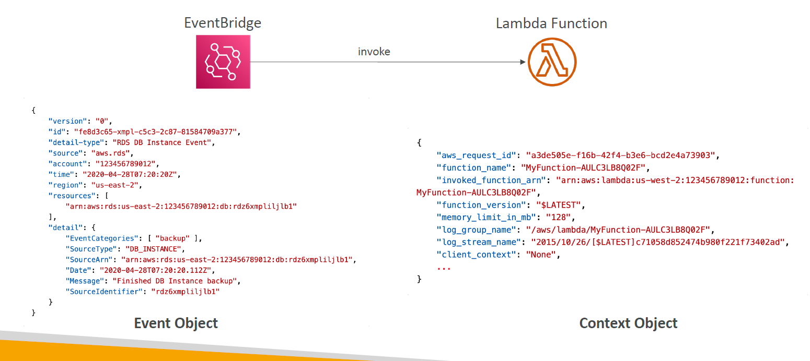

# 🧠 **AWS Lambda – Event & Context Objects**

Every time your Lambda function is invoked — whether from **EventBridge**, **API Gateway**, **S3**, **SQS**, or a **custom app** — it receives two core inputs:

- 📦 **`event`** → the data payload (from the trigger)
- 🧾 **`context`** → metadata about the function and invocation

Understanding these two inputs is critical for writing resilient, traceable, and dynamic serverless code.

---

<div style="text-align:center;">
  
</div>

---

## 📨 **The `event` Object**

> The **event object** is a **JSON-formatted payload** containing the **data that triggered the Lambda**. It varies depending on the event source.

### ✅ **Key Characteristics:**

| Property                  | Description                                                    |
| ------------------------- | -------------------------------------------------------------- |
| `version`                 | Schema version of the event                                    |
| `source`                  | Source of the event (e.g., `aws.ec2`, `aws.s3`, `aws.rds`)     |
| `detail-type`             | Type of event (e.g., `EC2 Instance State-change Notification`) |
| `detail`                  | Actual payload content to be processed                         |
| `resources`               | ARNs of resources related to the event                         |
| `region`, `account`, etc. | Contextual AWS metadata                                        |

### 🧪 **Use Cases:**

- EventBridge: triggered on schedule or resource events
- API Gateway: carries query/body/path params
- S3: details of the uploaded file
- SQS: list of messages

> The structure of `event` is **100% source-dependent**, and can be customized (e.g., for API Gateway or EventBridge rules).

---

## 🧾 **The `context` Object**

> The **context object** is a Lambda-generated object that provides metadata about the **invocation**, **function runtime**, and **execution environment**.

### ✅ **Key Fields in Context Object**

| Property                         | Description                                    |
| -------------------------------- | ---------------------------------------------- |
| `aws_request_id`                 | Unique identifier for this function invocation |
| `function_name`                  | The name of the Lambda function                |
| `function_version`               | Version (e.g., `$LATEST`)                      |
| `invoked_function_arn`           | ARN used to invoke the function                |
| `memory_limit_in_mb`             | Memory allocated to the function               |
| `log_group_name`                 | CloudWatch Logs group                          |
| `log_stream_name`                | CloudWatch Logs stream                         |
| `client_context`                 | Mobile SDK metadata (if applicable)            |
| `identity`                       | Cognito identity context (if available)        |
| `get_remaining_time_in_millis()` | Function to retrieve remaining execution time  |

---

## 🧪 **Python Example: Accessing Event & Context**

```python
def lambda_handler(event, context):
    # Event data
    print("Event Source:", event["source"])
    print("Event Region:", event["region"])

    # Context metadata
    print("Request ID:", context.aws_request_id)
    print("Function Name:", context.function_name)
    print("Function ARN:", context.invoked_function_arn)
    print("Memory (MB):", context.memory_limit_in_mb)
    print("Log Stream:", context.log_stream_name)
    print("Log Group:", context.log_group_name)
    print("Time Left (ms):", context.get_remaining_time_in_millis())
```

---

## 🔬 **When to Use Each Object**

| Use Case                         | Use `event` | Use `context`                           |
| -------------------------------- | ----------- | --------------------------------------- |
| Get payload or request params    | ✅ Yes      | ❌ No                                   |
| Extract user or file metadata    | ✅ Yes      | ❌ No                                   |
| Log traceability info            | ❌ No       | ✅ Yes                                  |
| Handle timeouts dynamically      | ❌ No       | ✅ Use `get_remaining_time_in_millis()` |
| Access ARN, version, memory info | ❌ No       | ✅ Yes                                  |

---

## 📦 **Event & Context Summary Table**

| Object    | Description                           | Key Example Fields                                      |
| --------- | ------------------------------------- | ------------------------------------------------------- |
| `event`   | Payload from the invoking service     | `source`, `region`, `detail`, `headers`, `body`, etc.   |
| `context` | Runtime metadata of Lambda invocation | `aws_request_id`, `function_name`, `memory_limit_in_mb` |

---

## 🏁 **Conclusion**

Understanding and leveraging the `event` and `context` objects in AWS Lambda:

- ✅ Allows dynamic behavior based on incoming payloads
- ✅ Helps with logging, tracing, and debugging
- ✅ Enables adaptive resource usage based on runtime limits

> Whether you’re reacting to **EventBridge**, **SQS**, **S3**, or building an API — these two inputs are **everything your Lambda needs to know.**
