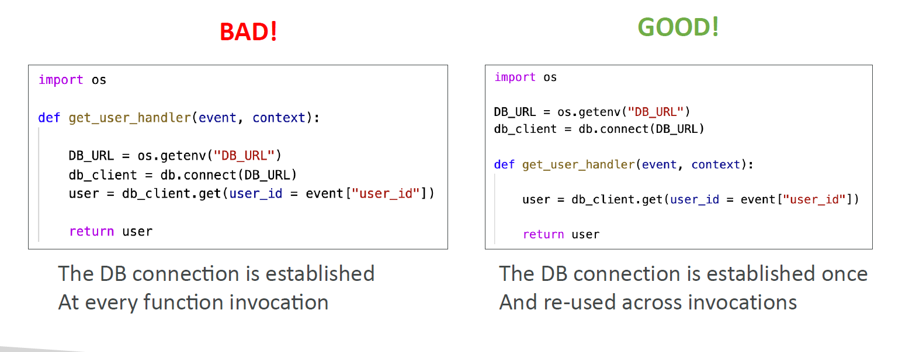

# 🚀 **Optimizing AWS Lambda Performance**

To build **high-performance serverless applications**, you need to understand how AWS Lambda **allocates resources**, **reuses context**, and how to **avoid latency traps** like cold starts or repeated database connections.

Let’s dive deep into **Lambda performance tuning** – from memory to execution context.

---

## ⚙️ **Lambda Function Configuration: RAM & CPU**

Lambda gives you control over memory allocation, which directly affects **CPU power** and **network throughput**.

| Setting     | Range                            | Performance Impact              |
| ----------- | -------------------------------- | ------------------------------- |
| **Memory**  | 128 MB → 10 GB (1 MB increments) | More memory = more vCPUs        |
| **Timeout** | 1s → 900s (15 mins)              | Higher limit for long processes |

### 🧠 CPU Allocation

- At **1792 MB**, your function gets **1 full vCPU**
- After that: **\~1 vCPU per 1792 MB**, up to **6 vCPUs**
- Multi-threaded code (e.g., using `concurrent.futures`, `asyncio`, or multiple Node.js workers) is **essential** to benefit from extra CPUs

> 🔥 For **CPU-bound** tasks (e.g., media encoding, ML inference): increase memory!

---

## ♻️ **Lambda Execution Context – Reuse It!**

Every time Lambda executes:

1. It spins up an **execution environment** (includes `/tmp`, runtime, and memory).
2. The environment **stays alive ("warm")** after execution for **a short period**.
3. If another invocation comes in, Lambda **reuses** that context → 🚫 no cold start.

---

<div style="text-align:center;">
  
</div>

---

### ✅ What to Initialize Outside the Handler

| ✅ Good to Initialize Once                  | ❌ Don’t Initialize in the Handler   |
| ------------------------------------------- | ------------------------------------ |
| DB connections (PostgreSQL, DynamoDB, etc.) | DB connection per request            |
| SDK clients (e.g., Boto3, S3, etc.)         | Redundant HTTP client instantiation  |
| Global variables/constants                  | Variable definitions in handler body |

```python
# GOOD ✅
db_client = db.connect(os.getenv("DB_URL"))

def lambda_handler(event, context):
    return db_client.query("SELECT * FROM users")
```

> 🔁 This avoids **creating a new DB connection on every invocation**, saving **100–500ms**!

---

## 🧊 **Cold Starts vs Warm Starts**

| Type     | What Happens                                        | Latency Impact      |
| -------- | --------------------------------------------------- | ------------------- |
| **Cold** | New environment, full init (runtime + dependencies) | Adds 100–1000ms+    |
| **Warm** | Reused context, DB/client/cache already loaded      | Nearly zero latency |

### 🧊 Tips to Reduce Cold Start Impact

- Avoid heavy packages (`Pandas`, `Selenium`, `sklearn`) if not needed
- Use **Provisioned Concurrency** for critical, latency-sensitive workloads
- Use lightweight runtimes (Node.js, Python) for short, fast functions
- **Keep your deployment package small** (zip size, dependencies, layers)

---

## 🗂️ **/tmp Directory for Caching**

Each Lambda gets **ephemeral disk space** under `/tmp`, useful for:

| Use Case                        | Benefit                             |
| ------------------------------- | ----------------------------------- |
| File download/cache (e.g. ZIPs) | Avoid repeated S3 fetches           |
| Model loading (e.g. TensorFlow) | Store large pre-loaded files        |
| Temporary logs/checkpoints      | Can persist across warm invocations |

### ⚠️ Constraints

- Max size: **10 GB**
- File system is **reset on cold starts**
- Not suitable for persistent storage — use S3

```python
# Write temporary cache
with open("/tmp/cached_data.json", "w") as f:
    json.dump(data, f)
```

---

## 🧪 Benchmark Tip: Optimize with Power Tuning

Try the **AWS Lambda Power Tuner** (open-source tool by AWS):

- It runs your function across multiple memory levels
- Measures duration, cost, and performance
- Helps you find **the "sweet spot"** for cost-vs-speed

> 📍 [GitHub – lambda-power-tuning](https://github.com/alexcasalboni/aws-lambda-power-tuning)

---

## 🏁 Final Checklist – Lambda Performance Optimization

| ✅ Optimization Area  | 💡 Best Practice                                          |
| --------------------- | --------------------------------------------------------- |
| Memory & CPU          | Increase memory for compute-heavy logic                   |
| Handler Structure     | Initialize DB/clients outside the handler                 |
| Cold Start Mitigation | Use Provisioned Concurrency + small deployment size       |
| Disk Cache            | Use `/tmp` for large file reuse (up to 10 GB)             |
| Parallelization       | Use threads or async if over 1792 MB RAM                  |
| Dependency Size       | Minimize packages, remove unused libraries                |
| Observability         | Enable X-Ray + CloudWatch for duration/cold start metrics |

---

## 💬 Conclusion

To **maximize performance and minimize latency** in AWS Lambda:

- 🔁 Reuse execution context
- 🚀 Right-size memory for your function profile (I/O-bound vs CPU-bound)
- 💾 Use `/tmp` for short-lived local disk caching
- ❄️ Avoid cold starts via architecture & config (Provisioned Concurrency)

> Serverless doesn’t mean “zero performance control.” With the right practices, **Lambda can rival traditional compute** in speed, cost, and scalability.
