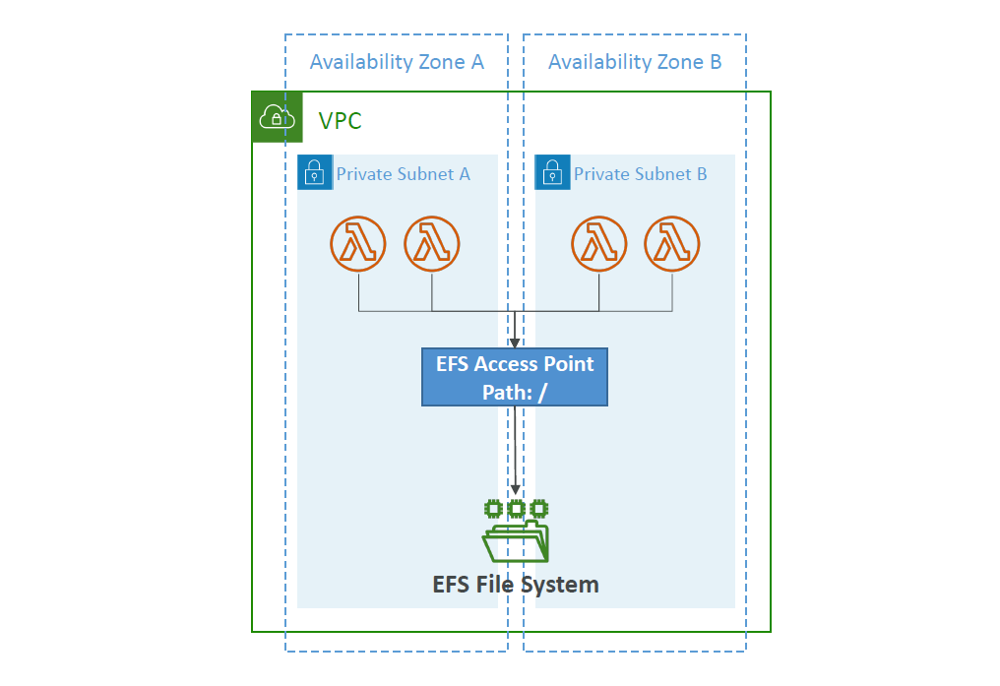

# 📂 **Lambda – File System Mounting with Amazon EFS**

> AWS Lambda can now process **large files, persistent data, and shared workloads** by integrating with **Amazon EFS (Elastic File System)**. This enables **stateful**, **data-heavy** serverless applications.

---

- ✅ Each Lambda runs inside a **VPC private subnet**
- ✅ EFS is mounted via **EFS Access Points**
- ✅ The mount path (e.g. `/mnt/efs`) is configured at deployment time

---

<div style="text-align:center;">
  
</div>

---

## 🔗 **Why Mount EFS to Lambda?**

- 📁 Persist files across Lambda invocations
- 🧠 Share stateful data (e.g., ML models, config files)
- 💾 Store large files (up to petabytes)
- 🧬 Enable multi-function coordination through shared storage

> 🧩 EFS enables **Lambda to work with mutable, persistent file storage**, unlike the ephemeral `/tmp`.

---

## 🛠️ **How to Configure EFS for Lambda**

### Step 1: Create an EFS File System

- Select **"General Purpose"** or **"Max I/O"** throughput
- Enable **automatic backups** if needed

### Step 2: Create EFS Access Point

- Define the **path** (e.g. `/` or `/lambda`)
- Set **POSIX user** and permissions
- Used to scope access for Lambda functions

### Step 3: Attach EFS to Lambda

- Lambda **must be in a VPC**
- Choose **subnets and security groups** with access to the EFS mount target
- Under **"File systems"**, add the EFS access point
- Define the **mount path** (e.g., `/mnt/efs`)

---

## ✅ **Sample Python Example – Reading a File from EFS**

```python
def lambda_handler(event, context):
    with open("/mnt/efs/myfile.txt", "r") as f:
        content = f.read()
    return content
```

> 📁 Files persist across invocations and can be shared across Lambda instances and functions.

---

## ⚠️ **Important Considerations**

| 🔍 Concern                   | ⚠️ Details                                                             |
| ---------------------------- | ---------------------------------------------------------------------- |
| **VPC Required**             | Lambda must run inside a VPC with access to EFS                        |
| **One Connection = One ENI** | Each function **instance** uses **one ENI** to connect to EFS          |
| **Burst Limits Apply**       | EFS has burst throughput & connection limits per file system           |
| **Latency**                  | Slightly higher latency than local `/tmp`, but scalable and persistent |
| **Cold Starts**              | Lambda may take slightly longer if EFS isn't warm                      |

---

## 📚 **Common Use Cases**

| Use Case                            | Why EFS Works Well                         |
| ----------------------------------- | ------------------------------------------ |
| Machine learning inference          | Load large models (100s of MBs/GBs) once   |
| Document processing or file parsing | Share large PDFs, images across executions |
| Shared configuration                | Mount shared config files per environment  |
| Transcoding, compression pipelines  | Store intermediate files across steps      |
| Cache or checkpointing              | Save state between invocations             |

---

## 💡 **EFS vs. /tmp in Lambda**

| Feature          | `/tmp` (ephemeral)           | `EFS` (persistent)           |
| ---------------- | ---------------------------- | ---------------------------- |
| **Size Limit**   | 10 GB                        | Petabyte scale               |
| **Persistence**  | Lost on cold start           | Shared & persistent          |
| **Availability** | Only within the same context | Available to all functions   |
| **Performance**  | Fast (local)                 | Network latency (\~ms)       |
| **Cost**         | Free                         | Pay per storage + throughput |

---

## 🧪 Testing Tips

- Use `mount` inside the function to verify path:

  ```bash
  print(os.listdir("/mnt/efs"))
  ```

- Check **CloudWatch logs** for mount errors
- Make sure your **Lambda security group** can **connect to the EFS mount target**

---

## 🏁 Final Summary

| ✅ Feature                  | 💡 Notes                                           |
| --------------------------- | -------------------------------------------------- |
| 🔌 Requires VPC             | Yes – Lambda must run inside a VPC                 |
| 📂 File Sharing             | Multiple Lambdas can access the same files         |
| 🔐 IAM + EFS Access Points  | Secure and isolate access                          |
| 💾 Persistent Storage       | Store models, logs, files that survive invocations |
| 🚫 Cold Start Consideration | Slight overhead due to mounting & VPC setup        |

---

> 🧠 Use EFS when your Lambda needs **persistent storage**, **shared access**, or **very large files**. Otherwise, stick to `/tmp` for short-lived, high-speed caching.
