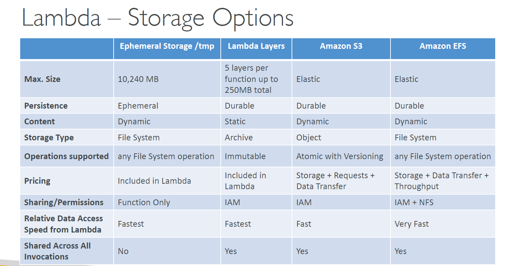

# 📦 **AWS Lambda Storage, Layers, and Container Images**

AWS Lambda gives developers the power to run code without managing servers. But when it comes to **code packaging**, **storage limits**, and **dependency handling**, understanding how Lambda works under the hood is crucial — especially when choosing between **ZIP-based deployment**, **Lambda Layers**, or **Container Images**.

---

    

---

## ⛔ **Lambda Function Storage Limits**

Lambda functions have constraints based on their packaging method:

| Deployment Type | Max Upload Size      | Where It Runs                         |
| --------------- | -------------------- | ------------------------------------- |
| ZIP package     | 50 MB (compressed)   | Unzipped into `/var/task`             |
| Container image | 10 GB (uncompressed) | Full image loaded into Lambda runtime |

✅ Regardless of method, Lambda provides:

- **512 MB of ephemeral storage at `/tmp`** (can be increased to 10 GB)
- **Read-only `/var/task`** for function code
- **Optional mounted `/opt`** for Lambda Layers

---

## 🍰 **Lambda Layers (Only for ZIP-Based Deployments)**

> A **Lambda Layer** is a distribution mechanism for **common libraries** and shared code across functions.

📌 **Key Points:**

- Only works with **ZIP-based Lambda functions**
- Layers are **mounted into `/opt`**
- You can include up to **5 layers per function**
- Layer size must be **<250 MB (unzipped)**

✅ Great for:

- Sharing SDKs, NumPy, Pandas, etc.
- Keeping your function package small and modular

🚫 Not applicable for container image functions.

---

## 🐳 **Lambda Container Images**

> For large or complex applications, AWS Lambda supports **Docker container images up to 10 GB**.

📌 **Key Points:**

- You define a full Dockerfile (runtime, dependencies, system tools)
- No need for layers — you install everything inside the image
- Great for **ML, image processing, custom binaries, and large apps**

❌ Not compatible with Lambda Layers (because layers mount to `/opt`, which is irrelevant inside a container).

---

## ZIP + Layers 🆚 Container Images — Which to Use?

| Feature                  | ZIP + Layer (Classic)    | Container Image             |
| ------------------------ | ------------------------ | --------------------------- |
| Layer support            | ✅ Yes                   | ❌ Not supported            |
| Max deployment size      | 250 MB (unzipped)        | 10 GB                       |
| Use prebuilt shared libs | ✅ Yes (via Layers)      | ❌ Must install manually    |
| Cold start performance   | ✅ Faster                | ❌ Slower in most cases     |
| Full OS/runtime control  | ❌ No                    | ✅ Yes (via Dockerfile)     |
| Ideal for                | Lightweight & fast setup | Heavy, custom, ML workloads |

---

## ❓Your Questions — Answered

### 💡 _Q1: Are Lambda Layers useful for container images?_

> ❌ **No**. Layers are only mounted for **ZIP-based functions**. Containers don’t support `/opt` layer mounting.

---

### 💡 _Q2: Is using ZIP + Layer better than container image?_

> ❌ **Not always**.
> ✅ Use ZIP + Layers for:

- Simpler, smaller apps
- Reusable code across functions
- Better cold start performance

> ✅ Use container image for:

- Large dependencies (e.g., TensorFlow)
- Custom OS requirements
- Docker-based workflows

---

### 💡 _Q3: What if my Lambda function needs >1 MB of encrypted data?_

> ✅ Use **Envelope Encryption** to:

- Encrypt large data files with a **Data Encryption Key (DEK)**
- Encrypt the DEK with **AWS KMS**
- Store the encrypted file (e.g., S3 or bundled with container)
- Decrypt it inside Lambda during runtime

Storing >1MB secrets in environment variables is **not safe or supported** — use files + envelope encryption.

---

## ✅ Final Summary

| Component           | Purpose                           | Best Fit                        |
| ------------------- | --------------------------------- | ------------------------------- |
| **Lambda Layer**    | Add shared libraries for ZIP code | ZIP-based lightweight functions |
| **/tmp Storage**    | Temp runtime data (max 10 GB)     | Caching, downloading at runtime |
| **Container Image** | Full control over Lambda image    | ML, large binaries, custom OS   |
| **ZIP Package**     | Traditional deployment method     | Fast, simple functions          |
