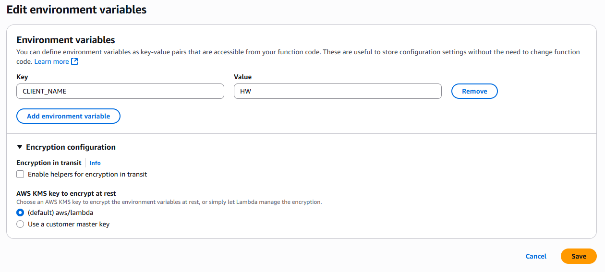

# ⚙️ **AWS Lambda Configuration: A Comprehensive Guide**

> This guide covers **Lambda general configuration, triggers, permissions, function URLs, VPC settings, monitoring tools, concurrency settings, and more**.

---

<div style="text-align: center;">
    
</div>

---

## **1️⃣ General Configuration**

> AWS Lambda’s **general configuration** settings control resource allocation and performance optimizations. Key settings include **memory allocation, timeout, ephemeral storage, and SnapStart**.

---

<div style="text-align: center;">
  
</div>

---

### **🛠 Key Configuration Options**

- ✅ **Memory Allocation:** From 128 MB to 10 GB (impacts CPU allocation)
- ✅ **Timeout:** Maximum execution time (default: 3s, max: 15 minutes)
- ✅ **Ephemeral Storage (`/tmp`):** Default 512 MB, configurable up to 10 GB
- ✅ **SnapStart:** Reduces cold start latency for **Java 11 and 17**

---

### 📂 **Ephemeral Storage (`/tmp`)**

AWS Lambda provides a **temporary file system (`/tmp`)** that is available during function execution. This storage is useful for **caching, temporary processing, and handling large datasets**.

#### **🛠 AWS CLI to Modify Ephemeral Storage**

```sh
aws lambda update-function-configuration \
  --function-name myFunction \
  --ephemeral-storage "Size=5120"
```

> 📌 **Example Use Case:** Temporary storage for machine learning model inference, image processing, or large file manipulation.

---

### ⚡ **SnapStart (For Java 11 & 17 Runtimes)**

Lambda **SnapStart** optimizes **cold starts** by **caching an initialized execution environment snapshot**.

#### Supported runtimes

- .NET 8 (C#/F#/PowerShell)
- Java 11, Java 17, Java 21
- Python 3.12, Python 3.13.

#### **How SnapStart Works**

- **1️⃣** When a function **version is published**, Lambda **takes a snapshot** of the memory & disk state after initialization.
- **2️⃣** The snapshot is **encrypted and cached** for fast access.
- **3️⃣** On the **first invocation** (and for scaling), Lambda **resumes from the snapshot** instead of reinitializing.

#### **🛠 AWS CLI to Enable SnapStart**

```sh
aws lambda update-function-configuration \
  --function-name myFunction \
  --snap-start "ApplyOn=PublishedVersions"
```

> 📌 **Benefits:**
>
> - **Faster cold start performance** (up to **90% reduction**)
> - **No additional cost**
> - **Best suited for Java-based functions**

---

## **2️⃣ Triggers**

> AWS Lambda **triggers** define how functions are executed automatically in response to events.

### **🛠 Common Triggers**

✅ **Amazon S3:** Runs when an object is uploaded  
✅ **API Gateway:** HTTP requests trigger the function  
✅ **CloudWatch Events:** Scheduled executions  
✅ **DynamoDB Streams:** React to database changes  
✅ **SNS / SQS:** Process messages asynchronously

### **🛠 AWS CLI to Add a Trigger (S3 Example)**

```sh
aws lambda create-event-source-mapping \
  --function-name myFunction \
  --event-source-arn arn:aws:s3:::my-bucket \
  --starting-position LATEST
```

📌 **Triggers allow event-driven execution of Lambda functions without manual invocation.**

---

## **3️⃣ Permissions**

> AWS Lambda functions require **IAM permissions** to securely interact with AWS resources and define who or what can invoke them.

Lambda permissions are managed through:  
✅ **Execution Roles** – Controls what AWS resources the function can access  
✅ **Resource-Based Policies** – Controls which AWS services or accounts can invoke the function

---

### **🛠 Execution Role (IAM Role for Lambda Functions)**

Every Lambda function needs an **IAM execution role** that grants it permissions to access AWS services such as **S3, DynamoDB, CloudWatch, and SNS**.

#### **Assign an Execution Role to a Lambda Function (AWS CLI)**

```sh
aws lambda update-function-configuration \
  --function-name myFunction \
  --role arn:aws:iam::123456789012:role/LambdaExecutionRole
```

> 📌 **Ensure least privilege access by assigning only necessary permissions.**

---

### **🛠 Resource-Based Policy (Who Can Invoke Lambda?)**

A **resource-based policy** allows **other AWS services** (e.g., **S3, API Gateway, EventBridge, SNS**) or **another AWS account** to invoke your Lambda function.

#### **Allow an S3 Bucket to Invoke a Lambda Function (AWS CLI)**

```sh
aws lambda add-permission \
  --function-name myFunction \
  --statement-id AllowS3Invoke \
  --action "lambda:InvokeFunction" \
  --principal s3.amazonaws.com \
  --source-arn arn:aws:s3:::my-bucket \
  --source-account 123456789012
```

> 📌 **This allows S3 to trigger the Lambda function whenever an event occurs.**

#### **Allow Another AWS Account to Invoke Lambda (AWS CLI)**

```sh
aws lambda add-permission \
  --function-name myFunction \
  --statement-id AllowCrossAccountInvoke \
  --action "lambda:InvokeFunction" \
  --principal arn:aws:iam::987654321098:root
```

> 📌 **This allows an external AWS account (`987654321098`) to invoke the function.**

---

## **4️⃣ Destinations**

> AWS Lambda **Destinations** define where **the result of an asynchronous function invocation is sent**.

---

<div style="text-align: center;">
  
</div>

---

### **🛠 AWS CLI to Configure a Destination (SNS Example)**

```sh
aws lambda put-function-event-invoke-config \
  --function-name myFunction \
  --destination-config 'OnSuccess={Destination=arn:aws:sns:us-east-1:123456789012:myTopic}'
```

> 📌 **Destinations help manage success and failure events efficiently.**

---

## **5️⃣ Function URL**

> AWS Lambda **Function URLs** provide a **built-in HTTPS endpoint** to invoke functions directly.

---

<div style="text-align: center;">
  
</div>

---

### **🛠 AWS CLI to Create a Function URL**

```sh
aws lambda create-function-url-config \
  --function-name myFunction \
  --auth-type NONE
```

> 📌 **Useful for simple HTTP endpoints without API Gateway.**

---

## **6️⃣ Environment Variables**

> Environment variables store **configurations, secrets, and runtime settings** for Lambda functions.

---

<div style="text-align: center;">
    
</div>

---

### **🛠 AWS CLI to Add Environment Variables**

```sh
aws lambda update-function-configuration \
  --function-name myFunction \
  --environment "Variables={DB_HOST=mydb.cluster.amazonaws.com,API_KEY=12345}"
```

> 📌 **Use AWS Secrets Manager for sensitive credentials.**

---

## **7️⃣ Tags**

> Tags help categorize Lambda functions for **cost tracking, security, and management**.

### **🛠 AWS CLI to Add Tags**

```sh
aws lambda tag-resource \
  --resource arn:aws:lambda:us-east-1:123456789012:function:myFunction \
  --tags "Project=MyApp" "Environment=Production"
```

---

## **8️⃣ VPC Configuration**

> By default, AWS Lambda runs **outside your VPC**, but you can attach it to a **VPC** for private network access.

---

<div style="text-align: center;">
  
</div>

---

### **🛠 AWS CLI to Attach a Lambda Function to a VPC**

```sh
aws lambda update-function-configuration \
  --function-name myFunction \
  --vpc-config SubnetIds=subnet-abc123,SecurityGroupIds=sg-xyz789
```

---

## **9️⃣ RDS Database Connectivity**

> To connect **AWS Lambda to an RDS database**, it must be in the **same VPC**.

---

<div style="text-align: center;">
    
</div>

---

### **🛠 AWS CLI to Add RDS Database Access**

```sh
aws lambda update-function-configuration \
  --function-name myFunction \
  --vpc-config "SubnetIds=subnet-abc123,SecurityGroupIds=sg-xyz789"
```

> 📌 **Use RDS Proxy for efficient database connections.**

---

## **🔟 Monitoring & Operations**

> AWS Lambda integrates with **CloudWatch, X-Ray, and AWS Config** for monitoring.

---

<div style="text-align: center;">
  
</div>

---

<div style="text-align: center;">
  
</div>

---

<div style="text-align: center;">
  
</div>

---

### **🛠 AWS CLI to Enable X-Ray Tracing**

```sh
aws lambda update-function-configuration \
  --function-name myFunction \
  --tracing-config Mode=Active
```

---

## **1️⃣1️⃣ Concurrency & Recursion Detection**

<div style="text-align: center;">
  
</div>

---

### **🛠 AWS CLI to Set Concurrency Limit**

```sh
aws lambda put-function-concurrency \
  --function-name myFunction \
  --reserved-concurrent-executions 5
```

---

## **1️⃣2️⃣ Asynchronous Invocation**

> AWS Lambda supports **async execution** for event-driven processing.

---

<div style="text-align: center;">
    
</div>

---

### **🛠 AWS CLI to Enable Async Invocation**

```sh
aws lambda invoke \
  --function-name myFunction \
  --invocation-type Event \
  --payload '{ "key": "value" }' \
  response.json
```

---

## **1️⃣3️⃣ Code Signing**

> Code signing ensures **only trusted Lambda code is deployed**.

### **🛠 AWS CLI to Add a Signing Profile**

```sh
aws lambda update-function-configuration \
  --function-name myFunction \
  --code-signing-config-arn arn:aws:signer:us-east-1:123456789012:signing-profile/MyProfile
```

---

## **1️⃣4️⃣ File Systems (EFS)**

> AWS Lambda supports **Amazon Elastic File System (EFS)** for persistent storage.

---

<div style="text-align: center;">
  
</div>

---

### **🛠 AWS CLI to Mount an EFS File System**

```sh
aws lambda update-function-configuration \
  --function-name myFunction \
  --file-system-configs "Arn=arn:aws:elasticfilesystem:us-east-1:123456789012:access-point/fsap-xyz123,LocalMountPath=/mnt/data"
```

---

## 🧾 **Conclusion**

AWS Lambda provides **robust configuration options** to optimize security, performance, and integration. **Master these settings to build scalable and efficient serverless applications.**
