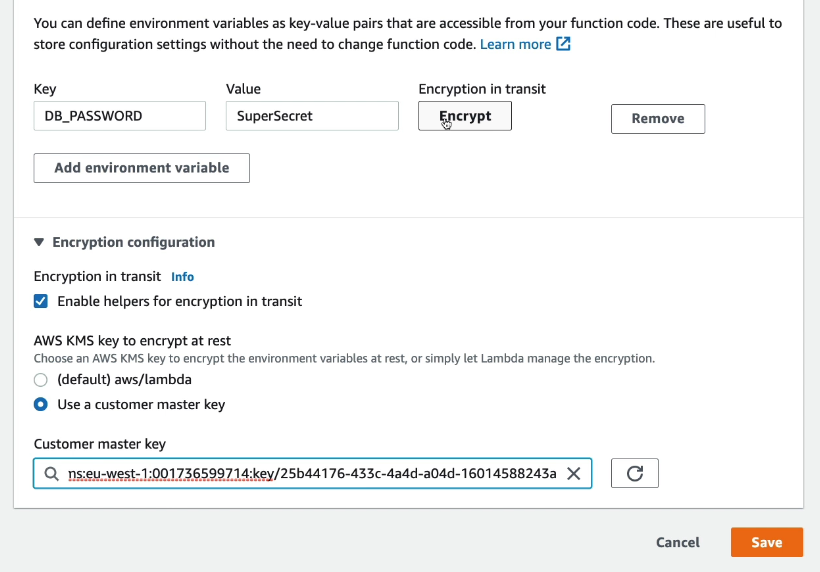
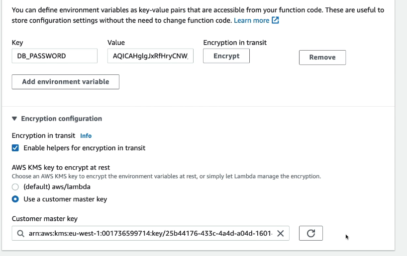
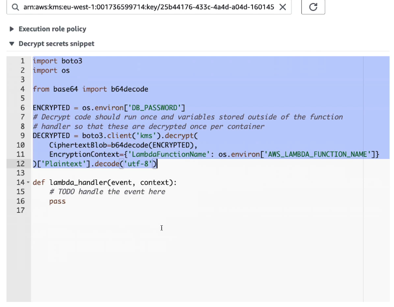

# 🌱 **AWS Lambda Environment Variables**

> AWS Lambda **Environment Variables** allow you to **store and manage configuration settings** without modifying your code. They are useful for **storing secrets, database connections, API keys, and feature flags**.

However, while **AWS encrypts environment variables at rest**, **they are not automatically encrypted in transit** when being retrieved inside your Lambda function. Additional security measures are recommended for **sensitive data**.

---

## 🛠 **How to Use Environment Variables in Lambda**

- ✔️ **Define Key-Value Pairs** – Set variables in the AWS Lambda console or via the AWS CLI.
- ✔️ **Access Variables in Code** – Use standard environment variable retrieval methods in Python, Node.js, Java, etc.
- ✔️ **Secure Sensitive Data** – Encrypt values using **AWS KMS** or store them in **AWS Secrets Manager**.

---

## 📌 **Setting Environment Variables**

### **1️⃣ AWS Console**

- Go to **AWS Lambda → Your Function → Configuration → Environment Variables**
- Add key-value pairs like:
  - `DB_HOST = mydatabase.example.com`
  - `API_KEY = abc123secret`

### **2️⃣ AWS CLI**

```sh
aws lambda update-function-configuration \
  --function-name myLambdaFunction \
  --environment "Variables={DB_HOST=mydatabase.example.com,API_KEY=abc123secret}"
```

---

## 🧑‍💻 **Accessing Environment Variables in Code**

### **Python Example**

```python
import os

def lambda_handler(event, context):
    db_host = os.getenv("DB_HOST")  # Fetch environment variable
    api_key = os.getenv("API_KEY")
    return {"Database Host": db_host, "API Key": api_key}
```

### **Node.js Example**

```javascript
exports.handler = async (event) => {
  const dbHost = process.env.DB_HOST;
  const apiKey = process.env.API_KEY;
  return { "Database Host": dbHost, "API Key": apiKey };
};
```

---

## 🔐 **Security Considerations for Environment Variables**

### **✔️ Encryption at Rest (AWS Managed)**

- AWS **automatically encrypts** environment variables **at rest** using an **AWS-managed KMS key**.
- You can also configure a **custom AWS KMS key** for added security.

**AWS CLI Example (Using a KMS Key for Encryption):**

```sh
aws lambda update-function-configuration \
  --function-name myLambdaFunction \
  --kms-key-arn arn:aws:kms:region:account-id:key/your-key-id
```

### **🚨 Data in Transit is NOT Encrypted Automatically**

- **Environment variables are decrypted when accessed inside the function** but **are NOT encrypted in transit** within the execution environment.
- **If an attacker gains access to the Lambda runtime environment, they can read sensitive data in plaintext.**

---

## 🛡️ **How to Secure Environment Variables in Transit**

Environment variables in Lambda are automatically encrypted **at rest**, but not **in transit between deployment tools and AWS**, or between **you and your source repo**. For **highly sensitive data** (e.g., API keys, DB passwords), avoid plain-text storage in environment variables.

Instead, use these secure alternatives:

---

### **1️⃣ Use AWS Secrets Manager** (✅ Recommended)

- Secrets are **encrypted at rest with KMS** and protected **in transit** with TLS.
- Supports **automatic rotation** for credentials (RDS, API tokens, etc.).
- Secrets can be **fetched at runtime** securely.

**Example (Python):**

```python
import boto3
import json

def get_secret():
    client = boto3.client('secretsmanager')
    secret = client.get_secret_value(SecretId='prod/db/password')
    return json.loads(secret['SecretString'])
```

---

### **2️⃣ Use AWS Systems Manager Parameter Store**

- Supports **KMS encryption** and fine-grained **IAM access control**
- Fetch secrets **only when needed**, not hardcoded into the function

**Example (Python):**

```python
import boto3

def get_parameter():
    ssm = boto3.client('ssm')
    response = ssm.get_parameter(Name='/prod/db/password', WithDecryption=True)
    return response['Parameter']['Value']
```

---

### **3️⃣ (Advanced) Manually Decrypt KMS-Encrypted Env Vars**

If you _must_ store encrypted values in Lambda environment variables, encrypt them with KMS manually and decrypt them at runtime.

<div style="text-align: center;">
    
</div>

<div style="text-align: center;">
    
</div>

<div style="text-align: center;">
    
</div>

---

**Code Example (from your screenshot):**

```python
from base64 import b64decode
import os, boto3

ENCRYPTED = os.environ['DB_PASSWORD']

DECRYPTED = boto3.client('kms').decrypt(
    CiphertextBlob=b64decode(ENCRYPTED),
    EncryptionContext={'LambdaFunctionName': os.environ['AWS_LAMBDA_FUNCTION_NAME']}
)['Plaintext'].decode('utf-8')

def lambda_handler(event, context):
    print(DECRYPTED)  # Use cautiously, avoid logging secrets
    return "success"
```

📌 This pattern:

- Ensures **only KMS and this function** can decrypt the secret
- Works **even if you're not using Secrets Manager or SSM**
- Still depends on **IAM permissions** for `kms:Decrypt`

---

### 🧠 **Conclusion:**

For the most secure and maintainable architecture:

> Prefer **Secrets Manager** or **Parameter Store**  
> Avoid manually managing encryption unless absolutely necessary
> Never log sensitive environment values in plaintext

## 🎯 **Why Use Environment Variables?**

- ✔️ **Easier Configuration** – Update values without changing code.
- ✔️ **Security at Rest** – Environment variables are **encrypted** using AWS KMS.
- ✔️ **Flexibility** – Use different configurations for **dev, test, and prod** environments.

🚨 **Why Avoid Storing Secrets in Environment Variables?**

- ✔️ **Not encrypted in transit** inside the execution environment.
- ✔️ **Exposed if an attacker gains access to the runtime process.**
- ✔️ **No automatic rotation** (unlike AWS Secrets Manager).

---

## 🚀 **Final Takeaways**

- ✔️ **Environment variables help manage configurations without code changes.**
- ✔️ **AWS encrypts environment variables at rest, but NOT in transit** – use AWS Secrets Manager for sensitive data.
- ✔️ **For security best practices, use AWS Secrets Manager or Systems Manager Parameter Store instead of storing secrets in environment variables.**
