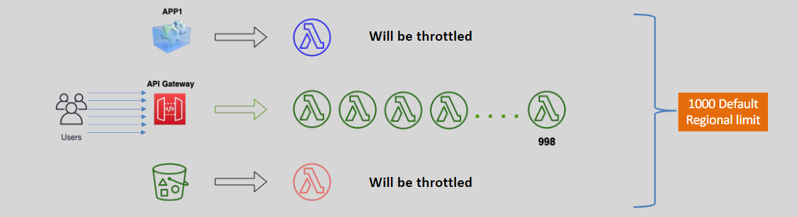
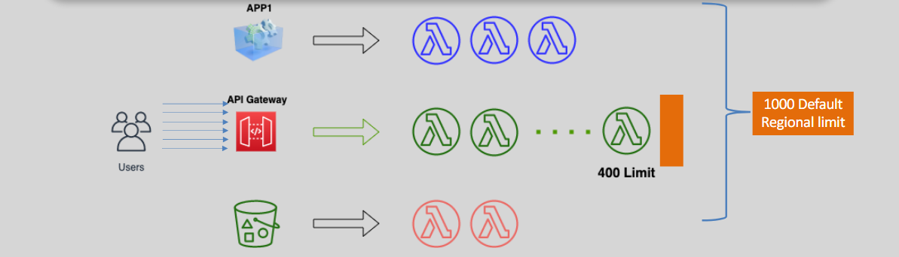

# 🔄 **AWS Lambda Concurrent Execution Deep Dive**

**Concurrent execution** in AWS Lambda refers to the number of Lambda instances that run simultaneously to handle incoming requests. Mastering concurrency is essential for building scalable and resilient serverless applications.

---

## 🧠 **What Is Lambda Concurrency?**

When your Lambda function is invoked, AWS spins up an instance to handle the request. If multiple events trigger the function at the same time, Lambda creates multiple instances—this is **concurrent execution**.

> 📌 _Each active Lambda function invocation counts toward your account’s concurrency limit._

---

## 🚫 **Default Behavior: Without Reserved Concurrency**

When you don’t set **reserved concurrency**, all your Lambda functions share the **default regional pool** of concurrent executions.

### 📊 **Key Characteristics:**

| Feature                     | Description                                                               |
| --------------------------- | ------------------------------------------------------------------------- |
| 🔢 **Default Limit**        | 1,000 concurrent executions per region (soft limit; can be increased)     |
| 🧮 **Shared Pool**          | All functions in a region draw from this quota                            |
| ⛔ **Throttling**           | If the quota is exhausted, **new invocations are throttled** (429 errors) |
| 📉 **Unpredictable Impact** | One function with a spike can starve others of capacity                   |

### 🖼️ _Conceptual Diagram:_

    

> ⚠️ Example: If Lambda A uses up 900 executions, Lambda B has only 100 left before throttling kicks in.

---

## ✅ **Controlled Behavior: With Reserved Concurrency**

**Reserved Concurrency** enables you to **dedicate** a portion of your account’s concurrency to a single function.

### 🔒 **Benefits:**

| Feature                    | Description                                                            |
| -------------------------- | ---------------------------------------------------------------------- |
| 🎯 **Guaranteed Capacity** | Ensures that critical functions always have concurrency available      |
| 🧍 **Isolation**           | Reserved capacity **cannot be borrowed** by other functions            |
| 🛠 **Throttling Control**   | Limits max concurrent executions for that function to prevent overload |
| ⚙️ **Per-function Limit**  | Configured individually per function                                   |

### 🖼️ _Conceptual Diagram:_

    

> ✅ Example: Function A is guaranteed 200, and can never consume more than that—nor be starved by others.

---

## ⚙️ **How to Configure Reserved Concurrency**

1. **Open the AWS Lambda Console**
2. Select your function.
3. Go to the **Configuration** tab → **Concurrency** section.
4. Enable **Reserved Concurrency**
5. Set the value (e.g., 100) and **save changes**.

---

## ⚠️ **Things to Watch Out For**

| Consideration                      | Impact                                                                             |
| ---------------------------------- | ---------------------------------------------------------------------------------- |
| ⛽ **Reserved ≠ Limitless**        | If reserved concurrency is set to 100, only 100 concurrent invocations are allowed |
| 🔄 **Deducted from Regional Pool** | A reserved amount reduces the shared regional pool quota                           |
| 🧪 **Test & Monitor**              | Misconfigured values can lead to self-throttling or starved capacity               |
| 📈 **Scaling**                     | Lambda still auto-scales **up to** the reserved limit                              |

---

## ⚖️ **Comparison Table: Reserved vs. Default Concurrency**

| Feature              | Default (No Reserved)                   | Reserved Concurrency                              |
| -------------------- | --------------------------------------- | ------------------------------------------------- |
| Concurrency Pool     | Shared across all functions             | Dedicated per function                            |
| Throttling Scope     | Regional limit exceeded                 | Function-specific limit exceeded                  |
| Resource Isolation   | ❌ No isolation                         | ✅ Full isolation                                 |
| Configuration Effort | None                                    | Manual per-function setup                         |
| Use Case             | General-purpose, non-critical workloads | Critical, latency-sensitive, guaranteed workloads |

---

## 🧪 **Advanced Usage Patterns**

### 📌 1. **Throttling Protection for Critical Functions**

- Reserve concurrency to **shield high-priority functions** from being throttled by less important ones.

### 📌 2. **Function Throttling (Rate Limiting)**

- Set a **low reserved concurrency** (e.g., `2`) to limit parallelism for resource-intensive or API-rate-limited backends.

### 📌 3. **Combination with Provisioned Concurrency**

- **Provisioned Concurrency** keeps functions pre-initialized and is ideal for cold-start-sensitive workloads.
- Can be combined with reserved concurrency for **warm, guaranteed, predictable performance**.

---

## 📈 **Monitoring Tools**

| Tool                   | Use Case                                    |
| ---------------------- | ------------------------------------------- |
| **CloudWatch Metrics** | View concurrency usage, throttling rates    |
| **AWS X-Ray**          | Trace throttled invocations and cold starts |
| **Service Quotas**     | Request concurrency limit increases         |

> 📊 _Metric to watch: `ConcurrentExecutions` and `Throttles` (per function and regional)_

---

## 🏁 **Conclusion**

Understanding and managing **concurrent execution** in AWS Lambda is crucial for:

- 🔒 Ensuring availability for critical services
- 💰 Optimizing cost and resource usage
- 🚀 Enabling scalable, resilient serverless architectures

> ✅ Use **reserved concurrency** when you:
>
> - Have critical functions that require guaranteed performance
> - Need to protect functions from mutual interference
> - Intend to **rate limit** or throttle function invocations intentionally
