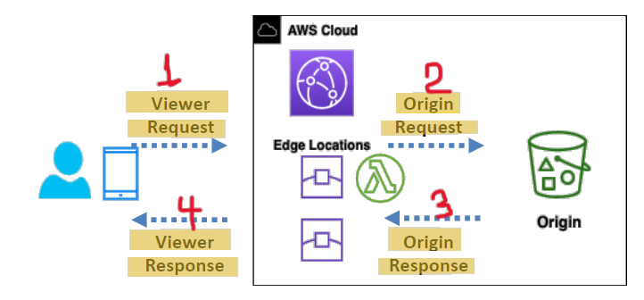

# 🌍 **Customization at the Edge with CloudFront Functions & Lambda\@Edge**

Modern applications demand **low latency**, **dynamic personalization**, and **security enforcement** — all before reaching the origin. **Edge computing** lets you run logic **close to your users**, right at AWS’s **CloudFront edge locations**.

AWS offers two serverless tools to do this:

- ⚡ **CloudFront Functions** (lightweight JS for high-scale)
- 🧠 **Lambda\@Edge** (full Lambda power at the edge)

---

<div style="text-align: center;">
  
</div>

---

## 🧱 **How Edge Customization Works**

> You write code (JavaScript or Node/Python) and **attach it to CloudFront events** like Viewer Request or Origin Response. CloudFront executes this logic across its **globally distributed POPs (Points of Presence)**.

**4 Integration Points (CloudFront Triggers):**

- 📩 Viewer Request
- 📤 Viewer Response
- 🛫 Origin Request
- 🛬 Origin Response

---

## ⚡ CloudFront Functions vs. Lambda\@Edge (Comparison Table)

| Feature             | **CloudFront Functions**            | **Lambda\@Edge**                  |
| ------------------- | ----------------------------------- | --------------------------------- |
| Language            | JavaScript                          | Node.js, Python                   |
| Scale               | Millions of req/sec                 | Thousands of req/sec              |
| Triggers Supported  | Viewer Request/Response             | Viewer + Origin Req/Res           |
| Execution Time      | < 1 ms                              | 5–10 sec                          |
| Memory              | 2 MB                                | 128 MB – 10 GB                    |
| Network Access      | ❌ No                               | ✅ Yes                            |
| Request Body Access | ❌ No                               | ✅ Yes                            |
| Pricing             | ✅ Cheaper (1/6th cost) + free tier | 💰 Charged per request + duration |

---

## ✅ **Common Use Cases for Edge Customization**

| Category                 | CloudFront Functions                          | Lambda\@Edge                                     |
| ------------------------ | --------------------------------------------- | ------------------------------------------------ |
| 🔐 Security & Access     | Header rewriting, JWT check                   | OAuth, JWT validation with external API          |
| 🚦 Routing               | Redirects, A/B testing, static URL rewrites   | Intelligent origin routing, language-based split |
| 📦 Caching & Performance | Cache key normalization                       | Modify cache behavior per-user                   |
| 🎨 SEO & UX Enhancements | Inject SEO-friendly headers                   | Dynamic personalization from S3/DB               |
| 🧪 Testing               | Region or user-agent-based variation delivery | Cookie/session-based A/B testing                 |
| 📈 Analytics & Tracking  | Add tracking headers/cookies                  | User behavior recording into backend             |

---

## ✏️ **Example 1: CloudFront Function – Normalize URL Case**

```js
function handler(event) {
  var request = event.request;
  request.uri = request.uri.toLowerCase();
  return request;
}
```

✅ Applied on: **Viewer Request**

🧠 Use case: Normalize URLs like `/HOME` → `/home` to improve cache hit rate

---

## ✏️ **Example 2: Lambda\@Edge – Redirect Based on Country**

```js
"use strict";
exports.handler = async (event) => {
  const request = event.Records[0].cf.request;
  const country = event.Records[0].cf.headers["cloudfront-viewer-country"][0].value;

  if (country === "DE") {
    return {
      status: "302",
      statusDescription: "Found",
      headers: {
        location: [{ value: "https://de.example.com" }],
      },
    };
  }
  return request;
};
```

✅ Applied on: **Viewer Request**

🧠 Use case: **Geo-based redirection** (Germany → localized site)

---

## 🔍 **Triggers Recap (When the Code Executes)**

| Trigger Name    | CloudFront Functions | Lambda\@Edge | When It Happens                                |
| --------------- | -------------------- | ------------ | ---------------------------------------------- |
| Viewer Request  | ✅ Yes               | ✅ Yes       | Just after client sends request to CloudFront  |
| Viewer Response | ✅ Yes               | ✅ Yes       | Before CloudFront sends response to client     |
| Origin Request  | ❌ No                | ✅ Yes       | Before CloudFront forwards to the origin       |
| Origin Response | ❌ No                | ✅ Yes       | After CloudFront receives response from origin |

---

## 🧠 Choosing the Right Tool

| Use This If...                                            | Use...                      |
| --------------------------------------------------------- | --------------------------- |
| You need ultra-fast header/url rewrites                   | ✅ **CloudFront Functions** |
| You want access to body, file system, or external network | ✅ **Lambda\@Edge**         |
| You're doing lightweight cache tuning or simple auth      | ✅ **CloudFront Functions** |
| You need advanced personalization or origin logic         | ✅ **Lambda\@Edge**         |
| You want to minimize cost and run at huge scale           | ✅ **CloudFront Functions** |

---

## 💡 Final Summary

| 🧩 Feature    | **CloudFront Functions**    | **Lambda\@Edge**                      |
| ------------- | --------------------------- | ------------------------------------- |
| 🔁 Triggers   | Viewer Req/Res              | All 4 (Viewer + Origin Req/Res)       |
| ⚙️ Complexity | Lightweight logic           | Heavy logic, file/network access      |
| 💰 Cost       | Low + Free Tier             | Higher cost, pay per duration         |
| 🧪 Best For   | Auth, cache keys, redirects | Dynamic personalization, integrations |

---

> ✅ CloudFront Functions = 🔥 For fast, cheap, lightweight edge logic
> ✅ Lambda\@Edge = 🧠 For complex, powerful processing at the edge
