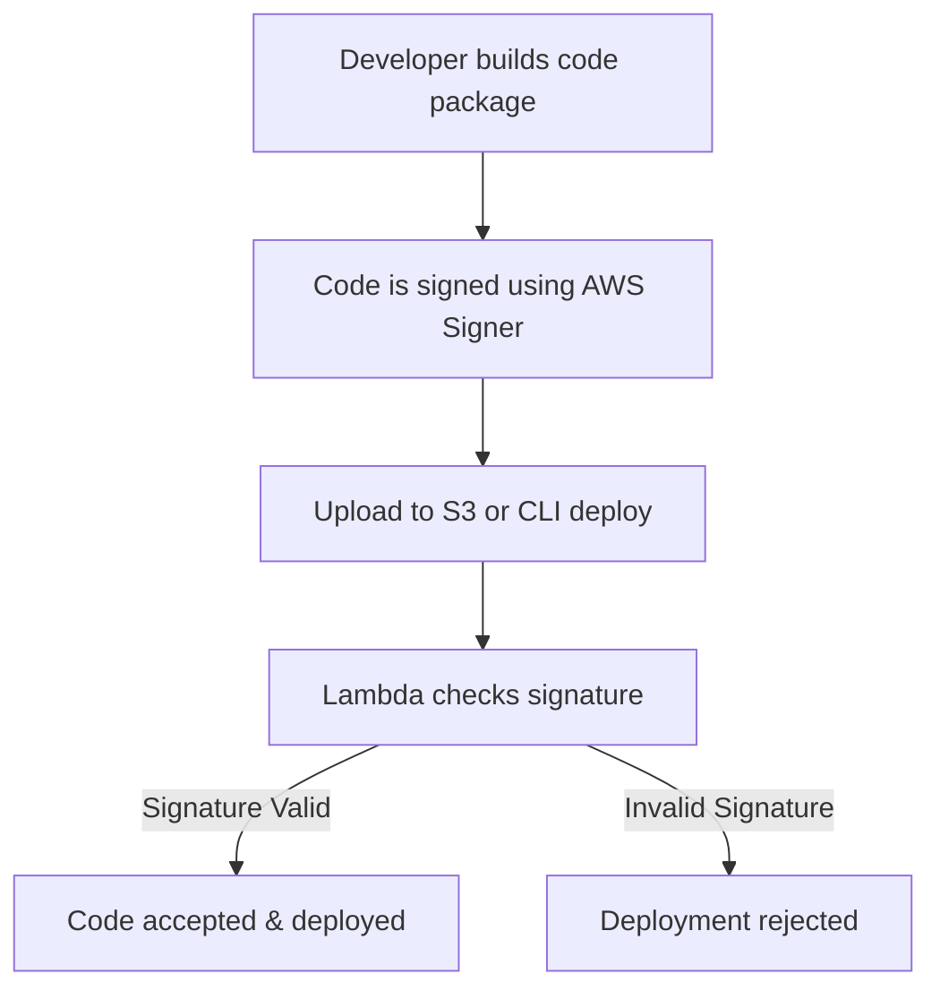

# ✍️ **Code Signing in AWS Lambda – Protect Your Code from Tampering**

In a world where **software supply chain attacks** are becoming more frequent, **code signing** is your shield. It ensures that your **Lambda deployment packages are verified**, **unaltered**, and **originated from a trusted source** before AWS allows them to run.

---

## 🔐 **What is Lambda Code Signing?**

Code signing in AWS Lambda allows you to:

- ✅ Verify that code comes from a **trusted developer**
- ✅ Detect **tampering** or unauthorized modification
- ✅ Enforce **deployment integrity** at runtime

If the code doesn’t match the expected signature, **Lambda rejects it immediately**, preventing unverified code from being deployed or executed.

---

## 🧠 **How Lambda Code Signing Works (Step-by-Step)**



### ✅ Main Components

| **Component**                        | **Purpose**                                                              |
| ------------------------------------ | ------------------------------------------------------------------------ |
| **Signing Profile**                  | Defines how your code is signed and what certificate is used             |
| **Code Signing Configuration (CSC)** | Specifies allowed signing profiles and behavior if validation fails      |
| **Signer Service**                   | AWS service that cryptographically signs your Lambda deployment packages |

---

## 🛡️ **Benefits of Code Signing**

| 🔒 Benefit                        | ✅ Description                                                              |
| --------------------------------- | --------------------------------------------------------------------------- |
| **Tamper Prevention**             | Code must match its digital signature — any byte changed = deployment fails |
| **Trusted Developer Enforcement** | Only code signed with **your allowed profile** can be deployed              |
| **Auditability**                  | Code signing provides **traceability** of who signed what and when          |
| **Compliance-Ready**              | Supports security standards such as **SOC 2, HIPAA, ISO 27001**             |
| **Defense-in-Depth**              | Adds another layer of security alongside IAM, encryption, and VPC           |

---

## 🛠️ **Enabling Code Signing for Lambda**

### 🔹 **Step 1: Create a Signing Profile**

```sh
aws signer put-signing-profile \
  --profile-name my-signer-profile \
  --platform-id AWSLambda-SHA384-ECDSA
```

> 🔍 `AWSLambda-SHA384-ECDSA` is the platform for Lambda signing.

### 🔹 **Step 2: Create a Code Signing Configuration**

```sh
aws lambda create-code-signing-config \
  --code-signing-policies '{"untrustedArtifactOnDeployment":"Enforce"}' \
  --allowed-publishers '{"signingProfileVersionArns":["arn:aws:signer:region:account-id:/signing-profiles/my-signer-profile/versions/version-id"]}'
```

- **Enforce**: Fails deployment if signature invalid
- **Warn**: Allows deployment but logs a warning

### 🔹 **Step 3: Attach CSC to Lambda Function**

```sh
aws lambda update-function-configuration \
  --function-name myFunction \
  --code-signing-config-arn arn:aws:lambda:region:account-id:code-signing-config:your-csc-id
```

---

## 📌 **Best Practices for Code Signing in Lambda**

| ✅ Practice                                   | 💡 Why It Matters                                       |
| --------------------------------------------- | ------------------------------------------------------- |
| Use **dedicated signing profiles** per app    | Enforces function-specific integrity policies           |
| Enable **IAM access control** to signer roles | Prevents unauthorized users from signing arbitrary code |
| Rotate signing keys periodically              | Minimizes risk from compromised keys                    |
| Combine with **CI/CD validation**             | Validate signatures automatically before deployment     |

---

## 🚨 What Happens When Code Is Not Signed Correctly?

| Scenario                  | Behavior                                                      |
| ------------------------- | ------------------------------------------------------------- |
| Signature missing         | ❌ Deployment is **rejected** if policy is `Enforce`          |
| Signature invalid         | ❌ Deployment is **rejected** or **warned** (based on policy) |
| Wrong signer profile      | ❌ Lambda blocks deployment (CSC whitelist violation)         |
| Function updated manually | ❌ Lambda checks signature before any update is accepted      |

---

## 🧪 Example: CI/CD Integration

Code signing integrates well with **SAM** or **CloudFormation**:

```yaml
CodeSigningConfigArn: arn:aws:lambda:region:account-id:code-signing-config:your-csc-id
```

> 💡 This ensures **all deployments** via IaC also pass signature validation.

---

## 🏁 **Conclusion**

**Code signing in Lambda is your last line of defense** against compromised packages. With minimal setup, you get:

- ✅ Cryptographic verification
- ✅ Trusted publisher enforcement
- ✅ Secure CI/CD pipeline integration
- ✅ Full alignment with compliance standards

> 🔐 Your code is your crown jewel — **sign it, protect it, and trust only verified deployments.**
