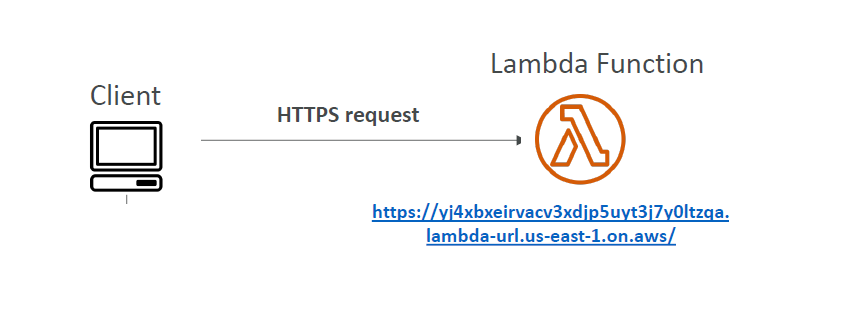
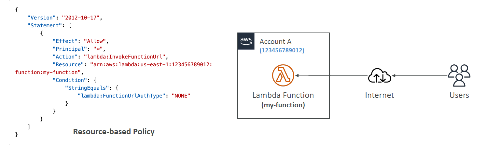
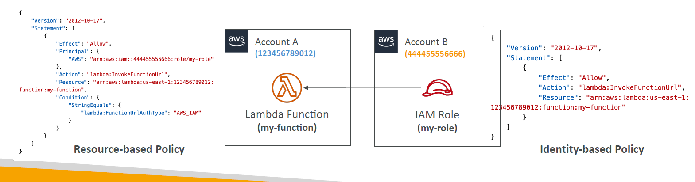
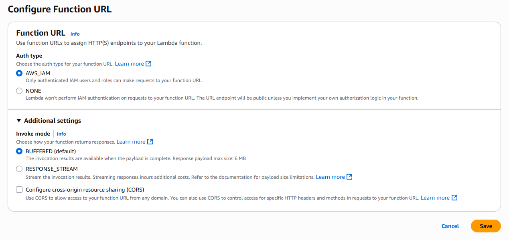
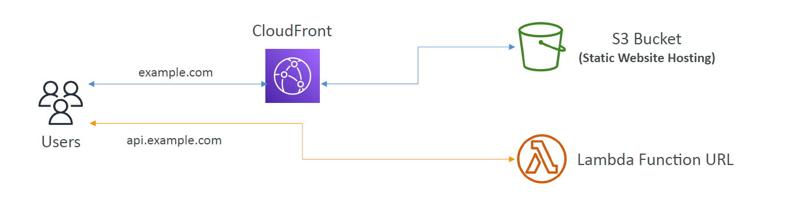
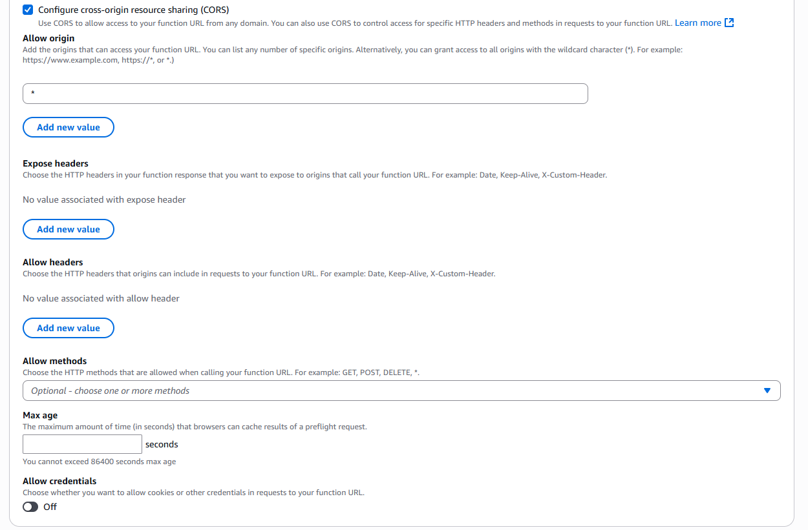

# 🌐 **3. Enable Function URL – Expose Your Lambda via HTTPS**

> A **Function URL** is a dedicated HTTPS endpoint that **allows direct invocation of your Lambda function**.

---

<div style="text-align: center;">
    
</div>

---

## 📌 **Why Use Function URLs?**

- ✔️ Invoke Lambda **without needing API Gateway** (simplifies architecture).
- ✔️ Call the function from **browsers, curl, Postman, or any HTTP client**.
- ✔️ Secure access with **IAM authentication** or make it **public**.

---

## 🔒 **Function URL Authentication Types**

| **Auth Type** | **Description**                                                                                        |
| ------------- | ------------------------------------------------------------------------------------------------------ |
| `AWS_IAM`     | Requires IAM authentication. Only authorized IAM users & roles can invoke the function.                |
| `NONE`        | Public URL—anyone on the internet can access it. You must handle security manually (JWT, OIDC, OAuth). |

💡 **Best Practice:** Use `AWS_IAM` for sensitive data. If using `NONE`, implement **custom authentication inside your function**.

---

<div style="text-align: center;">
    
</div>

---

<div style="text-align: center;">
    
</div>

---

## 🔧 **How to Create a Function URL**

1. Enable Function URL for your Lambda function.
2. Choose an **auth type** (`AWS_IAM` or `NONE`).
3. (Optional) Configure **CORS** for cross-origin access.

---

**AWS Console Example:**

<div style="text-align: center;">
  
</div>

---

**AWS CLI Example:**

```sh
aws lambda create-function-url-config \
  --function-name myFunction \
  --auth-type NONE
```

📌 **AWS will return a **unique URL**, like:**

```ini
https://<your-function-id>.lambda-url.<region>.on.aws
```

---

## ⚡ **Invoke Modes for Function URL**

| **Mode**             | **Behavior**                                                                        |
| -------------------- | ----------------------------------------------------------------------------------- |
| `BUFFERED` (default) | Returns a response only after the **entire payload is processed**. (Max size: 6 MB) |
| `RESPONSE_STREAM`    | Streams results **as they are processed** (useful for large payloads).              |

---

## 🌍 **Cross-Origin Resource Sharing (CORS)**

✔️ Allows access to the function URL from external domains.  
✔️ You can control **allowed origins, headers, and methods**.

---

<div style="text-align: center;">
    
</div>

---

Example of enabling CORS:

---

**AWS Console Example:**

<div style="text-align: center;">
    
</div>

---

**AWS CLI Example:**

```sh
aws lambda update-function-url-config \
  --function-name myFunction \
  --cors "AllowOrigins=['*'],AllowMethods=['GET','POST']"
```
