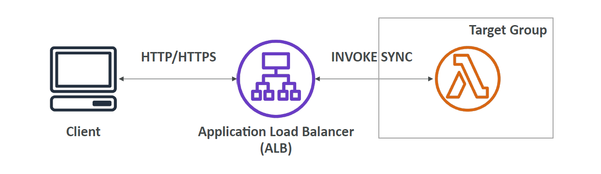
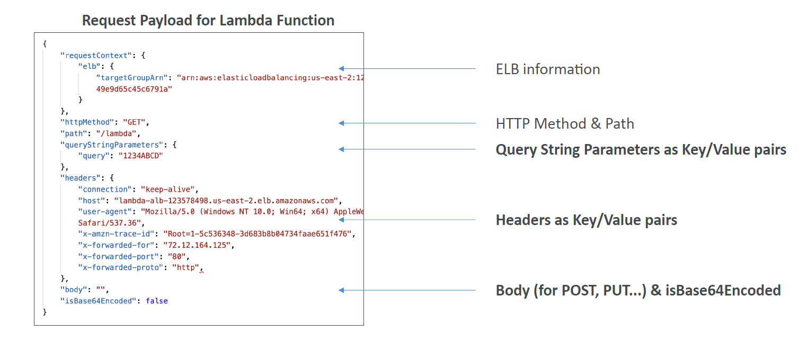
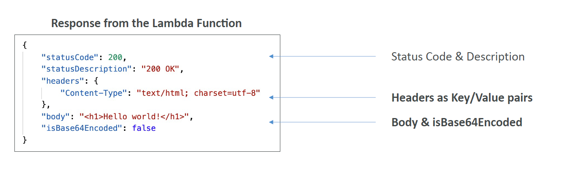
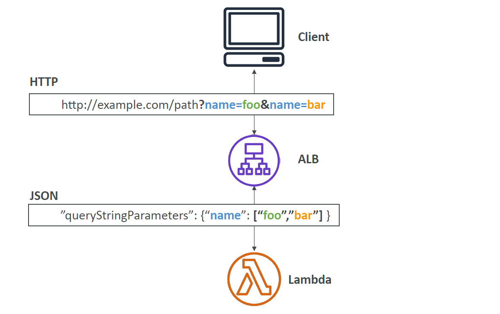

# 🔁 **AWS Lambda + ALB Integration**

One of the lesser-known but powerful integration patterns in AWS is routing **HTTP(S)** traffic through an **Application Load Balancer (ALB)** directly to **AWS Lambda**.

This enables you to use Lambda as a **scalable backend** behind a standard ALB — without provisioning EC2 or containers.

---

## 🧩 **Why Use ALB with Lambda?**

- ✅ HTTP(S) frontend (no need for API Gateway)
- ✅ Lambda scales automatically
- ✅ Works natively with DNS, path-based routing, SSL termination
- ✅ Unified architecture if you already use ALB for other services

---

## 📡 **Architecture Overview**

<div style="text-align: center;">
  
</div>

- The **client sends HTTP/HTTPS requests** to the ALB
- ALB invokes the **Lambda synchronously**
- Lambda processes the event and **returns a structured HTTP response**

---

## 📦 **Step-by-Step Setup Overview**

1. ✅ Create the Lambda function
2. ✅ Create a **target group** with type = `lambda`
3. ✅ Register the function in the target group
4. ✅ Create an ALB with a listener rule pointing to the Lambda target group
5. ✅ Grant ALB permissions to invoke the Lambda (resource-based policy)

---

## 🔐 **Lambda Resource Policy for ALB Invocation**

To allow ALB to invoke your function:

```json
{
  "Statement": {
    "Effect": "Allow",
    "Principal": {
      "Service": "elasticloadbalancing.amazonaws.com"
    },
    "Action": "lambda:InvokeFunction",
    "Resource": "arn:aws:lambda:us-west-2:123456789012:function:alb-function"
  }
}
```

📌 Required for the ALB to call the function.

---

## 📨 **Request Payload from ALB to Lambda**

<div style="text-align: center;">
  
</div>

Your Lambda will receive a **JSON event** that includes:

| Field                   | Description                          |
| ----------------------- | ------------------------------------ |
| `requestContext.elb`    | ELB metadata                         |
| `httpMethod`            | GET, POST, etc.                      |
| `path`                  | URL path                             |
| `queryStringParameters` | Map of query strings                 |
| `headers`               | Request headers                      |
| `body`                  | Request body (if applicable)         |
| `isBase64Encoded`       | Indicates whether the body is base64 |

---

## 💬 **Example Request to Lambda**

```json
{
  "httpMethod": "GET",
  "path": "/lambda",
  "queryStringParameters": {
    "query": "1234ABCD"
  },
  "headers": {
    "host": "lambda-alb-123.alb.amazonaws.com",
    "user-agent": "Mozilla/5.0...",
    "x-forwarded-for": "1.2.3.4"
  },
  "body": "",
  "isBase64Encoded": false
}
```

---

## 🔁 **Lambda → ALB Response Format**

<div style="text-align: center;">
  
</div>

---

Lambda must respond with:

| Field               | Purpose                                   |
| ------------------- | ----------------------------------------- |
| `statusCode`        | HTTP status code (e.g., 200)              |
| `statusDescription` | Optional HTTP status message (e.g., "OK") |
| `headers`           | HTTP headers to return                    |
| `body`              | Body of the response (string)             |
| `isBase64Encoded`   | If true, body must be base64 encoded      |

---

## 🌐 **Multi-Value Headers & Query Params**

By default, ALB sends **single-value headers** and query params. You can enable **multi-value support** in the ALB listener config.

<div style="text-align: center;">
  
</div>

---

> 🔄 Example:
>
> - HTTP: `?name=foo&name=bar`
> - JSON in Lambda:

```json
"queryStringParameters": {
  "name": ["foo", "bar"]
}
```

---

## 🧪 **Use Cases for ALB + Lambda**

| Scenario                          | Why ALB?                                             |
| --------------------------------- | ---------------------------------------------------- |
| 💳 Serverless HTTP backend        | ALB terminates HTTPS, routes to Lambda               |
| 🛠️ Migration from EC2 to Lambda   | Use same ALB, migrate target group type              |
| 🌍 Public URL without API Gateway | ALB listener does the job (custom domains, SSL, etc) |
| ⚡ High-throughput edge traffic   | ALB supports WAF, TLS termination, low latency       |

---

## 🧭 **ALB vs API Gateway vs Lambda URLs**

| Feature                 | ALB                       | API Gateway         | Lambda URLs           |
| ----------------------- | ------------------------- | ------------------- | --------------------- |
| Custom Domain Support   | ✅ Yes                    | ✅ Yes              | ✅ Yes                |
| Native REST API Support | ❌ No                     | ✅ Built-in         | ❌ No                 |
| Built-in Auth/WAF       | ✅ Yes (WAF)              | ✅ Yes              | ❌ Needs workaround   |
| Multi-target routing    | ✅ Supports Lambda & EC2  | ❌ Only Lambda      | ❌ One function       |
| Cost (high volume)      | ✅ Lower than API Gateway | ❌ Can be expensive | ✅ Free (but limited) |

---

## 🔚 **Conclusion**

Using ALB with Lambda gives you:

- 🌀 Seamless HTTP → Lambda integration
- 🔐 TLS + WAF + header-routing support
- 🧩 Powerful alternative to API Gateway for simple HTTP workloads

Use ALB + Lambda when you want to:

- Serve REST endpoints without API Gateway
- Mix EC2 + Lambda in one load balancer
- Save cost on simple public endpoints
