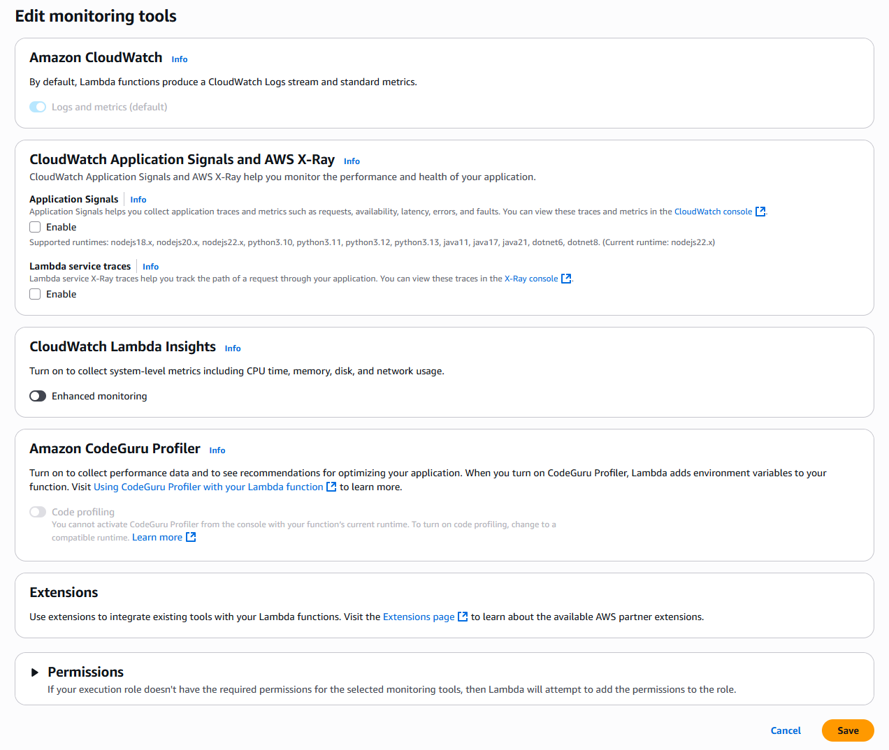
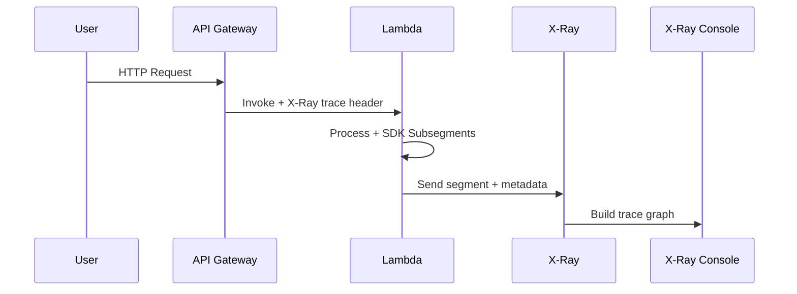
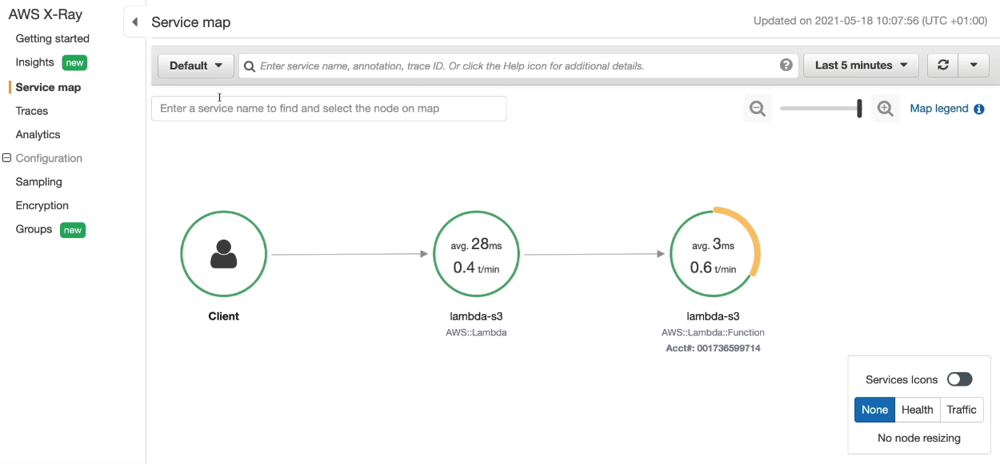

# 🔍 **AWS Lambda Tracing with AWS X-Ray**

> Track, Visualize, and Debug Serverless Applications with Confidence

When building event-driven, distributed applications on AWS Lambda, understanding **how data flows** and **where latency or failures occur** becomes crucial. AWS X-Ray provides **end-to-end tracing**, making it easy to pinpoint performance issues, bottlenecks, and errors in your serverless stack.

---

## 🧠 **What Is AWS X-Ray?**

**AWS X-Ray** is a distributed tracing system that helps you **analyze and debug** production, test, and development applications — especially **microservices** and **serverless** functions.

- 🧩 Visualizes end-to-end request flows
- 🚨 Identifies slow components and exceptions
- 📈 Tracks performance across services (Lambda, API Gateway, DynamoDB, etc.)

---

## ⚙️ **Enabling X-Ray Tracing in AWS Lambda**

<div style="text-align: center;">
  
</div>

---

### ✅ Steps

1. Go to your **Lambda function → Configuration → Monitoring and Operations tools**
2. Turn on **Active Tracing**
3. Save the configuration

This tells Lambda to **automatically run the X-Ray daemon** and **emit segments** to X-Ray.

---

## 🔐 **Required IAM Permissions**

To allow Lambda to send traces to X-Ray:

### 🛡️ Execution Role must include

```json
{
  "Effect": "Allow",
  "Action": ["xray:PutTraceSegments", "xray:PutTelemetryRecords"],
  "Resource": "*"
}
```

> ✅ Use the managed policy: `AWSXRayDaemonWriteAccess`

This gives Lambda permission to push trace data to X-Ray.

---

## 💻 **Using X-Ray SDK in Your Code**

For **custom subsegment tracing**, use the **AWS X-Ray SDK**:

- 📦 Install the SDK for your language:

  - Python: `aws-xray-sdk`
  - Node.js: `aws-xray-sdk-core`
  - Java: `aws-xray-recorder-sdk-core`

### 🧪 Python Example

```python
from aws_xray_sdk.core import xray_recorder
from aws_xray_sdk.core import patch_all

patch_all()

def lambda_handler(event, context):
    with xray_recorder.in_segment('MyCustomSegment'):
        # traced logic
        print("Processing...")
```

### 🧪 Node.js Example

```js
const AWSXRay = require("aws-xray-sdk");
AWSXRay.captureHTTPsGlobal(require("https"));

exports.handler = async (event) => {
  const segment = AWSXRay.getSegment();
  const subsegment = segment.addNewSubsegment("MyLogic");
  subsegment.addAnnotation("key", "value");
  subsegment.close();
};
```

---

## 🧬 **Environment Variables in Lambda Tracing**

Lambda automatically injects special environment variables when tracing is enabled:

| Variable                   | Description                                                     |
| -------------------------- | --------------------------------------------------------------- |
| `_X_AMZN_TRACE_ID`         | X-Ray trace header (used to propagate the trace)                |
| `AWS_XRAY_CONTEXT_MISSING` | Controls context-missing behavior (default: `LOG_ERROR`)        |
| `AWS_XRAY_DAEMON_ADDRESS`  | IP and port where daemon listens (default: `169.254.79.2:2000`) |

> ⚠️ These are used internally by the X-Ray SDK and Lambda runtime to manage trace propagation.

---

## 🧭 **How Tracing Works Behind the Scenes**

<div align="center">



</div>

---

- API Gateway adds trace header
- Lambda **creates a segment** for each invocation
- X-Ray SDK can add **custom subsegments**
- All data is **sent to X-Ray asynchronously**

---

## 🔍 **Visualizing in the X-Ray Console**

After enabling tracing and making requests:

1. Go to **AWS Console → X-Ray**
2. Open the **Service Map**
3. Drill down into Lambda function trace summaries
4. Explore **timeline, segments, annotations, subsegments**

---

<div style="text-align: center;">
  
</div>

---

## 🎯 **Best Practices for Lambda Tracing with X-Ray**

| ✅ Practice                    | 🔍 Why It Matters                                             |
| ------------------------------ | ------------------------------------------------------------- |
| Enable Active Tracing          | Required for basic end-to-end visibility                      |
| Add `AWSXRayDaemonWriteAccess` | Without this, Lambda cannot write to X-Ray                    |
| Use SDK to create subsegments  | Helps track custom logic, DB calls, API requests              |
| Avoid over-tracing             | Too many subsegments = increased overhead                     |
| Use annotations/metadata       | Enables filtering traces by business or domain logic          |
| Monitor cold starts            | Trace timeline shows which invocations triggered a cold start |

---

## 🧾 Summary Table: Lambda Tracing with X-Ray

| Feature                | Enabled with Active Tracing         |
| ---------------------- | ----------------------------------- |
| X-Ray Daemon           | ✅ Runs automatically               |
| IAM Policy Required    | `AWSXRayDaemonWriteAccess`          |
| Default Trace Segment  | ✅ Yes, one per function invocation |
| Subsegment SDK Support | ✅ Optional with AWS X-Ray SDK      |
| Env Vars Injected      | `_X_AMZN_TRACE_ID`, `AWS_XRAY_*`    |
| Cold Start Visibility  | ✅ Yes                              |

---

## 🏁 **Conclusion**

With **AWS X-Ray + Lambda**, you can gain **deep visibility into every invocation**, track performance across services, and debug production issues faster.

- ✅ Use Active Tracing for **basic function metrics**
- ✅ Use the SDK to **customize trace spans**
- ✅ Visualize everything in **X-Ray’s service map and trace viewer**

> Perfect for debugging, compliance, SLA monitoring, and optimizing performance in **microservice and serverless applications**.
