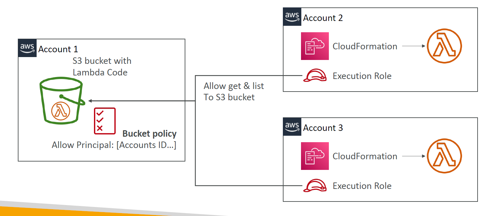

# 📦 **Deploying AWS Lambda with CloudFormation – Inline, S3, and Cross-Account**

AWS CloudFormation allows you to **provision Lambda functions** as part of your infrastructure-as-code (IaC). There are two primary ways to include the Lambda code in your templates:

- 🧾 Inline code for small scripts
- 🪣 S3-based deployment for production-grade functions with dependencies

---

## 🧾 **1. Inline Lambda Code with CloudFormation**

Use this for **small, dependency-free** functions. The code is directly embedded in the template using `ZipFile`.

### ✅ When to use

- Simple logic
- Teaching/demo purposes
- No third-party libraries required

### 🧠 Limitation

- You cannot install external packages (e.g., `boto3`, `requests`, `psycopg2`)

### 🔧 CloudFormation Template (Python)

```yaml
AWSTemplateFormatVersion: "2010-09-09"
Description: Lambda function inline
Resources:
  InlineFunction:
    Type: AWS::Lambda::Function
    Properties:
      FunctionName: MyInlineLambda
      Runtime: python3.10
      Handler: index.handler
      Role: arn:aws:iam::123456789012:role/lambda-execution-role
      Code:
        ZipFile: |
          import os

          DB_URL = os.getenv("DB_URL")
          def handler(event, context):
              return f"Hello from {DB_URL}"
```

> ⚠️ Recommended only for **short scripts** under 4 KB.

---

## 🪣 **2. Lambda Deployment via S3 Bucket (Modular Code)**

For real apps with dependencies (e.g., `pip install`), you need to:

1. Package your Lambda into a `.zip`
2. Upload it to an S3 bucket
3. Reference it in CloudFormation

### ✅ When to use

- Functions with dependencies
- Version control via `S3ObjectVersion`
- Shared deployment artifacts across environments

### 🔧 CloudFormation Template (Node.js from S3)

```yaml
AWSTemplateFormatVersion: "2010-09-09"
Description: Lambda from S3
Resources:
  FunctionFromS3:
    Type: AWS::Lambda::Function
    Properties:
      FunctionName: MyS3Lambda
      Runtime: nodejs18.x
      Handler: index.handler
      Role: arn:aws:iam::123456789012:role/lambda-execution-role
      Code:
        S3Bucket: my-lambda-deployments
        S3Key: functions/my-function.zip
        S3ObjectVersion: xYiO21dJmOAj2Wk3Mq9gXJdoKkXcZna
```

### 💡 Notes

- If you **update the S3 object** without changing `S3Key` or `S3ObjectVersion`, **CloudFormation will NOT update the function**.
- Use versioning in S3 or change the key name for automatic update.

---

## 🌐 **3. Deploying Lambda from S3 Across Multiple Accounts**

You can **store Lambda code in one account (e.g., Account A)** and **deploy it from another (Account B)** using **CloudFormation**, if you configure permissions properly.

---

<div style="text-align:center;">
  
</div>

---

### 🪣 Bucket Policy (Account A – Source)

```json
{
  "Version": "2012-10-17",
  "Statement": [
    {
      "Sid": "AllowCrossAccountAccess",
      "Effect": "Allow",
      "Principal": {
        "AWS": ["arn:aws:iam::222222222222:root", "arn:aws:iam::333333333333:root"]
      },
      "Action": ["s3:GetObject", "s3:ListBucket"],
      "Resource": ["arn:aws:s3:::my-central-lambda-code", "arn:aws:s3:::my-central-lambda-code/*"]
    }
  ]
}
```

### 🔧 CloudFormation in Account B or C

Just refer to the central bucket path:

```yaml
Resources:
  FunctionFromSharedS3:
    Type: AWS::Lambda::Function
    Properties:
      FunctionName: SharedLambda
      Runtime: python3.9
      Handler: index.handler
      Role: arn:aws:iam::222222222222:role/lambda-execution-role
      Code:
        S3Bucket: my-central-lambda-code
        S3Key: myapp/latest.zip
```

> 🔐 Ensure the **Lambda execution role** has `s3:GetObject` permissions too.

---

## 📚 Summary – CloudFormation + Lambda Deployment Modes

| **Mode**             | **Use Case**                               | **Supports Dependencies?** | **CloudFormation Updates?** |
| -------------------- | ------------------------------------------ | -------------------------- | --------------------------- |
| **Inline (ZipFile)** | Tiny scripts                               | ❌                         | Yes                         |
| **S3 Zip**           | Real Lambda apps                           | ✅                         | Yes (requires key/version)  |
| **Cross-Account S3** | Share centralized Lambda code across teams | ✅                         | Yes (with bucket policy)    |

---

## ✅ Best Practices

- 📦 Use **inline** only for small, quick functions
- 📁 Always enable **S3 versioning** for Lambda source buckets
- 🔐 Lock S3 buckets with IAM or bucket policy
- 📂 Organize S3 keys by environment (`prod/myfn.zip`, `dev/myfn.zip`)
- 🔄 Use `AWS::Lambda::Version` resource to publish immutable versions
