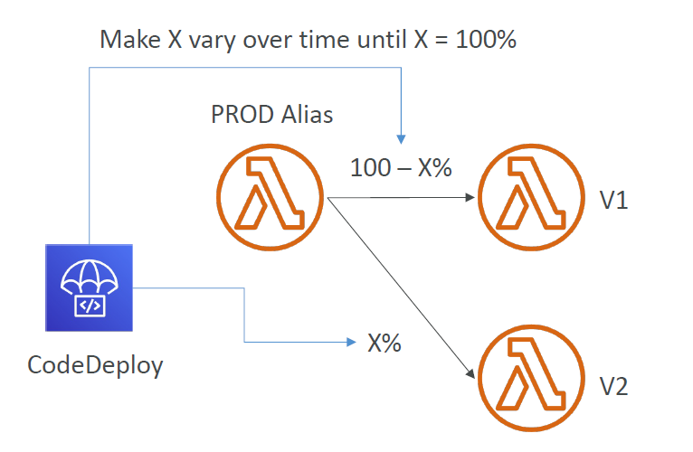

# 🚀 **AWS Lambda + CodeDeploy: Safe, Automated Traffic Shifting for Deployments**

When deploying new versions of AWS Lambda functions, reliability and control are key — especially in production. AWS **CodeDeploy** enables **automated, gradual deployments** to Lambda using **aliases and traffic shifting**, reducing the risk of errors and downtime during updates.

---

<div style="text-align:center;">
  
</div>

---

## 🔄 **How It Works**

CodeDeploy integrates directly with Lambda **aliases** and allows you to safely **shift live traffic** from one version of a function to another — automatically and with built-in hooks for validation.

1. **Alias Points to a Version:** You attach an alias (e.g., `PROD`) to a specific function version.
2. **CodeDeploy Deployment:** When a new version is deployed, CodeDeploy shifts a **percentage of traffic** to the new version based on the selected strategy.
3. **Validation Hooks (Optional):** Run pre- or post-deployment Lambda functions to verify the deployment’s health.
4. **Completion or Rollback:** Traffic is fully shifted to the new version, or rolled back if errors are detected.

---

## ⚙️ **Deployment Strategies**

| **Strategy**                    | **Description**                                     |
| ------------------------------- | --------------------------------------------------- |
| `AllAtOnce`                     | Shifts 100% of traffic to the new version instantly |
| `Canary10Percent5Minutes`       | Sends 10% for 5 min, then 100% if no errors         |
| `Canary10Percent30Minutes`      | Sends 10% for 30 min, then 100%                     |
| `Linear10PercentEvery3Minutes`  | Adds 10% every 3 minutes until reaching 100%        |
| `Linear10PercentEvery10Minutes` | Adds 10% every 10 minutes until 100%                |

These are useful for **gradual rollouts**, **canary testing**, and **reducing blast radius** in case of errors.

---

## 📄 **Example AppSpec.yml for Lambda Deployment**

The `AppSpec.yml` file controls which Lambda function alias and versions are involved in the traffic shift:

```yaml
version: 0.0
Resources:
  - myLambdaFunction:
      Type: AWS::Lambda::Function
      Properties:
        Name: myLambdaFunction
        Alias: myLambdaFunctionAlias
        CurrentVersion: 1
        TargetVersion: 2
```

### 🔑 Key Fields Explained

- **Name**: The name of the Lambda function.
- **Alias**: Alias used to shift traffic (e.g., `PROD`).
- **CurrentVersion**: The version traffic is currently routed to.
- **TargetVersion**: The new version to which traffic will be shifted.

---

## 🧪 **Optional: Pre & Post Traffic Hooks**

You can configure **Lambda lifecycle hooks**:

```yaml
hooks:
  BeforeAllowTraffic: preTrafficHook
  AfterAllowTraffic: postTrafficHook
```

These can be used to:

- Run health checks
- Validate integration
- Monitor metrics before finalizing rollout

---

## 📦 **Integration with AWS SAM**

SAM simplifies CodeDeploy integration:

```yaml
AutoPublishAlias: live
DeploymentPreference:
  Type: Canary10Percent5Minutes
  Hooks:
    PreTraffic: !Ref PreTrafficHook
    PostTraffic: !Ref PostTrafficHook
```

This ensures that every time you deploy with SAM:

- A new version is created
- The alias is updated
- Traffic is shifted using CodeDeploy

---

## 🛡️ **Why Use CodeDeploy for Lambda?**

- ✅ **Zero-downtime deployments**
- ✅ **Built-in rollback safety**
- ✅ **Canary testing and A/B testing**
- ✅ **Metrics and CloudWatch alarm integration**

---

## 🏁 **Conclusion**

Using **AWS CodeDeploy with Lambda** ensures your application evolves **safely**, **predictably**, and **without downtime**. Whether you're launching new features or fixing bugs, this integration makes Lambda versioning and traffic control first-class citizens in your CI/CD pipeline.
