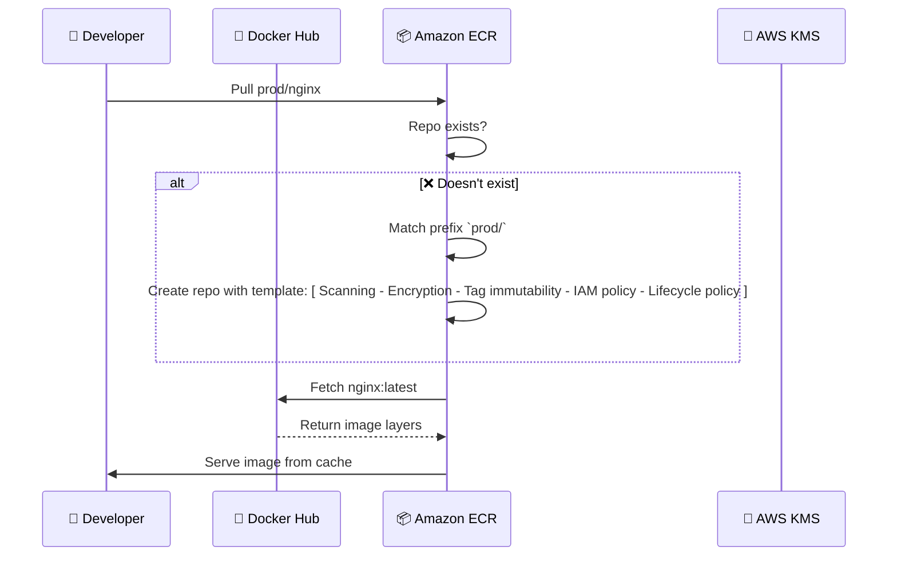

---
tags:
  - aws
  - aws/service
  - aws/domain/containers
  - aws/topic/ecr
aliases:
  - "Amazon ECR Pull-Through Cache + Repository Creation Templates Deep Practical Guide"
  - "Pull Through Cache And Repo Creation Templates Exampel"
---

# 🐳💨 **Amazon ECR Pull-Through Cache + Repository Creation Templates: Deep Practical Guide**

> _Build caching + control pipelines with zero manual repo creation!_

---

## 🎯 **What You'll Learn**

| 🔍 Topic                   | ✅ You'll Master                                          |
| -------------------------- | --------------------------------------------------------- |
| 🌀 Pull-Through Cache      | Speeding up and caching public images                     |
| 🧩 Repo Creation Templates | Applying default settings when ECR auto-creates repos     |
| 🔥 Real Example            | Use Docker Hub’s `nginx` image under `prod/nginx`         |
| ⚙️ Console + CLI           | Step-by-step for both interfaces                          |
| 💡 Deep Insights           | Why these features matter, what happens behind the scenes |

---

## 🧠 Scenario: Cache Docker Hub NGINX Securely

> You're pulling `nginx:latest` often in CI. It’s **slow**, **Docker Hub is rate-limiting you**, and you're **manually creating ECR repos**.

We’ll fix all that with:

- 🔁 Pull-through cache
- 🛡️ Secure default repo settings (via template)
- 💥 No manual repo creation

---

## 🌀 Step 1: Enable Pull-Through Cache

### 📦 Console Steps

1. Go to **ECR Console → Private Registry → Feature Settings**
2. Under **Pull through cache**, click **Edit**
3. Add rule:
   - **Upstream registry**: Docker Hub
   - **Namespace prefix**: `prod/nginx`
4. Click **Save**

### 🧪 CLI

```bash
aws ecr create-pull-through-cache-rule \
  --ecr-repository-prefix prod/nginx \
  --upstream-registry-url registry-1.docker.io \
  --region us-east-1
```

⏳ First pull from this repo will reach Docker Hub.
🚀 Next pulls are cached in your private ECR.

---

## 🧩 Step 2: Configure Repository Creation Template

> 🧠 **Why?**  
> When the `prod/nginx` repo **doesn't exist**, ECR will auto-create it using your **template**, applying:

- Encryption ✅
- Scanning ✅
- Tag immutability ✅
- IAM restrictions ✅
- Lifecycle policy ✅

### 👨‍💻 Console Steps

1. Go to **ECR Console → Feature Settings → Repository creation templates**
2. Click **Edit**
3. Add a template:
   - **Prefix**: `prod/`
   - **Tag immutability**: Enabled
   - **KMS encryption**: Enabled
   - **Scanning**: Basic
   - **Lifecycle**: Delete untagged images after 30 days
   - **Permissions**: Allow `ECRDeveloperRole` only
4. Save

### 🧪 CLI Setup

#### 1. `lifecycle.json`

```json
{
  "rules": [
    {
      "rulePriority": 1,
      "description": "Delete untagged images older than 30 days",
      "selection": {
        "tagStatus": "untagged",
        "countType": "sinceImagePushed",
        "countUnit": "days",
        "countNumber": 30
      },
      "action": {
        "type": "expire"
      }
    }
  ]
}
```

#### 2. `policy.json`

```json
{
  "Version": "2012-10-17",
  "Statement": [
    {
      "Sid": "AllowCIOnly",
      "Effect": "Allow",
      "Principal": {
        "AWS": "arn:aws:iam::123456789012:role/ECRDeveloperRole"
      },
      "Action": [
        "ecr:GetDownloadUrlForLayer",
        "ecr:BatchGetImage",
        "ecr:BatchCheckLayerAvailability",
        "ecr:PutImage",
        "ecr:InitiateLayerUpload",
        "ecr:UploadLayerPart",
        "ecr:CompleteLayerUpload"
      ],
      "Resource": "*"
    }
  ]
}
```

#### 3. Apply Template

```bash
aws ecr put-repository-creation-template \
  --registry-id 123456789012 \
  --repository-prefix prod/ \
  --encryption-configuration encryptionType=KMS \
  --image-tag-mutability IMMUTABLE \
  --image-scanning-configuration scanOnPush=true \
  --lifecycle-policy-text file://lifecycle.json \
  --repository-policy-text file://policy.json \
  --region us-east-1
```

---

## 🧪 Step 3: Pull Image from ECR (Trigger the Flow)

### 🧑‍💻 Authenticate Docker

```bash
aws ecr get-login-password --region us-east-1 \
  | docker login \
    --username AWS \
    --password-stdin 123456789012.dkr.ecr.us-east-1.amazonaws.com
```

### 🐳 Pull the Cached Image

```bash
docker pull 123456789012.dkr.ecr.us-east-1.amazonaws.com/prod/nginx:latest
```

---

## 🔍 What Happens Behind the Scenes



---

## ❓ Do I Need to Manually Create Repos?

| Condition                                                                       | What Happens                           |
| ------------------------------------------------------------------------------- | -------------------------------------- |
| You pull from a cached prefix, repo **doesn’t exist**, and template exists      | ✅ ECR creates repo automatically      |
| You pull from a cached prefix, repo exists                                      | ✅ ECR caches & serves it              |
| You pull from a cached prefix, repo **doesn’t exist**, but no matching template | ❌ Pull fails — repo not found         |
| You push your own image                                                         | 🔧 Manual repo creation still required |

---

## 🧠 Summary of Benefits

| Feature                    | What It Solves                                     |
| -------------------------- | -------------------------------------------------- |
| **Pull Through Cache**     | Avoid Docker Hub rate limits + speed up builds     |
| **Repo Creation Template** | Secure auto-created repos with policies & defaults |

---

## 🧼 Optional Cleanup

```bash
aws ecr delete-pull-through-cache-rule \
  --ecr-repository-prefix prod/nginx \
  --region us-east-1

aws ecr delete-repository \
  --repository-name prod/nginx \
  --force \
  --region us-east-1
```

---

## 🏁 Final Thoughts

With this combo, your private registry becomes:

- 🧠 Smart (auto-creates repos with safe defaults)
- 🚀 Fast (caches from Docker Hub once)
- 🔐 Secure (IAM + encryption + lifecycle)
- 💥 Fully automated

Would you like this in Markdown or a one-click deployment with CloudFormation next? 😎
---

## Related Notes
- [[aws-services/6.containers/1.ecr/|Index]] - folder map
- [[aws-services/6.containers/1.ecr/3.1.pull_through_cache-and-repo-creation-templates|Amazon ECR Pull Through Cache & Repository Creation Templates]] - previous lesson
- [[aws-services/6.containers/1.ecr/4.ecr-image-scanning|Amazon ECR Image Scanning Comprehensive Guide]] - next lesson
-[[1.1.cfn|AWS CloudFormation]]] - mentions CloudFormation
-[[3.1.build-caching|CodeBuild Caching]]] - mentions Build Caching
- [[aws-services/4.storage/1.s3/2.5.encryption|Amazon S3 Encryption]] - mentions Encryption
- [[aws-services/6.containers/1.ecr/1.2.ecr|Amazon ECR Your Secure Container Image Vault]] - mentions ECR
- [[aws-services/2.security/1.1.iam/1.fundmmentals/1.2.iam|AWS Identity and Access Management IAM]] - mentions IAM

---
