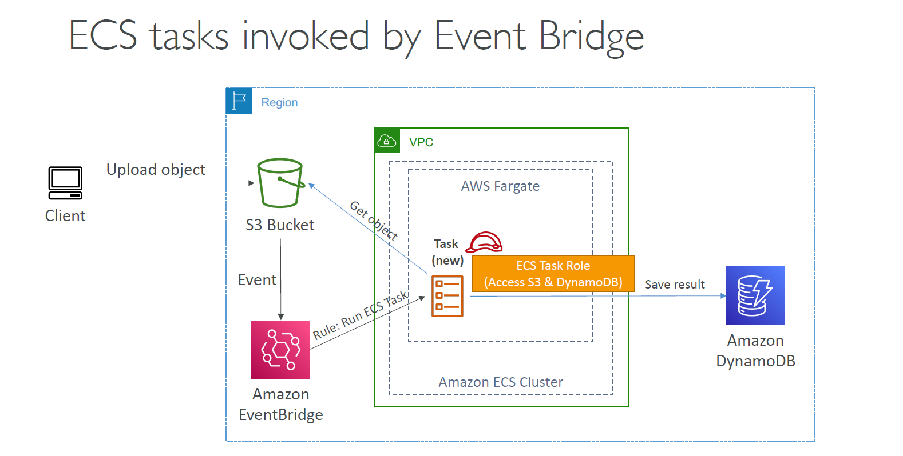
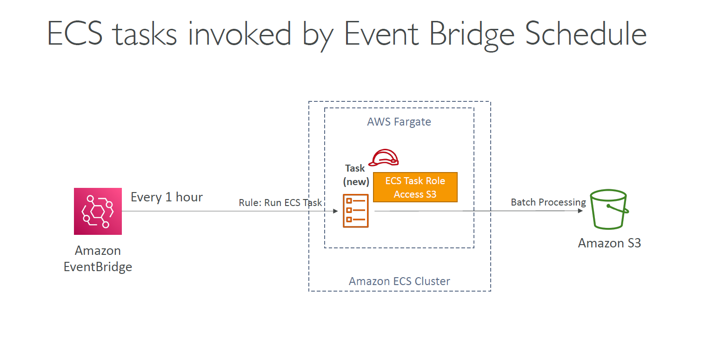
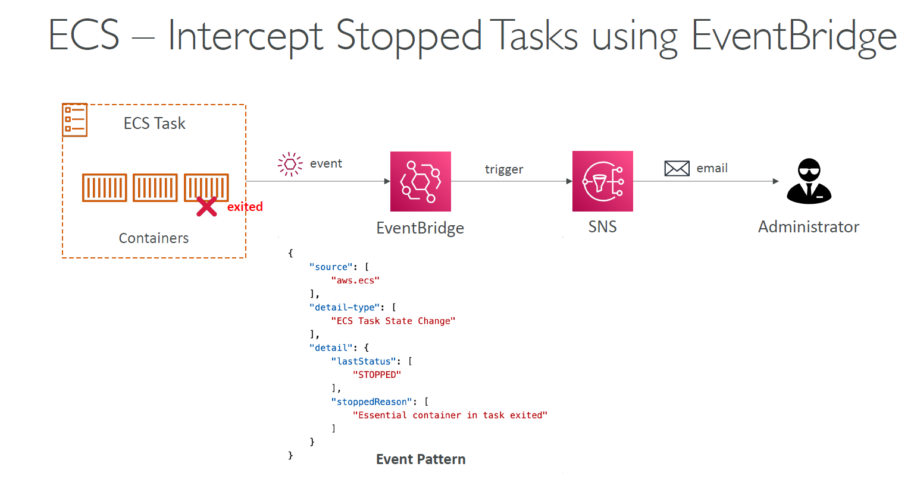

---
tags:
  - aws
  - aws/service
  - aws/domain/containers
  - aws/topic/ecs
aliases:
  - "ECS Use Cases"
---

# ECS Use Cases

    

    

    

    

---

## Related Notes
- [[aws-services/6.containers/2.ecs/|Index]] - folder map
- [[aws-services/6.containers/2.ecs/1.2.ecs-components|Amazon ECS Full Architecture Broken Down Visually]] - previous lesson
- [[aws-services/6.containers/2.ecs/2.1.ecr-cluster|Amazon ECS Clusters Launch & Manage Containers at Scale]] - next lesson
- [[aws-services/6.containers/2.ecs/1.1.ecs|Amazon ECS Elastic Container Service]] - mentions ECS

---
