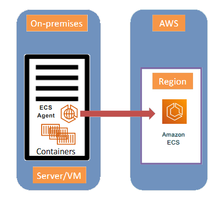

---
tags:
  - aws
  - aws/service
  - aws/domain/containers
  - aws/topic/ecs
aliases:
  - "Amazon ECS Anywhere"
  - "ECS Anywhere"
---

# Amazon ECS Anywhere

> **Amazon ECS Anywhere** empowers AWS customers to extend their ECS capabilities to non-AWS environments, enabling seamless container orchestration across hybrid infrastructure.

  

---

## 📝 Overview

- **Run ECS Tasks Beyond AWS:** ECS Anywhere allows you to run ECS tasks on non-AWS environments, such as on-premises servers or virtual machines.
- **Hybrid Deployment:** Integrate and manage external instances within your existing ECS cluster, maintaining consistency and control.

---

## 🌟 Key Features

- **Linux and Windows Support:** ECS Anywhere supports both Linux and Windows instances, providing flexibility in your choice of operating systems.
- **AWS Systems Manager (SSM) Agent:** External instances must have the SSM agent installed, making them manageable through AWS.
- **External Launch Type:** Configure your services or run tasks on external instances using the EXTERNAL launch type.

---

## 🛠️ Use Cases

- **Outbound Traffic Applications:** Ideal for applications that generate outbound traffic or process data locally.
- **Hybrid Workloads:** Suitable for scenarios where workloads span both on-premises and cloud environments, providing seamless integration.

---

## ⚙️ Configuration Steps

1. **Install SSM Agent:** Ensure the AWS Systems Manager agent is installed on your on-premises servers or virtual machines.
2. **Define Task Definition:** Create a task definition specifying the configuration for your containers.
3. **Create ECS Service:** Use the EXTERNAL launch type to create services or run tasks on your external instances.

---

## 🚫 Limitations

- **Inbound Traffic:** Not recommended for applications requiring inbound traffic due to the current lack of service load balancing support.
---

## Related Notes
- [[aws-services/6.containers/2.ecs/|Index]] - folder map
- [[aws-services/6.containers/2.ecs/2.1.ecr-cluster|Amazon ECS Clusters Launch & Manage Containers at Scale]] - previous lesson
- [[aws-services/6.containers/2.ecs/3.1.task-definition-console|Amazon ECS Task Definition]] - next lesson
- [[aws-services/6.containers/2.ecs/4.5.1.ecs-service|Amazon ECS Service Creation]] - mentions ECS Service
- [[aws-services/6.containers/2.ecs/1.1.ecs|Amazon ECS Elastic Container Service]] - mentions ECS

---
