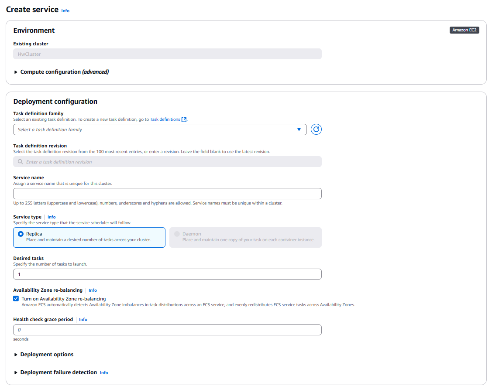
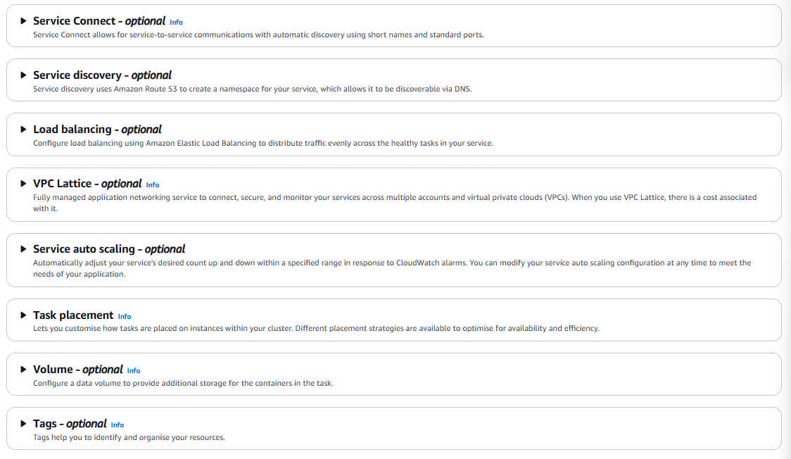
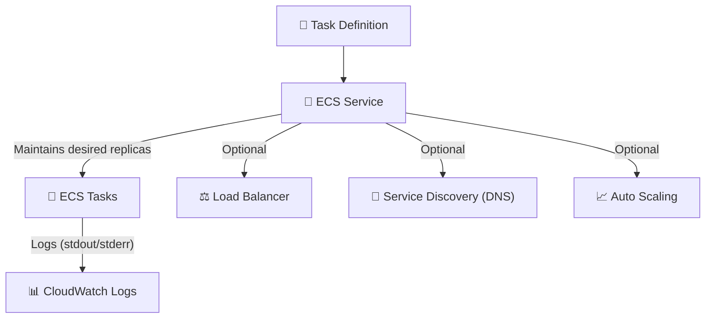

---
tags:
  - aws
  - aws/service
  - aws/domain/containers
  - aws/topic/ecs
aliases:
  - "Amazon ECS Service Creation"
  - "ECS Service"
---

# 🚢 Amazon ECS Service Creation

> “If tasks are the engines, ECS services are the pilots keeping them running 24/7.”

---

<div style="text-align: center;">
    
</div>

---

<div style="text-align: center;">
    
</div>

---

## 📚 What Is an ECS Service?

An **Amazon ECS Service** is like a smart supervisor for your containers. It:

- Launches tasks from a **task definition**
- Keeps them running as long as you want
- Replaces any unhealthy tasks automatically
- Supports **deployment strategies**, **auto scaling**, **load balancing**, and more

🧠 Think of it as:

> Kubernetes Deployment + ECS capacity control + optional load balancing + built-in healing = ECS Service.

---

## 🧩 How ECS Services Work – Internal Flow



---

## 🧱 1️⃣ Basic Configuration

### 🏗️ Environment

| Field   | Description                              |
| ------- | ---------------------------------------- |
| Cluster | The ECS cluster where this service lives |

---

### Task Definition

| Field              | Description                                                                    |
| ------------------ | ------------------------------------------------------------------------------ |
| Task Definition    | Choose the app/task you want to run (previously registered)                    |
| Revision           | Choose the specific version of the task definition (or leave for latest)       |
| Service Name       | Name of the ECS service (unique per cluster)                                   |
| Service Type       | `Replica` (multiple tasks) or `Daemon` (1 task per EC2 instance, only for EC2) |
| Desired Count      | How many copies of the task should always be running                           |
| AZ Rebalancing     | ECS will rebalance tasks across availability zones automatically               |
| Health Check Grace | Time buffer before ECS considers a task unhealthy (useful during boot) <br/>   |

> 💡 Health Check Grace:  
> If your service's tasks take a while to start and respond, you can specify a health check grace period of. During that time, the service scheduler ignores the health check status. This grace period can prevent the service scheduler from marking tasks as unhealthy and stopping them before they have time to come up.

---

## ⚙️ 2️⃣ Compute Configuration

This determines **how ECS launches your tasks** — and you have two options:

### 🧠 Option A: Capacity Provider Strategy (✅ Recommended)

This is the modern, flexible way to manage compute. You assign weights to **FARGATE**, **FARGATE_SPOT**, or even EC2 Auto Scaling Groups.

```json
[
  { "capacityProvider": "FARGATE_SPOT", "weight": 2 },
  { "capacityProvider": "FARGATE", "weight": 1 }
]
```

💡 ECS will try to run more on `FARGATE_SPOT` (cheaper) but use `FARGATE` as fallback.

---

### 🧾 Option B: Launch Type (Legacy, simpler)

```bash
--launch-type FARGATE
```

Use this if you don’t want to define a capacity provider strategy. Less flexible, but easier for one-off setups.

| When to use    | Use case                        |
| -------------- | ------------------------------- |
| `FARGATE`      | Serverless infra                |
| `FARGATE_SPOT` | Cost-optimized (but not stable) |
| `EC2`          | Run on your own EC2 instances   |

---

## 🔌 3️⃣ Optional Service Features

### 🔗 Service Connect (Optional)

> Provides service-to-service communication via names like `orders.local`.

- Auto-assigns **service discovery names + ports**
- Great for microservices running within the same namespace

---

### 🔍 Service Discovery (Optional)

> Uses Route 53 DNS to give your service a hostname like `orders.myapp.local`.

Useful for:

- Internal traffic routing
- DNS-based discovery between services

You define a namespace like `myapp.local`, and ECS registers your task IPs in it.

---

### ⚖️ Load Balancing (Optional)

> Spread incoming HTTP/HTTPS/TCP traffic across healthy containers.

- Use **ALB or NLB**
- Attach a listener + target group
- Define which container + port to register

💡 Load balancers can even use **container-specific health checks** for smarter traffic control.

---

### 🌐 VPC Lattice (Optional)

> Think of this as "Cross-AWS Service Mesh."

- Securely route traffic across **accounts**, **regions**, and **VPCs**
- View insights and metrics
- Requires a little setup, but powerful for enterprises

---

### 📈 Service Auto Scaling (Optional)

> Automatically increases/decreases task count based on metrics.

You can scale based on:

- **CPU utilization**
- **Memory**
- **Custom CloudWatch metrics**
- Or manually through CLI/console

Auto scaling is defined as:

```json
{
  "minCapacity": 1,
  "maxCapacity": 10,
  "targetValue": 60,
  "metricType": "CPUUtilization"
}
```

---

### 📦 Task Placement (Optional)

> You can choose how tasks are distributed inside the cluster:

| Strategy  | What it does                                     |
| --------- | ------------------------------------------------ |
| `spread`  | Spread tasks across AZs, instances, or attribute |
| `binpack` | Pack tasks tightly to reduce cost                |
| `random`  | Choose a random instance                         |

💡 You can combine `spread + binpack` for best efficiency.

---

### 💾 Volume Configuration (Optional)

> Attach **EBS volumes** to your ECS tasks

Good for:

- Storing uploaded files temporarily
- Caching builds or processing large files

---

### 🏷️ Tags (Optional)

Use tags like:

```plaintext
Team = DevOps
Environment = Production
Project = Analytics
```

✅ Tags help with:

- Cost tracking
- IAM condition-based access
- Resource grouping

---

## 🧰 CLI Equivalent for Creating a Service

```bash
aws ecs create-service \
  --cluster my-cluster \
  --service-name my-backend-svc \
  --task-definition my-task:5 \
  --desired-count 2 \
  --launch-type FARGATE \
  --network-configuration 'awsvpcConfiguration={subnets=["subnet-xyz"],securityGroups=["sg-abc"],assignPublicIp="ENABLED"}' \
  --enable-execute-command \
  --health-check-grace-period-seconds 30
```

---

## 🧠 Bonus: Fargate vs EC2 for Services

| Feature         | FARGATE          | EC2                     |
| --------------- | ---------------- | ----------------------- |
| Serverless      | ✅ Yes           | ❌ You manage instances |
| Scaling         | Fast, managed    | Slower (based on ASG)   |
| Cost            | Slightly higher  | Cheaper at large scale  |
| Custom AMIs     | ❌ No            | ✅ Yes                  |
| Daemon Services | ❌ Not supported | ✅ Supported            |

---

## ✅ Final Thoughts

- Use **ECS services** when you want a **self-healing, always-on** container deployment
- Combine with **auto scaling**, **load balancing**, and **discovery** to build production-grade apps
- Always prefer **capacity providers** for modern setups
- EC2 gives more control, Fargate gives simplicity
---

## Related Notes
- [[aws-services/6.containers/2.ecs/|Index]] - folder map
- [[aws-services/6.containers/2.ecs/4.4.2.how-targets-in-scheduled-task-works|ECS Scheduled Task Targets - Internals]] - previous lesson
- [[aws-services/6.containers/2.ecs/4.5.2.ecs-service-lb|Amazon ECS Service with Elastic Load Balancing ELB]] - next lesson
- [[aws-services/5.compute/1.3.ec2-auto-scaling/1.1.ec2-auto-scaling|EC2 Auto Scaling]] - mentions EC2 Auto Scaling
- [[aws-services/6.containers/2.ecs/3.3.task-placement|Amazon ECS Task Placement EC2 Launch Type Only]] - mentions Task Placement
- [[aws-daily/aws-architectures/3.1.serverless|Server-Based Architectures vs. Serverless Computing]] - mentions Serverless
-[[1.serverless|The Ultimate Guide to Serverless Computing & Tools]]] - mentions Serverless
- [[aws-services/5.compute/2.ebs/1.1.ebs|Amazon EBS Elastic Block Store Scalable Persistent Storage for EC2]] - mentions EBS
- [[aws-services/2.security/1.1.iam/1.fundmmentals/1.2.iam|AWS Identity and Access Management IAM]] - mentions IAM
- [[aws-services/6.containers/2.ecs/1.1.ecs|Amazon ECS Elastic Container Service]] - mentions ECS

---
